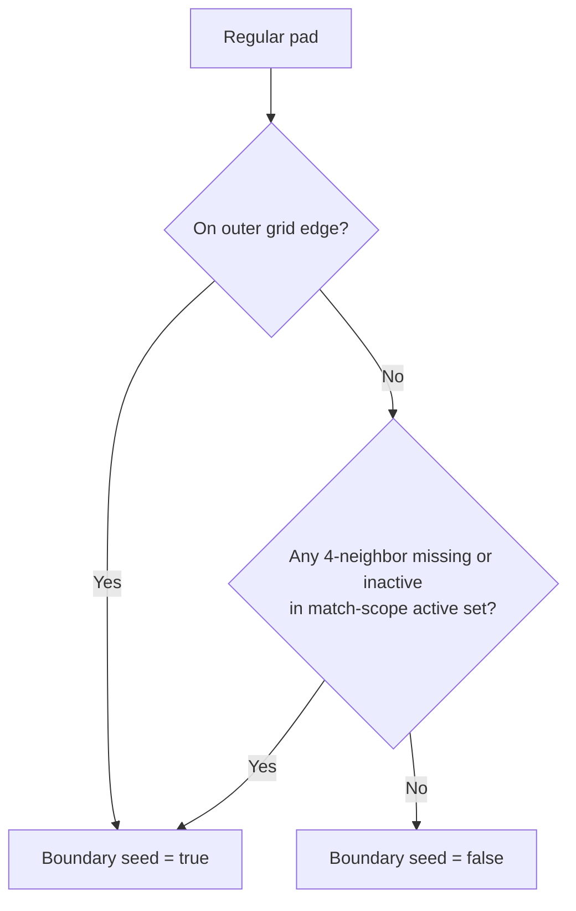
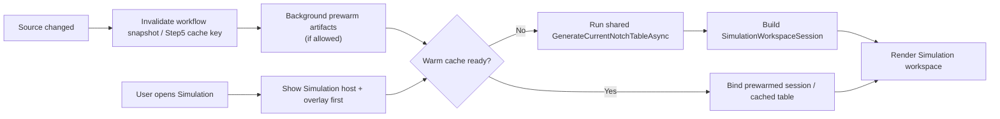
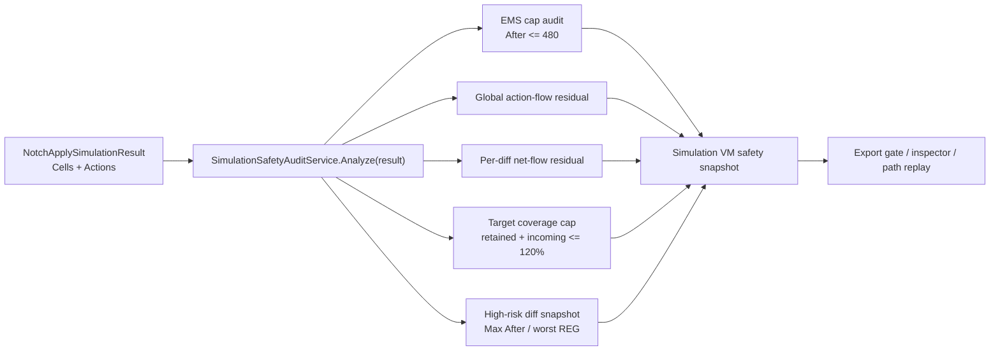

# Notch / Simulation Overall Flow (Mermaid)

> Canonical reference：[`docs/reference/notch-system-reference.md`](../reference/notch-system-reference.md)
> 本檔只保留總覽圖與名詞提醒；若與 canonical reference 不一致，以 canonical reference 為準。

> 最後更新：2026-04-30

## 1. Workflow Identity Flow

```mermaid
flowchart LR
    A["Build RegularGrid<br/>(RegularPad.DiffIndex fixed)"] --> B["Run Step1 Match"]
    B --> B1["Build Match-Scope Active Regular Set<br/>(RegularToCad.Keys)"]
    B --> C0{"SeeRegular enabled?"}
    C0 -- "Yes" --> C1["Load SeeRegular Mask"]
    C0 -- "No" --> C2["No mask"]
    B1 --> D["Assign CAD Output FW Diff"]
    C1 --> D
    C2 --> D
    D --> E["Freeze Workflow Snapshot"]
    E --> F["Generate Step5 Notch Table"]
    F --> G["Precompute Boundary Regular Indices<br/>(from match-scope active set)"]
    G --> H["Build V22 Candidates<br/>(shared boundary query context)"]
    H --> H1["Apply Step3 Boundary / Coverage Guards<br/>(optional compensation switches)"]
    H1 --> I["Build Canonical Rows"]
    I --> J["Project Anchor + Build CAD Output Grid"]
    J --> K["Reuse in Export / Simulation / Inspector"]

    N1["Regular Visibility Mask (SeeRegular.csv) only constrains Step4 geometry seed and Simulation active surface"]:::note
    N2["ToFull boundary currently uses match-scope active regular set, not Regular Visibility Mask (SeeRegular.csv)"]:::note
    D -.-> N1
    G -.-> N2

    classDef note fill:#FFF8E7,stroke:#D6B874,color:#3A3120,stroke-dasharray: 4 3;
```

## 2. Boundary Seed Rule

重點：

- `active set` 目前來自 `PadMatchResult.RegularToCad.Keys`
- 不是 `Regular Visibility Mask (SeeRegular.csv)`
- `Regular Visibility Mask (SeeRegular.csv)` 是另一層額外限制，用在 Step4 / Simulation
- beta0.9 boundary / coverage guard 是 Step3 中段補償，不是 SeeRegular；它在 V22 candidate 產生後、canonical rows 輸出前限制 ToFull 虛擬面積與 target coverage。

## 3. Simulation Open / Warm Path

重點：

- Simulation 不使用第二套數學路徑
- 仍然共用 Step5 table generation
- 優化重點是 `prewarm + cache reuse + candidate hot-path reduction`

## 4. Simulation Audit Gate

重點：

- audit 入口吃同一份 `Cells + Actions`，不讓 UI / export / inspector 各自從局部資料重推。
- `After > 480` 是 EMS hard-risk gate。
- target coverage cap 預設 `120%`，用來抓小 overlap 被放大成不合理 target ratio 的情況。
- `global 400` 只作診斷輸入；偏差需歸類為 `GeometryExpected`、`NetFlowSuspicious` 或 `EmsRisk`。
- Copper path replay 每個 point 都走 `BuildCopperDataset -> BuildSnapshot -> Analyze(result)`，並記錄 Max After / EMS violations / worst diff。

## 5. Physical Intent Notes

- `ToRegular`
  - 目的是 Undo NF 對面積差異的部分壓平，讓感應量先回到較接近面積正比的狀態。
- `ToFull`
  - 目的是支援 boundary / 推邊，不應自動等同於「擴展後 full area 直接成為主要分配權重」。
- `Boundary virtual-area cap`
  - 目的是限制 ToFull 長出去的虛擬面積，避免很小的邊界 overlap 取得過大的 expansion 權重。
- `Target coverage guard`
  - 目的是限制同一 FW diff 最終 retained + incoming coverage，作為 Current(Gain) 的 EMS safety guard。
- canonical truth
  - 應以 `v2.2 canonical` 為主；`v2.1` 只作 compatibility payload。
- default compensation mode
  - 若目標是維持 `global 400` 下的 uniform-field 合理性，預設應優先採 `without gain`。
  - `without gain` 仍套用 `ToRegular` 面積還原；它只關閉 `ToFull` 對 source combine 的放大。
