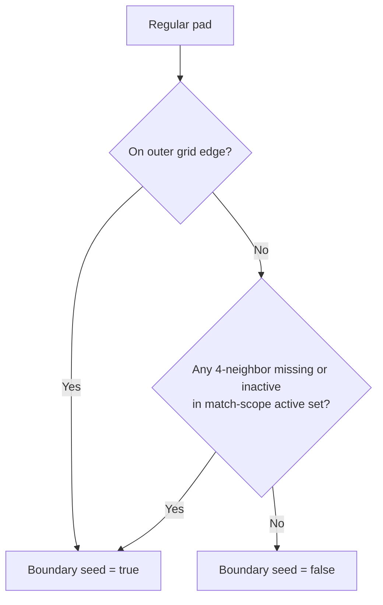
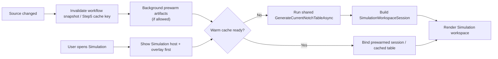
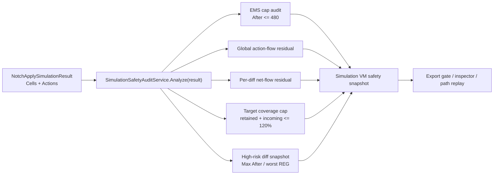

# Notch / Simulation Overall Flow (Mermaid)

> Canonical reference: [`docs/reference/notch-system-reference.md`](../reference/notch-system-reference.md)
> This file only keeps the overview diagrams and term reminders. If it conflicts with the canonical reference, the canonical reference takes precedence.

> Last updated: 2026-04-30

## 1. Workflow Identity Flow

```mermaid
flowchart LR
    A["Build RegularGrid<br/>(RegularPad.DiffIndex fixed)"] --> B["Run Step1 Match"]
    B --> B1["Build Match-Scope Active Regular Set<br/>(RegularToCad.Keys)"]
    B --> C0{"SeeRegular enabled?"}
    C0 -- "Yes" --> C1["Load SeeRegular Mask"]
    C0 -- "No" --> C2["No mask"]
    B1 --> D["Assign CAD Output FW Diff"]
    C1 --> D
    C2 --> D
    D --> E["Freeze Workflow Snapshot"]
    E --> F["Generate Step5 Notch Table"]
    F --> G["Precompute Boundary Regular Indices<br/>(from match-scope active set)"]
    G --> H["Build V22 Candidates<br/>(shared boundary query context)"]
    H --> H1["Apply Step3 Boundary / Coverage Guards<br/>(optional compensation switches)"]
    H1 --> I["Build Canonical Rows"]
    I --> J["Project Anchor + Build CAD Output Grid"]
    J --> K["Reuse in Export / Simulation / Inspector"]

    N1["Regular Visibility Mask (SeeRegular.csv) only constrains Step4 geometry seed and Simulation active surface"]:::note
    N2["ToFull boundary currently uses match-scope active regular set, not Regular Visibility Mask (SeeRegular.csv)"]:::note
    D -.-> N1
    G -.-> N2

    classDef note fill:#FFF8E7,stroke:#D6B874,color:#3A3120,stroke-dasharray: 4 3;
```

## 2. Boundary Seed Rule

Key points:

- The `active set` currently comes from `PadMatchResult.RegularToCad.Keys`.
- It is not the `Regular Visibility Mask (SeeRegular.csv)`.
- The `Regular Visibility Mask (SeeRegular.csv)` is a separate additional constraint, used in Step4 / Simulation.
- The beta0.9 boundary / coverage guard is a mid-stage compensation in Step3, not SeeRegular. It limits ToFull virtual area and target coverage after V22 candidates are generated and before canonical rows are output.

## 3. Simulation Open / Warm Path

Key points:

- Simulation does not use a second math path.
- It still shares Step5 table generation.
- The optimization focus is `prewarm + cache reuse + candidate hot-path reduction`.

## 4. Simulation Audit Gate

Key points:

- The audit entry takes the same `Cells + Actions` data. UI, export, and inspector do not each re-derive results from partial data.
- `After > 480` is the EMS hard-risk gate.
- The target coverage cap defaults to `120%`. It catches cases where a small overlap is amplified into an unreasonable target ratio.
- `global 400` is only a diagnostic input. Deviations must be classified as `GeometryExpected`, `NetFlowSuspicious`, or `EmsRisk`.
- Copper path replay runs every point through `BuildCopperDataset -> BuildSnapshot -> Analyze(result)`, and records Max After, EMS violations, and the worst diff.

## 5. Physical Intent Notes

- `ToRegular`
  - Its purpose is to partly flatten the area difference caused by Undo NF, so the sensed quantity first returns to a state closer to proportional to area.
- `ToFull`
  - Its purpose is to support boundary / edge push. It should not automatically mean that the expanded full area becomes the main allocation weight directly.
- `Boundary virtual-area cap`
  - Its purpose is to limit the virtual area that ToFull extends, so that a very small boundary overlap does not get an excessively large expansion weight.
- `Target coverage guard`
  - Its purpose is to limit the final retained + incoming coverage of the same FW diff, as an EMS safety guard for Current(Gain).
- Canonical truth
  - The `v2.2 canonical` should be the main reference. `v2.1` is only a compatibility payload.
- Default compensation mode
  - If the goal is to keep uniform-field reasonableness under `global 400`, `without gain` should be the default.
  - `without gain` still applies the `ToRegular` area restoration. It only turns off the amplification of source combine by `ToFull`.
