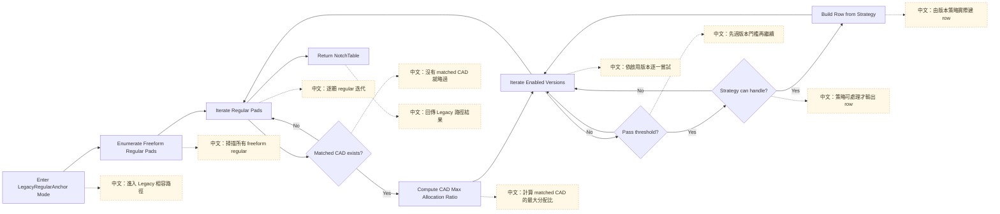
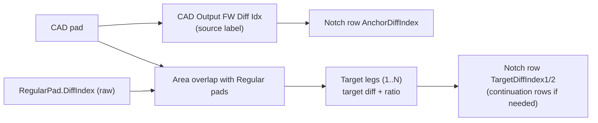
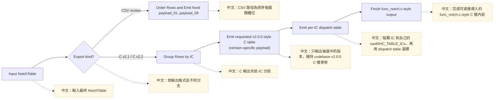

# Notch v2.1 / v2.2 流程定義與流程圖（Current As-Is）

> Canonical reference：[`docs/reference/notch-system-reference.md`](../reference/notch-system-reference.md)
> 本檔保留詳細流程圖與 entrypoint 拆解；若本檔與 canonical reference 不一致，以 canonical reference 為準。

> 最後更新：2026-08-08
> 適用範圍：`NotchTableGenerator` + `NotchTableExporter` + Step5 export selection 現行路徑

## 1. 先確認：怎麼產出「好的流程圖」

這份專案的流程圖一律遵守以下規則，避免畫成看起來漂亮但無法維護的圖。

### 1.1 資訊來源規則（Single Source of Truth）
- 流程圖節點必須對應實際 code entry，不可憑 UI 文案推導。
- 每個節點至少對應一個程式位置（檔案/方法）。
- 若同一結果有多入口，流程圖只畫「共同收斂路徑」，不畫重複分岔。

### 1.2 分層規則（從外到內）
- Layer A：使用者可見流程（Step1~Step5 / 匯出）
- Layer B：計算分流（`CadAllocation` vs `LegacyRegularAnchor`）
- Layer C：版本策略（`V21` / `V22`）
- Layer D：row payload 組裝與輸出

### 1.3 判斷節點規則
每個判斷節點必須明確回答：
- 判斷條件是什麼
- 通過/不通過分別做什麼
- 是否終止流程

### 1.4 Mermaid 命名規則
- 節點名稱以「動詞 + 資料」命名，例如 `Build CAD allocation profiles`。
- Decision 節點使用 `?` 結尾。
- 不在節點中放長段註解；長說明放到圖下方「節點對照表」。

### 1.5 驗證規則（畫完一定要做）
- 用 `rg` 對照關鍵方法仍存在。
- 檢查每個 decision 的兩條路徑都有落點。
- 檢查輸出 payload 欄位與程式定義一致（v2.1: 9 欄；v2.2 node: 7 欄）。

---

## 2. 現行 Notch 主流程（總覽）

### 2.1 主入口
- `src/FreeformHelper.Application/Services/NotchTableGenerator.cs`
  - `Generate(...)`
  - `EvaluateCadRowEligibility(...)`
- `src/FreeformHelper.UI/ViewModels/FreeformHelperViewModel.NotchTableGeneration.cs`
  - `GenerateCurrentNotchTableAsync(...)`
- `src/FreeformHelper.Application/Services/NotchCadOutputFwDiffProjectionService.cs`
  - `Project(...)`
- `src/FreeformHelper.UI/ViewModels/FreeformHelperViewModel.Operations.LayerFiltering.cs`
  - `RebuildVisibleDxfIndexMap(...)`

### 2.2 總覽流程圖（EN flow + 中文旁註）

```mermaid
flowchart LR
    A["Build RegularGrid Key<br/>(IC, DiffIndex baseline)"] --> B["Run Step1 Geometry Match<br/>(CAD to Regular candidates)"]
    B --> B1["Build Match-Scope Active Regular Set<br/>(RegularToCad.Keys)"]
    B --> C0{"SeeRegular enabled?"}
    C0 -- "Yes" --> C1["Load SeeRegular Active Mask<br/>(CSV + toggle)"]
    C0 -- "No" --> C2["No SeeRegular Mask"]
    B1 --> C["Assign Step4 CAD Output FW Diff<br/>(override first, then strict seed)"]
    C1 --> C
    C2 --> C
    C --> D["Freeze Workflow Snapshot<br/>(CadOutputFwDiffIndexByCadId + ActiveRegularVisibilityMaskPadIds)"]
    D --> E["Generate Step5 Notch Table<br/>(GenerateCurrentNotchTableAsync)"]
    E --> F{"Enabled versions empty?"}
    F -- "Yes" --> Z["Return Empty NotchTable"]
    F -- "No" --> G{"Computation mode?"}
    G -- "CadAllocation (default)" --> H["Run GenerateCadAllocationCompatible"]
    G -- "LegacyRegularAnchor (compat)" --> I["Run GenerateLegacyRegularAnchor"]
    H --> J["Build Notch Rows<br/>(CadAllocation source already final)"]
    I --> J
    J --> K["Project Anchor Only + Build CAD Output Grid<br/>(NotchCadOutputFwDiffProjectionService)"]
    K --> L["Build Dual Grid Views + Final NotchTable<br/>(shared by Step5 / Simulation / export)"]
    L --> M["Export via NotchTableExporter<br/>(CSV / C v2.1 / C v2.2)"]

    A_CN["中文：建立 RegularGrid 基準鍵，固定 (IC,DiffIndex)"]:::note
    B_CN["中文：Step1 建立 CAD->Regular 候選配對"]:::note
    B1_CN["中文：matching 結果同時定義目前的 active regular set"]:::note
    C0_CN["中文：SeeRegular 是額外 mask，不是 Step1 active set 本身"]:::note
    C_CN["中文：Step4 指派 CAD Output FW Diff，override 優先"]:::note
    D_CN["中文：凍結 workflow snapshot；同時保存 CAD output 與 Regular Visibility Mask (SeeRegular.csv)"]:::note
    E_CN["中文：進入 Step5 產表入口"]:::note
    F_CN["中文：若未啟用任何版本則直接回傳空表"]:::note
    G_CN["中文：依設定分流到 CadAllocation 或 Legacy"]:::note
    J_CN["中文：CadAllocation rows 在生成時就固定 source=CAD Output FW Diff"]:::note
    K_CN["中文：projection 只修正 anchor 與顯示用 CAD output grid，不再改 target"]:::note
    L_CN["中文：產出最終表與 dual-grid view，供下游共用"]:::note
    M_CN["中文：以同一份 payload 匯出 CSV / C v2.1 / C v2.2"]:::note

    A -.-> A_CN
    B -.-> B_CN
    B1 -.-> B1_CN
    C0 -.-> C0_CN
    C -.-> C_CN
    D -.-> D_CN
    E -.-> E_CN
    F -.-> F_CN
    G -.-> G_CN
    J -.-> J_CN
    K -.-> K_CN
    L -.-> L_CN
    M -.-> M_CN

    classDef note fill:#FFF8E7,stroke:#D6B874,color:#3A3120,stroke-dasharray: 4 3;
```

### 2.3 Diff ID 在哪裡被決定（報告版）
- `FW Diff Idx`（Regular 真值）：
  - 來源是 `RegularPad.DiffIndex`，在 Step0/建格後就固定在 `RegularGrid`。
- `CAD Output FW Diff Idx`（Step4 真值）：
  - 由 `CadOutputFwDiffIndexAssignmentService.Assign(...)` 產生，runtime snapshot 對應 `CadOutputFwDiffIndexByCadId`。
  - 這個值代表該 CAD pad 最終要輸出到哪個 FW diff / memory address。
  - 優先序是 `manual override > strict best-match`（在同 IC 下套 unique/衝突規則）。
- `Best-Match FW Diff Idx`（幾何 seed）：
  - 由 best-match / raw anchor regular 推得，典型來源是 `SelectCadAllocationAnchor(...)` 選中的 regular `DiffIndex`。
  - 這是幾何與 trace 用的 seed，不是最終輸出位址。
- Notch row source diff（Step5）：
  - `CadAllocation` mode 會優先使用 `CAD Output FW Diff Idx` 當 row source。
  - 若沒有可用的 CAD output mapping，才 fallback 到 raw anchor diff（相容路徑）。
- Target diff（v2.2 legs）：
  - 永遠來自 Stage3 allocation 對 regular `(IC, Diff)` 的幾何聚合。
  - target diff 保持 `Regular FW Diff` 身份，不再做 Step4/CAD output 投影。

---

## 3. `CadAllocation` 詳細流程（目前預設）

### 3.1 關鍵實作位置
- `src/FreeformHelper.Application/Services/NotchTableGenerator.Generation.cs`
- `src/FreeformHelper.Application/Services/NotchTableGenerator.Generation.Allocation.cs`
- `src/FreeformHelper.Application/Services/NotchTableGenerator.Generation.V22.cs`
- `src/FreeformHelper.Application/Services/NotchTableGenerator.Generation.Thresholds.cs`
- `src/FreeformHelper.Application/Services/NotchTableGenerator.Memo.cs`
- `src/FreeformHelper.Application/Services/NotchV22TargetAllocationService.cs`

### 3.2 流程圖（EN flow + 中文旁註）

```mermaid
flowchart LR
    A["Enter CadAllocation Mode<br/>(GenerateCadAllocationCompatible)"] --> B["BuildCadAllocationGenerationContext"]
    B --> C["Build CAD Allocation Profiles<br/>(allocations / maxRatio / IC set)"]
    C --> D["Build CAD Pool by IC"]
    D --> E{"Need canonical projection?<br/>(V21 or V22 enabled)"}
    E -- "No" --> F["Use empty canonical candidate bucket"]
    E -- "Yes" --> G["BuildCanonicalCandidatesByDiff<br/>(parallel per profile)"]

    subgraph CB["Canonical Candidate Builder"]
        direction TB
        G0["Iterate CAD Profiles"]
        G1{"Has allocations?"}
        G2{"Anchor exists?"}
        G3["Select anchor per overlapped IC"]
        G4["Build V22 candidate<br/>(ToRegular / ToFull / Stage3 allocation)"]
        G5{"Candidate should be included?"}
        G6["Put candidate into bucket<br/>key=(IcIndex, SourceDiff)"]
        G0 --> G1
        G1 -- "No" --> G0
        G1 -- "Yes" --> G2
        G2 -- "No" --> G0
        G2 -- "Yes" --> G3 --> G4 --> G5
        G5 -- "No" --> G0
        G5 -- "Yes" --> G6 --> G0
    end

    G --> G0
    G0 -->|"all profiles done"| I["BuildCanonicalRows<br/>(BuildV22DiffCentricRows)"]
    F --> I
    I --> J["AppendCanonicalExports"]
    J --> K{"Export V22 enabled?"}
    K -- "Yes" --> L["Append canonical V22 rows"]
    K -- "No" --> M["Skip V22 append"]
    L --> N{"Export V21 enabled?"}
    M --> N
    N -- "Yes" --> O["ProjectV22RowsToV21Rows and append"]
    N -- "No" --> P["Skip V21 projection"]
    O --> Q["Return NotchTable<br/>(source/target identity fixed)"]
    P --> Q

    A_CN["中文：主入口只做 orchestration，不直接混算"]:::note
    B_CN["中文：先建 context，顯式帶出 stage 共用資料"]:::note
    E_CN["中文：若 V21/V22 都未啟用，canonical bucket 直接為空"]:::note
    G_CN["中文：candidate 建構仍是 per-profile，但平行執行"]:::note
    I_CN["中文：canonical rows 單一路徑來自 v2.2 diff-centric"]:::note
    J_CN["中文：最後再決定要輸出 v2.2 與/或投影 v2.1"]:::note
    Q_CN["中文：CadAllocation 回傳的 table 已經固定 source/target 身份；後續只做 anchor 對齊與 display grid"]:::note

    A -.-> A_CN
    B -.-> B_CN
    E -.-> E_CN
    G -.-> G_CN
    I -.-> I_CN
    J -.-> J_CN
    Q -.-> Q_CN

    classDef note fill:#FFF8E7,stroke:#D6B874,color:#3A3120,stroke-dasharray: 4 3;
```

### 3.3 重要節點說明
- `Build CAD allocation profiles`
  - 對每個 CAD 計算 allocation，並挑 anchor。
  - allocation 計算有 memo cache（同 grid + 同 geometry 可重用）。
- `Build match-scope boundary regular set`
  - 來源是 `match-scope active regular set`，不是 `Regular Visibility Mask (SeeRegular.csv)`。
  - 規則是：
    - regular 位於 grid 外圈，或
    - 上下左右任一鄰居不存在 / 不在 active set 中
  - 這個集合自 2026-04-25 起會在同一輪 generation 預算一次，再在每個 candidate 內過濾重用。
- `Pass threshold?`
  - `V22` 走 `PassesV22Threshold`。
  - 其他版本走 `PassesV21ThresholdQ7`。
- `Build V22 candidate`
  - 先跑 `NotchV22CompensationService.Compute(...)` 得到 ToRegular/ToFull。
  - `ToRegular%` / `ToFull%` 保留為 diagnostics/comment。
  - beta0.9 起，`Current (Gain)` / `Conservative (No Gain)` 的 `CombinePercent` 由 per-target regular coverage sum 決定，上限 255：
    - `Current (Gain)`：`Σ(stage3EffectiveAreaOnTarget / targetRegularArea)`。
    - `Conservative (No Gain)`：`Σ(overlapAreaOnTarget / targetRegularArea)`。
  - 這避免把整顆 CAD 的 `R` 當 source-wide gain 乘到每個 target share。
  - `Boundary virtual-area cap` 屬於 Step3 中段補償：限制 ToFull boundary 長出去的有效虛擬面積，不改 Step1/Step4 mapping。
  - source diff 優先取 `CAD Output FW Diff Idx`；target legs 只從 regular `(IC,Diff)` 幾何聚合建立。
  - 建立 target legs；coverage 超過 `100%` 時會拆成多個 <=100% chunk，以符合 v2.2 `INT8` ratio payload。
- `BuildV22DiffCentricRows`
  - 同 `(IC,Diff)` 只選一個 primary candidate。
  - `Target coverage guard` 屬於 Step3 中段補償：在 primary candidates 選定後、row payload 產生前，限制同一 target diff 的總覆蓋率，避免 Current(Gain) 在邊界堆出 EMS 風險。
  - 腿資料每 2 個組一列。
  - 第一列用真實 `CombinePercent`；續列強制 `CombinePercent=100` 並打 continuation flag。

### 3.4 Boundary / Active-Set 規則（CadAllocation）
1. `activeRegularPadIds`
   - 目前來自 `_latestPadMatchResult.RegularToCad.Keys`
   - 語意是「已經被 CAD 分配到的 regular」
2. `Regular Visibility Mask (SeeRegular.csv)`
   - 是另一組額外限制集合
   - 目前不直接作為 `ToFull boundary` 來源
   - 它是前段幾何/可見性輸入，不是 Step3 補償項；因此不應承擔 EMS cap 或 target coverage 行為。
3. `boundary seed`
   - 目前定義為 `grid outer edge OR inactive neighbor in match-scope active set`
4. `StageB` 重用策略
   - 同一輪 generation 先建立完整 boundary regular index set
   - 單一 candidate 僅對自己的 overlapped regulars 做過濾
   - 這是快取/重用，不改輸出數值

### 3.5 Diff ID 分配規則（CadAllocation）
1. `SourceDiff` 來源：
   - 先看 Step4 的 `CAD Output FW Diff Idx`。
   - 若沒有可用 mapping，才 fallback 到 `SelectCadAllocationAnchor(...)` 選中的 raw anchor regular `DiffIndex`。
2. `Bucket key` 來源：
   - 每個 candidate 進入 `key=(IcIndex, SourceDiff)` 的 bucket，保證同 IC 同最終 source diff 會收斂在一起。
3. `TargetDiff` 來源：
   - `NotchV22TargetAllocationService.Build(...)` 先把 Stage3 命中的 regular 依 `(IC,Diff)` 聚合，再轉成 legs。
   - target diff 永遠是 `Regular FW Diff`，不會被 Step4 / SeeRegular 改寫。
4. 同 key 多 CAD 競爭時：
   - `SelectPrimaryV22Candidate(...)` 依固定優先序選一個 primary，避免同一 `(IC,Diff)` 多條主路徑。
5. 產表後對齊 Step4：
   - `NotchCadOutputFwDiffProjectionService.Project(...)` 只會以 `CadPadId` 對齊 row anchor diff，並建立 display-only 的 CAD output grid。
   - target diff 不再做 visible/CAD output 投影。

### 3.6 補償語義與物理前提對照
1. `ToRegular`
   - 在 domain 上應理解為「Undo NF 對面積差異的部分壓平」。
   - 也就是先把感應量拉回較接近面積正比的狀態，而不是單純做 gain。
2. `ToFull`
   - 在 domain 上應理解為「Boundary / 推邊支撐」。
   - 它的首要目的，是讓邊界 regular 有足夠的可分配支撐來協助報邊。
3. beta0.7 baseline
   - `NotchV22TargetAllocationService.Build(...)` 對 `IsToFullApplied` 的 regular 會使用 `ReachableArea` 當 `EffectiveArea` 進 target allocation。
   - 這代表 full-area expansion 會直接影響 target ratio。
4. beta0.8 prototype
   - target allocation 主權重先改回 `SourceArea`。
   - `ToFull` 暫時只保留 support / inclusion 訊號，不再直接主導比例。
   - 這可改善 tiny-overlap 被放大的 case，但尚未完成完整 cap / allowance。
5. beta0.9 gain-mode 修正
  - `Current (Gain)` 使用 per-target Stage3 coverage：`stage3EffectiveAreaOnTarget / targetRegularArea`。
  - `Conservative (No Gain)` 使用 per-target source overlap coverage：`overlapAreaOnTarget / targetRegularArea`。
  - `ToRegularRatio = Σ(overlapArea / targetRegularArea)` 仍是診斷值，但不再當 source-wide gain 乘到所有 target share。
  - 單腿超過 `100%` 時拆成 continuation/chunk legs，維持 v2.2 `INT8` ratio payload。
6. beta0.9 boundary / coverage guards
  - `Boundary virtual-area cap`：對 ToFull 產生的虛擬外擴面積設上限，預設只允許外擴量不超過原始 overlap 面積的 100%。
  - `Target coverage guard`：對同一 `(IC, FW Diff)` 最終會收到的 retained + incoming coverage 設上限，預設 120%，對 uniform 400 等同將 After 控制在約 480 以下。
  - 這兩者是 Step3 compensation switch，位置在 ToRegular/ToFull 幾何計算之後、v2.1/v2.2 row payload 組裝之前。
  - beta0.9 target-regular coverage 修正後，3635 Current(Gain) uniform 400 診斷已收斂到 `max=424 / violations=0`；guard 仍保留作 EMS safety net。
7. Simulation physical audit gate
   - `SimulationSafetyAuditService.Analyze(NotchApplySimulationResult)` 是正式 audit 入口，輸入同一份 simulation `Cells + Actions`。
   - audit 會檢查 EMS cap、global action-flow residual、per-diff net-flow residual 與 target coverage cap。
   - 風險分類為 `GeometryExpected`、`NetFlowSuspicious`、`EmsRisk`；`global 400` 只作診斷輸入，不作「越接近 400 越正確」的目標。
   - Simulation VM / export safety snapshot 均使用這份 audit result，避免 UI、export、inspector 重新從局部資料推導不同結論。
8. Copper path replay
   - `SimulationWorkspaceUseCase.ReplayCopperPath(...)` 讓 copper center 沿指定路徑掃描。
   - 每一點都走 `BuildCopperDataset -> BuildSnapshot -> SimulationSafetyAuditService.Analyze(...)`，並記錄 Max After、EMS violations、worst diff 與 physical audit counts。
   - 用途是把邊緣與 notch 區驗證自動化，不再只靠手動 mouse preview。
9. 建議 future direction
   - `exact overlap` 應是 base weight。
   - `ToFull` 較適合只作 `support mask / cap / boundary allowance`，不直接主導比例。
   - `global=400` 應作為診斷輸入，而不是「越接近 400 越正確」的目標函數。
   - target allocation 還需要 `area-preserving + EMS-guarded` audit：保留面積比例、檢查 net-flow residual，並將 `After > 480` 視為 safety risk。
10. 版本與模式建議
   - canonical truth：`v2.2 + without gain`
   - `without gain`：`C = ToRegular`，ToFull 只保留 support / cap / allowance，不參與 source combine 放大
   - `v2.1`：只做 compatibility projection
   - `with gain`：已改為 Stage3 effective allocation，但仍保留做校準/研究，不宜作為預設主路徑

---

## 4. `LegacyRegularAnchor` 詳細流程

### 4.1 關鍵實作位置
- `src/FreeformHelper.Application/Services/NotchTableGenerator.Generation.cs`
  - `GenerateLegacyRegularAnchor(...)`

### 4.2 流程圖（EN flow + 中文旁註）

---

## 5. 版本策略（V21 / V22）

### 5.1 `V21NotchAlgorithm`
- 檔案：`src/FreeformHelper.Application/Services/NotchAlgorithms/V21NotchAlgorithm.cs`
- 輸出：9 欄 legacy row。
- 行為重點：
  - `v[1]`: CAD area / REG area 百分比。
  - `v[2]`: CAD bounds area / REG area 百分比。
  - `v[3..8]`: 依 XWay/YWay 邊界與鄰居 diff 填左右(或上下)資訊。

### 5.2 `V22LegacyRowStrategy`（legacy 9 欄相容路徑）
- 檔案：`src/FreeformHelper.Application/Services/NotchAlgorithms/V22LegacyRowStrategy.cs`
- 輸出：9 欄 legacy row（策略層）；真正 Step5 主輸出以 `NotchV22Node` 7 欄為主。
- 行為重點：
  - 公開 `Generate` 只有 `LegacyRegularAnchor` 會呼叫此 strategy 的 `Build`；`CadAllocation` 主路徑不會經過它。
  - `Generate` 在 mode dispatch 後同步回報 caller 提供的 `IProgress`；callback 可修改同一份 mutable settings，使 `Build` 重新讀到 CadAllocation。因此 R13.004f 保留 compensation branch、comment 與 `allCadPads`，不把正常流程未使用誤判為 public API 下不可達。
  - `CanHandle` 仍被 CadAllocation eligibility 查詢共用，但 eligibility 不會呼叫 `Build`；這個跨模式 seam 留給 R13.101～R13.103 收斂。

---

## 6. V22 Node（Step5 主要 payload）

### 6.1 欄位定義（7 ints）
型別：`src/FreeformHelper.Domain/Notch/NotchV22Node.cs`

1. `AnchorDiffIndex`
2. `CombinePercent`（0..255）
3. `TargetDiffIndex1`（無目標時為 NullValue）
4. `TargetRatioPercent1`（-100..100）
5. `TargetDiffIndex2`（無目標時為 NullValue）
6. `TargetRatioPercent2`（-100..100）
7. `Flags`（continuation bit）

### 6.2 continuation row 規則
- 首列：保留真實 combine。
- 續列：`CombinePercent = 100`，`Flags` 打 continuation。
- 目的：讓同 anchor diff 的多腿 target 可序列化到多列。

### 6.3 Anchor / Target Diff 來源備註
- `AnchorDiffIndex`
  - `CadAllocation` mode 下，優先使用 `CAD Output FW Diff Idx`。
  - 相容/legacy 路徑仍可能先以 raw anchor diff 建 row，再由 `NotchCadOutputFwDiffProjectionService.Project(...)` 對齊到 Step4 CAD output。
- `TargetDiffIndex1/2`
  - 原始值來自 Stage3 allocation 聚合後的 target legs。
  - target diff 永遠保留 regular FW diff 身份，不再經過 projection 改寫。

### 6.4 名詞關聯總表（CAD / Visible / Regular / Row）

這一節統一定義「誰固定、誰可變、誰是來源、誰是落點」。

| 名詞 | 所屬層 | 是否固定 | 定義 |
| --- | --- | --- | --- |
| `FW Diff Idx` | Regular pad | 固定 | 目前 code 對應 `RegularPad.DiffIndex`。Grid 建立後固定，代表該 regular cell 的硬體/FW 身份。 |
| `Best-Match FW Diff Idx` | CAD pad / 幾何 seed | 可變 | CAD 依 best-match/raw anchor regular 得到的幾何 seed。用於 trace/anchor fallback，不代表最終輸出位址。 |
| `CAD Output FW Diff Idx` | CAD pad | 可變 | Step4（含 override / SeeRegular）後，CAD pad 最終要輸出到的 FW diff / memory address。workflow snapshot 現行欄位為 `CadOutputFwDiffIndexByCadId`。 |
| `AnchorDiffIndex`（row source） | Notch row | 最終固定 | Step5 row 的 source diff。CadAllocation 會直接使用 `CAD Output FW Diff Idx`；legacy 相容路徑才可能事後投影。 |
| `TargetDiffIndex`（row target） | Notch row | 固定 | 來自 CAD 對 regular 的幾何分配 legs，永遠使用 regular FW diff。 |
| `Leg` | Notch row | N/A | 單一 `source -> target` 分配項（含 `TargetRatioPercent`）。 |
| `Candidate` | CAD profile | N/A | 單一 CAD 推導出的 `source + legs` 提案。 |
| `Bucket (IC, SourceDiff)` | 聚合層 | N/A | 以同 IC、同最終 source diff 收斂 candidate。 |

關鍵對應規則：

1. `CAD -> CAD Output FW Diff Idx` 是單值（每顆 CAD 只有一個最終輸出來源）。
2. `CAD Output FW Diff Idx -> CAD` 原則上應保持唯一；若出現重複，代表 Step4 指派或資料有異常，應先查根因。
3. 一顆 CAD 可對多個 target diff 分配（`1 source -> N targets`），v2.2 僅在序列化時每列最多放 2 legs。
4. Simulation workspace 需分離兩套 diff 身份：`FW Diff Idx`（regular/raw 身份）與 `CAD Output FW Diff Idx`（CAD source/output 身份）。

實務上可記一句：
- Source（anchor）看 CAD 的 `CAD Output FW Diff Idx`；Target 看 CAD 與 regular 的幾何分配 `FW Diff Idx`。

---

## 7. 匯出流程（CSV / C）

### 7.1 關鍵實作位置
- `src/FreeformHelper.Application/Export/NotchTableExporter.cs`

### 7.2 流程圖（EN flow + 中文旁註）

### 7.3 輸出契約
- CSV review：固定 review 欄位 + `payload_01..payload_09`，定位是 trace / diff review，不是 FW direct-import contract。
- `C v2.1`：
  - 輸出 codebase v2.0.0 `func_notch.c` style。
  - 保留 legacy `ST_PRI_NHC_TABLE_NODE_INFO` 欄位；leg ratio 是 `UINT8 0..255` Q7 magnitude（`128=100%`），sign 只由 `NHC_TYPE_ADD/SUB` 承載。
  - `ThresholdQ7` 另為 `0..128` admission gate；兩者不可共用上限。
  - 在 CadAllocation canonical 路徑下，`NotchV21FirmwareProjector` 會把 source-oriented v2.1 payload 投影成 legacy FW function 可正確套用的 destination-oriented rows；C formatter 與 C# simulation 都消費同一 final node。
  - Firmware apply 使用 raw integer `(INT16 source * magnitudeQ7) >> 7`，simulation 與 GCC runtime 必須逐點 exact，不接受先 decode percent 造成的近似。
- `C v2.2`：
  - 同樣輸出 codebase v2.0.0 `func_notch.c` style。
  - 不使用 unified root / accessor；對外仍是 `FUNC_NHC_DiffCompensation(void)`，多 IC 使用 `FUNC_NHC_DiffCompensationByIc(UINT8 u8Ic)`。
  - table payload 改成 source-oriented v2.2 node；leg 維持 `INT8 -100..100` signed percent，不走 V21 Q7 codec。algorithm 在 `FUNC_NHC_DiffCompensationOneTable(...)` 內以 source backup + legs 套用。
- 多 IC：
  - 每顆 IC 有自己的 `castNHC_TABLE_ICx`。
  - `castNHC_TABLE_BY_IC` 做 dispatch。
  - `castNHC_TABLE` 是 IC1 的 legacy alias。

---

## 8. UI 顯示與 Notch row 的對應（Step5）

### 8.1 關鍵實作位置
- `src/FreeformHelper.UI/ViewModels/NotchExportSelectionViewModel.cs`
- `src/FreeformHelper.UI/ViewModels/NotchExportSelectionViewModel.Models.cs`
- `src/FreeformHelper.UI/Services/NotchExportSelectionProjectionBuilder.cs`

### 8.2 顯示重點
- v2.2 row 統計只計 `Row.Version == V22`。
- `Transfer-only` 會排除 no-op row（`combine=100` 且 target1/2 皆空）。
- warning/no-cad/legacy 標籤由 row payload 與 cad link 狀態推導。

### 8.3 Simulation 共用契約（S11.135）
- `src/FreeformHelper.Application/Services/NotchApplySimulationService.cs`
- `src/FreeformHelper.Application/Services/NotchDiffIdentityPipeline.cs`
- `src/FreeformHelper.Application/Services/NotchApplySimulationModels.cs`
- `src/FreeformHelper.UI/Services/RuntimeQueryUseCase.Commands.Simulation.cs`
- `src/FreeformHelper.UI/ViewModels/FreeformHelperViewModel.Simulation.cs`
- `src/FreeformHelper.UI/ViewModels/ShellViewModel.Workspaces.cs`
- `src/FreeformHelper.UI/ViewModels/SimulationHostViewModel.cs`

重點：
- Simulation baseline 使用 `NotchDiffIdentityPipeline.BuildActiveDiffBaseline(...)`，不再由 UI/Simulation 各自重推導 duplicate diff 規則。
- Simulation workspace 分離兩條路徑：`FwDiffGrid`（FW Diff Idx）保留 regular/raw diff，`CadOutputFwDiffGrid`（相容 alias：`CadLayerDiffGrid`）只作為顯示用的 CAD output 投影視圖。
- Simulation active surface 目前使用：
  - `full regular grid`，或
  - `full regular grid ∩ Regular Visibility Mask (SeeRegular.csv)`（當 mask 載入且啟用時）
- Simulation build 行為：
  - 先顯示 host 頁與 build overlay
  - 共用 Step5 `GenerateCurrentNotchTableAsync(...)`
  - 若 cache/prewarm 命中則直接 bind，否則才走 cold build
- duplicate diff 採固定策略 `merge-sum-active-regular-pads`，並輸出結構化契約 `NotchApplySimulationDiffIdentityContract`。
- Runtime query `simulation` payload 內固定包含 `workspace.diffIdentity`：
  - `HasDuplicateDiffResolutions`
  - `DuplicateDiffResolutionCount`
  - `DuplicateDiffResolutionStrategyText`
  - `DuplicateDiffResolutionSummaryText`
  - `DuplicateDiffResolutionSampleText`

---

## 9. 目前的固定契約（給調整演算法前必看）
- 同一個使用者可見結果，不可多條重算 path；必須共用結果模型。
- `CadAllocation` 為預設路徑；`LegacyRegularAnchor` 只保留相容。
- v2.2 顯示名稱統一為 `V22 / v2.2`，不再使用 `V30` 命名。
- 匯出前 UI 顯示的 payload 與最終匯出 payload 必須一致（同一份 row model）。

---

## 10. 快速稽核清單（修改 Notch 前後）
- [ ] `Generate(...)` 入口沒有新增平行重算路徑。
- [ ] `PassesThresholdForVersion(...)` 規則仍一致。
- [ ] `V22` row continuation 規則未破壞。
- [ ] CSV review、C v2.1、C v2.2 對同一 row 的欄位語意一致。
- [ ] Step5 顯示統計與實際匯出筆數一致。

