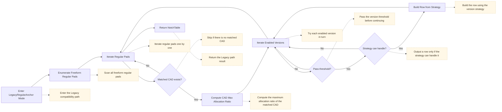
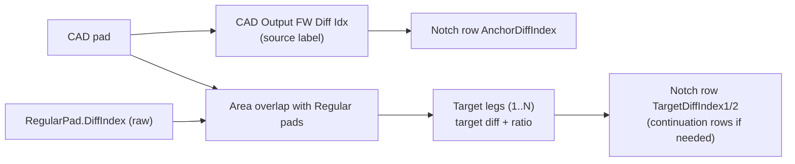
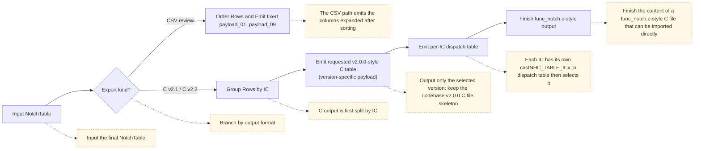

# Notch v2.1 / v2.2 Flow Definitions and Flowcharts (Current As-Is)

> Canonical reference: [`docs/reference/notch-system-reference.md`](../reference/notch-system-reference.md)
> This file retains detailed flowcharts and entrypoint breakdowns; if it differs from the canonical reference, the canonical reference takes precedence.

> Last updated: 2026-08-08
> Scope: the current `NotchTableGenerator` + `NotchTableExporter` + Step5 export selection paths

## 1. First Check: How to Produce a "Good Flowchart"

All flowcharts in this project follow these rules to avoid diagrams that look attractive but cannot be maintained.

### 1.1 Information Source Rules (Single Source of Truth)
- Flowchart nodes must correspond to actual code entries, not be inferred from UI text.
- Each node must correspond to at least one code location (file/method).
- If the same result has multiple entry points, draw only their shared converging path, without duplicate branches.

### 1.2 Layering Rules (Outside In)
- Layer A: user-visible flow (Step1~Step5 / export)
- Layer B: computation dispatch (`CadAllocation` vs `LegacyRegularAnchor`)
- Layer C: version strategies (`V21` / `V22`)
- Layer D: row payload assembly and output

### 1.3 Decision Node Rules
Each decision node must clearly answer:
- What the condition is
- What happens when it passes/fails
- Whether the flow terminates

### 1.4 Mermaid Naming Rules
- Name nodes with "verb + data", for example `Build CAD allocation profiles`.
- End Decision node names with `?`.
- Do not put long annotations in nodes; put long explanations in the "node mapping table" below the diagram.

### 1.5 Validation Rules (Required After Drawing)
- Use `rg` to check that key methods still exist.
- Check that both paths of each decision have a destination.
- Check that output payload fields match the code definitions (v2.1: 9 fields; v2.2 node: 7 fields).

---

## 2. Current Main Notch Flow (Overview)

### 2.1 Main Entry Points
- `src/FreeformHelper.Application/Services/NotchTableGenerator.cs`
  - `Generate(...)`
  - `EvaluateCadRowEligibility(...)`
- `src/FreeformHelper.UI/ViewModels/FreeformHelperViewModel.NotchTableGeneration.cs`
  - `GenerateCurrentNotchTableAsync(...)`
- `src/FreeformHelper.Application/Services/NotchCadOutputFwDiffProjectionService.cs`
  - `Project(...)`
- `src/FreeformHelper.UI/ViewModels/FreeformHelperViewModel.Operations.LayerFiltering.cs`
  - `RebuildVisibleDxfIndexMap(...)`

### 2.2 Overview Flowchart (Flow + Side Notes)

```mermaid
flowchart LR
    A["Build RegularGrid Key<br/>(IC, DiffIndex baseline)"] --> B["Run Step1 Geometry Match<br/>(CAD to Regular candidates)"]
    B --> B1["Build Match-Scope Active Regular Set<br/>(RegularToCad.Keys)"]
    B --> C0{"SeeRegular enabled?"}
    C0 -- "Yes" --> C1["Load SeeRegular Active Mask<br/>(CSV + toggle)"]
    C0 -- "No" --> C2["No SeeRegular Mask"]
    B1 --> C["Assign Step4 CAD Output FW Diff<br/>(override first, then strict seed)"]
    C1 --> C
    C2 --> C
    C --> D["Freeze Workflow Snapshot<br/>(CadOutputFwDiffIndexByCadId + ActiveRegularVisibilityMaskPadIds)"]
    D --> E["Generate Step5 Notch Table<br/>(GenerateCurrentNotchTableAsync)"]
    E --> F{"Enabled versions empty?"}
    F -- "Yes" --> Z["Return Empty NotchTable"]
    F -- "No" --> G{"Computation mode?"}
    G -- "CadAllocation (default)" --> H["Run GenerateCadAllocationCompatible"]
    G -- "LegacyRegularAnchor (compat)" --> I["Run GenerateLegacyRegularAnchor"]
    H --> J["Build Notch Rows<br/>(CadAllocation source already final)"]
    I --> J
    J --> K["Project Anchor Only + Build CAD Output Grid<br/>(NotchCadOutputFwDiffProjectionService)"]
    K --> L["Build Dual Grid Views + Final NotchTable<br/>(shared by Step5 / Simulation / export)"]
    L --> M["Export via NotchTableExporter<br/>(CSV / C v2.1 / C v2.2)"]

    A_CN["Build the RegularGrid baseline key and fix (IC, DiffIndex)"]:::note
    B_CN["Step1 builds CAD->Regular candidate matches"]:::note
    B1_CN["The matching result also defines the current active regular set"]:::note
    C0_CN["SeeRegular is an extra mask, not the Step1 active set itself"]:::note
    C_CN["Step4 assigns CAD Output FW Diff; override takes priority"]:::note
    D_CN["Freeze workflow snapshot; save both CAD output and Regular Visibility Mask (SeeRegular.csv)"]:::note
    E_CN["Enter the Step5 table generation entry"]:::note
    F_CN["If no version is enabled, return an empty table directly"]:::note
    G_CN["Branch to CadAllocation or Legacy based on settings"]:::note
    J_CN["CadAllocation rows fix source=CAD Output FW Diff at generation time"]:::note
    K_CN["Projection only corrects the anchor and the display CAD output grid; it no longer changes target"]:::note
    L_CN["Produce the final table and dual-grid view for shared downstream use"]:::note
    M_CN["Export CSV / C v2.1 / C v2.2 from the same payload"]:::note

    A -.-> A_CN
    B -.-> B_CN
    B1 -.-> B1_CN
    C0 -.-> C0_CN
    C -.-> C_CN
    D -.-> D_CN
    E -.-> E_CN
    F -.-> F_CN
    G -.-> G_CN
    J -.-> J_CN
    K -.-> K_CN
    L -.-> L_CN
    M -.-> M_CN

    classDef note fill:#FFF8E7,stroke:#D6B874,color:#3A3120,stroke-dasharray: 4 3;
```

### 2.3 Where Diff IDs Are Determined (Report Version)
- `FW Diff Idx` (Regular truth):
  - Comes from `RegularPad.DiffIndex` and is fixed in `RegularGrid` after Step0/grid construction.
- `CAD Output FW Diff Idx` (Step4 truth):
  - Generated by `CadOutputFwDiffIndexAssignmentService.Assign(...)`; the corresponding runtime snapshot field is `CadOutputFwDiffIndexByCadId`.
  - This value represents the FW diff / memory address to which the CAD pad will finally be output.
  - The priority is `manual override > strict best-match` (with uniqueness/conflict rules applied within the same IC).
- `Best-Match FW Diff Idx` (geometry seed):
  - Derived from the best-match / raw anchor regular, typically the regular `DiffIndex` selected by `SelectCadAllocationAnchor(...)`.
  - This is a seed for geometry and trace, not the final output address.
- Notch row source diff (Step5):
  - `CadAllocation` mode prioritizes `CAD Output FW Diff Idx` as the row source.
  - It falls back to the raw anchor diff only when no CAD output mapping is available (compatibility path).
- Target diff (v2.2 legs):
  - Always comes from Stage3 allocation's geometric aggregation of regular `(IC, Diff)`.
  - The target diff retains its `Regular FW Diff` identity and no longer undergoes Step4/CAD output projection.

---

## 3. Detailed `CadAllocation` Flow (Current Default)

### 3.1 Key Implementation Locations
- `src/FreeformHelper.Application/Services/NotchTableGenerator.Generation.cs`
- `src/FreeformHelper.Application/Services/NotchTableGenerator.Generation.Allocation.cs`
- `src/FreeformHelper.Application/Services/NotchTableGenerator.Generation.V22.cs`
- `src/FreeformHelper.Application/Services/NotchTableGenerator.Generation.Thresholds.cs`
- `src/FreeformHelper.Application/Services/NotchTableGenerator.Memo.cs`
- `src/FreeformHelper.Application/Services/NotchV22TargetAllocationService.cs`

### 3.2 Flowchart (Flow + Side Notes)

```mermaid
flowchart LR
    A["Enter CadAllocation Mode<br/>(GenerateCadAllocationCompatible)"] --> B["BuildCadAllocationGenerationContext"]
    B --> C["Build CAD Allocation Profiles<br/>(allocations / maxRatio / IC set)"]
    C --> D["Build CAD Pool by IC"]
    D --> E{"Need canonical projection?<br/>(V21 or V22 enabled)"}
    E -- "No" --> F["Use empty canonical candidate bucket"]
    E -- "Yes" --> G["BuildCanonicalCandidatesByDiff<br/>(parallel per profile)"]

    subgraph CB["Canonical Candidate Builder"]
        direction TB
        G0["Iterate CAD Profiles"]
        G1{"Has allocations?"}
        G2{"Anchor exists?"}
        G3["Select anchor per overlapped IC"]
        G4["Build V22 candidate<br/>(ToRegular / ToFull / Stage3 allocation)"]
        G5{"Candidate should be included?"}
        G6["Put candidate into bucket<br/>key=(IcIndex, SourceDiff)"]
        G0 --> G1
        G1 -- "No" --> G0
        G1 -- "Yes" --> G2
        G2 -- "No" --> G0
        G2 -- "Yes" --> G3 --> G4 --> G5
        G5 -- "No" --> G0
        G5 -- "Yes" --> G6 --> G0
    end

    G --> G0
    G0 -->|"all profiles done"| I["BuildCanonicalRows<br/>(BuildV22DiffCentricRows)"]
    F --> I
    I --> J["AppendCanonicalExports"]
    J --> K{"Export V22 enabled?"}
    K -- "Yes" --> L["Append canonical V22 rows"]
    K -- "No" --> M["Skip V22 append"]
    L --> N{"Export V21 enabled?"}
    M --> N
    N -- "Yes" --> O["ProjectV22RowsToV21Rows and append"]
    N -- "No" --> P["Skip V21 projection"]
    O --> Q["Return NotchTable<br/>(source/target identity fixed)"]
    P --> Q

    A_CN["The main entry only orchestrates and does not mix calculations directly"]:::note
    B_CN["Build the context first, explicitly passing stage-shared data"]:::note
    E_CN["If neither V21 nor V22 is enabled, the canonical bucket is empty directly"]:::note
    G_CN["Candidate building is still per-profile, but runs in parallel"]:::note
    I_CN["Canonical rows come from a single path: v2.2 diff-centric"]:::note
    J_CN["Finally decide whether to output v2.2 and/or project v2.1"]:::note
    Q_CN["CadAllocation's returned table already fixes source/target identity; later steps only do anchor alignment and display grid"]:::note

    A -.-> A_CN
    B -.-> B_CN
    E -.-> E_CN
    G -.-> G_CN
    I -.-> I_CN
    J -.-> J_CN
    Q -.-> Q_CN

    classDef note fill:#FFF8E7,stroke:#D6B874,color:#3A3120,stroke-dasharray: 4 3;
```

### 3.3 Key Node Explanations
- `Build CAD allocation profiles`
  - Compute allocations and select an anchor for each CAD.
  - Allocation computation has a memo cache (reusable for the same grid + geometry).
- `Build match-scope boundary regular set`
  - Comes from the `match-scope active regular set`, not the `Regular Visibility Mask (SeeRegular.csv)`.
  - The rule is:
    - The regular is on the outer edge of the grid, or
    - Any top/bottom/left/right neighbor is missing / outside the active set
  - Since 2026-04-25, this set has been precomputed once per generation, then filtered and reused within each candidate.
- `Pass threshold?`
  - `V22` uses `PassesV22Threshold`.
  - Other versions use `PassesV21ThresholdQ7`.
- `Build V22 candidate`
  - First run `NotchV22CompensationService.Compute(...)` to obtain ToRegular/ToFull.
  - Retain `ToRegular%` / `ToFull%` as diagnostics/comments.
  - Since beta0.9, `CombinePercent` for `Current (Gain)` / `Conservative (No Gain)` has been determined by the sum of per-target regular coverage, capped at 255:
    - `Current (Gain)`: `Σ(stage3EffectiveAreaOnTarget / targetRegularArea)`.
    - `Conservative (No Gain)`: `Σ(overlapAreaOnTarget / targetRegularArea)`.
  - This avoids multiplying each target share by the whole CAD's `R` as a source-wide gain.
  - `Boundary virtual-area cap` is part of the middle Step3 compensation stage: it limits the effective virtual area extended by the ToFull boundary without changing Step1/Step4 mapping.
  - Source diff prioritizes `CAD Output FW Diff Idx`; target legs are built only from geometric aggregation of regular `(IC,Diff)`.
  - Build target legs; coverage above `100%` is split into multiple <=100% chunks to fit the v2.2 `INT8` ratio payload.
- `BuildV22DiffCentricRows`
  - Select only one primary candidate for the same `(IC,Diff)`.
  - `Target coverage guard` is part of the middle Step3 compensation stage: after primary candidates are selected and before row payload generation, it limits total coverage on the same target diff to prevent Current(Gain) from accumulating EMS risk at boundaries.
  - Group leg data into rows of 2.
  - The first row uses the actual `CombinePercent`; continuation rows force `CombinePercent=100` and set the continuation flag.

### 3.4 Boundary / Active-Set Rules (CadAllocation)
1. `activeRegularPadIds`
   - Currently comes from `_latestPadMatchResult.RegularToCad.Keys`
   - Means "regulars to which CAD has already been allocated"
2. `Regular Visibility Mask (SeeRegular.csv)`
   - A separate set of additional restrictions
   - Currently not used directly as the source of `ToFull boundary`
   - It is an upstream geometry/visibility input, not a Step3 compensation item; therefore it should not carry EMS cap or target coverage behavior.
3. `boundary seed`
   - Currently defined as `grid outer edge OR inactive neighbor in match-scope active set`
4. `StageB` reuse strategy
   - Build the complete boundary regular index set first within the same generation
   - Each candidate filters only its own overlapped regulars
   - This is caching/reuse and does not change output values

### 3.5 Diff ID Assignment Rules (CadAllocation)
1. `SourceDiff` source:
   - First check Step4's `CAD Output FW Diff Idx`.
   - Fall back to the raw anchor regular `DiffIndex` selected by `SelectCadAllocationAnchor(...)` only when no mapping is available.
2. `Bucket key` source:
   - Each candidate enters the bucket with `key=(IcIndex, SourceDiff)`, ensuring that the same IC and final source diff converge together.
3. `TargetDiff` source:
   - `NotchV22TargetAllocationService.Build(...)` first aggregates regulars hit by Stage3 by `(IC,Diff)`, then converts them into legs.
   - Target diff is always `Regular FW Diff` and is never rewritten by Step4 / SeeRegular.
4. When multiple CADs compete for the same key:
   - `SelectPrimaryV22Candidate(...)` selects one primary by a fixed priority to avoid multiple main paths for the same `(IC,Diff)`.
5. Align with Step4 after table generation:
   - `NotchCadOutputFwDiffProjectionService.Project(...)` only aligns the row anchor diff by `CadPadId` and builds the display-only CAD output grid.
   - Target diff no longer undergoes visible/CAD output projection.

### 3.6 Compensation Semantics and Physical Assumptions
1. `ToRegular`
   - In domain terms, this should mean "undo NF's partial flattening of area differences".
   - That is, first restore the sensing value to a state closer to area proportionality, rather than simply applying gain.
2. `ToFull`
   - In domain terms, this should mean "Boundary / edge-extension support".
   - Its primary purpose is to give boundary regulars enough allocatable support to assist edge reporting.
3. beta0.7 baseline
   - `NotchV22TargetAllocationService.Build(...)` uses `ReachableArea` as `EffectiveArea` in target allocation for regulars with `IsToFullApplied`.
   - This means full-area expansion directly affects the target ratio.
4. beta0.8 prototype
   - The primary target allocation weight was first changed back to `SourceArea`.
   - `ToFull` temporarily retains only the support / inclusion signal and no longer directly controls the ratio.
   - This can improve cases where tiny overlaps are amplified, but the full cap / allowance is not yet complete.
5. beta0.9 gain-mode correction
  - `Current (Gain)` uses per-target Stage3 coverage: `stage3EffectiveAreaOnTarget / targetRegularArea`.
  - `Conservative (No Gain)` uses per-target source overlap coverage: `overlapAreaOnTarget / targetRegularArea`.
  - `ToRegularRatio = Σ(overlapArea / targetRegularArea)` remains a diagnostic value but is no longer multiplied into all target shares as a source-wide gain.
  - Split a leg above `100%` into continuation/chunk legs to preserve the v2.2 `INT8` ratio payload.
6. beta0.9 boundary / coverage guards
  - `Boundary virtual-area cap`: caps the virtual outward expansion area produced by ToFull; by default, expansion may not exceed 100% of the original overlap area.
  - `Target coverage guard`: caps the retained + incoming coverage that the same `(IC, FW Diff)` will finally receive; the default is 120%, equivalent to keeping After below approximately 480 for uniform 400.
  - Both are Step3 compensation switches, placed after ToRegular/ToFull geometry computation and before v2.1/v2.2 row payload assembly.
  - After the beta0.9 target-regular coverage correction, the 3635 Current(Gain) uniform 400 diagnostic converged to `max=424 / violations=0`; the guard remains as an EMS safety net.
7. Simulation physical audit gate
   - `SimulationSafetyAuditService.Analyze(NotchApplySimulationResult)` is the formal audit entry point, taking the same simulation `Cells + Actions` as input.
   - The audit checks the EMS cap, global action-flow residual, per-diff net-flow residual, and target coverage cap.
   - Risk categories are `GeometryExpected`, `NetFlowSuspicious`, and `EmsRisk`; `global 400` is only a diagnostic input, not a goal of "the closer to 400, the more correct".
   - Both the Simulation VM and the export safety snapshot use this audit result to prevent UI, export, and inspector from deriving different conclusions again from partial data.
8. Copper path replay
   - `SimulationWorkspaceUseCase.ReplayCopperPath(...)` moves the copper center along a specified path.
   - Each point follows `BuildCopperDataset -> BuildSnapshot -> SimulationSafetyAuditService.Analyze(...)` and records Max After, EMS violations, worst diff, and physical audit counts.
   - Its purpose is to automate validation of the edge and notch regions instead of relying only on manual mouse preview.
9. Recommended future direction
   - `exact overlap` should be the base weight.
   - `ToFull` is better used only as `support mask / cap / boundary allowance`, without directly controlling the ratio.
   - `global=400` should be a diagnostic input, not an objective function of "the closer to 400, the more correct".
   - Target allocation still needs an `area-preserving + EMS-guarded` audit: preserve area ratios, check net-flow residuals, and treat `After > 480` as a safety risk.
10. Version and mode recommendations
   - canonical truth: `v2.2 + without gain`
   - `without gain`: `C = ToRegular`; ToFull retains only support / cap / allowance and does not amplify the source combine
   - `v2.1`: compatibility projection only
   - `with gain`: changed to Stage3 effective allocation, but retained for calibration/research and unsuitable as the default main path

---

## 4. Detailed `LegacyRegularAnchor` Flow

### 4.1 Key Implementation Locations
- `src/FreeformHelper.Application/Services/NotchTableGenerator.Generation.cs`
  - `GenerateLegacyRegularAnchor(...)`

### 4.2 Flowchart (Flow + Side Notes)

---

## 5. Version Strategies (V21 / V22)

### 5.1 `V21NotchAlgorithm`
- File: `src/FreeformHelper.Application/Services/NotchAlgorithms/V21NotchAlgorithm.cs`
- Output: a 9-field legacy row.
- Key behavior:
  - `v[1]`: CAD area / REG area percentage.
  - `v[2]`: CAD bounds area / REG area percentage.
  - `v[3..8]`: populate left/right (or top/bottom) information from XWay/YWay boundaries and neighboring diffs.

### 5.2 `V22LegacyRowStrategy` (Legacy 9-Field Compatibility Path)
- File: `src/FreeformHelper.Application/Services/NotchAlgorithms/V22LegacyRowStrategy.cs`
- Output: a 9-field legacy row (strategy layer); the actual main Step5 output primarily uses the 7-field `NotchV22Node`.
- Key behavior:
  - In public `Generate`, only `LegacyRegularAnchor` calls this strategy's `Build`; the main `CadAllocation` path does not go through it.
  - After mode dispatch, `Generate` synchronously reports to the caller-provided `IProgress`; its callback can modify the same mutable settings, causing `Build` to read CadAllocation again. Therefore, R13.004f retains the compensation branch, comment, and `allCadPads`, without mistaking absence from the normal flow for unreachability through the public API.
  - `CanHandle` is still shared by CadAllocation eligibility queries, but eligibility does not call `Build`; consolidation of this cross-mode seam is left to R13.101 to R13.103.

---

## 6. V22 Node (Main Step5 Payload)

### 6.1 Field Definitions (7 ints)
Type: `src/FreeformHelper.Domain/Notch/NotchV22Node.cs`

1. `AnchorDiffIndex`
2. `CombinePercent` (0..255)
3. `TargetDiffIndex1` (NullValue when there is no target)
4. `TargetRatioPercent1` (-100..100)
5. `TargetDiffIndex2` (NullValue when there is no target)
6. `TargetRatioPercent2` (-100..100)
7. `Flags` (continuation bit)

### 6.2 Continuation Row Rules
- First row: retain the actual combine.
- Continuation rows: `CombinePercent = 100`; set continuation in `Flags`.
- Purpose: allow multiple target legs with the same anchor diff to be serialized into multiple rows.

### 6.3 Notes on Anchor / Target Diff Sources
- `AnchorDiffIndex`
  - In `CadAllocation` mode, prioritize `CAD Output FW Diff Idx`.
  - Compatibility/legacy paths may still build rows with the raw anchor diff first, then align them with Step4 CAD output through `NotchCadOutputFwDiffProjectionService.Project(...)`.
- `TargetDiffIndex1/2`
  - Original values come from target legs aggregated by Stage3 allocation.
  - Target diff always retains its regular FW diff identity and is no longer rewritten through projection.

### 6.4 Terminology Relationship Table (CAD / Visible / Regular / Row)

This section defines consistently "what is fixed, what can change, what is the source, and what is the destination".

| Term | Layer | Fixed? | Definition |
| --- | --- | --- | --- |
| `FW Diff Idx` | Regular pad | Fixed | Corresponds to `RegularPad.DiffIndex` in the current code. Fixed after grid construction, representing the hardware/FW identity of the regular cell. |
| `Best-Match FW Diff Idx` | CAD pad / geometry seed | Variable | A geometry seed obtained by CAD from the best-match/raw anchor regular. Used for trace/anchor fallback; does not represent the final output address. |
| `CAD Output FW Diff Idx` | CAD pad | Variable | The FW diff / memory address to which the CAD pad will finally be output after Step4 (including override / SeeRegular). The current workflow snapshot field is `CadOutputFwDiffIndexByCadId`. |
| `AnchorDiffIndex` (row source) | Notch row | Fixed at the end | The source diff of the Step5 row. CadAllocation uses `CAD Output FW Diff Idx` directly; only legacy compatibility paths may project it afterward. |
| `TargetDiffIndex` (row target) | Notch row | Fixed | Comes from geometric allocation legs from CAD to regulars and always uses regular FW diff. |
| `Leg` | Notch row | N/A | A single `source -> target` allocation item (including `TargetRatioPercent`). |
| `Candidate` | CAD profile | N/A | A `source + legs` proposal derived from a single CAD. |
| `Bucket (IC, SourceDiff)` | Aggregation layer | N/A | Converges candidates with the same IC and final source diff. |

Key mapping rules:

1. `CAD -> CAD Output FW Diff Idx` is single-valued (each CAD has only one final output source).
2. `CAD Output FW Diff Idx -> CAD` should generally remain unique; duplicates indicate an anomaly in Step4 assignment or the data, and the root cause should be investigated first.
3. One CAD can allocate to multiple target diffs (`1 source -> N targets`); v2.2 places at most 2 legs in each row only during serialization.
4. Simulation workspace must separate two diff identities: `FW Diff Idx` (regular/raw identity) and `CAD Output FW Diff Idx` (CAD source/output identity).

A practical rule to remember:
- Source (anchor) follows the CAD's `CAD Output FW Diff Idx`; Target follows the `FW Diff Idx` from the geometric allocation between CAD and regulars.

---

## 7. Export Flow (CSV / C)

### 7.1 Key Implementation Locations
- `src/FreeformHelper.Application/Export/NotchTableExporter.cs`

### 7.2 Flowchart (Flow + Side Notes)

### 7.3 Output Contracts
- CSV review: fixed review fields + `payload_01..payload_09`; intended for trace / diff review, not as the FW direct-import contract.
- `C v2.1`:
  - Output in the codebase v2.0.0 `func_notch.c` style.
  - Retain legacy `ST_PRI_NHC_TABLE_NODE_INFO` fields; leg ratio is a `UINT8 0..255` Q7 magnitude (`128=100%`), with the sign carried only by `NHC_TYPE_ADD/SUB`.
  - `ThresholdQ7` is a separate `0..128` admission gate; the two must not share the same upper limit.
  - On the CadAllocation canonical path, `NotchV21FirmwareProjector` projects the source-oriented v2.1 payload into destination-oriented rows that the legacy FW function can apply correctly; both the C formatter and C# simulation consume the same final node.
  - Firmware apply uses raw integer `(INT16 source * magnitudeQ7) >> 7`; simulation and GCC runtime must match exactly at every point, without approximation from decoding percent first.
- `C v2.2`:
  - Likewise, output in the codebase v2.0.0 `func_notch.c` style.
  - Do not use a unified root / accessor; the external entry remains `FUNC_NHC_DiffCompensation(void)`, with `FUNC_NHC_DiffCompensationByIc(UINT8 u8Ic)` for multiple ICs.
  - Change the table payload to source-oriented v2.2 nodes; legs retain `INT8 -100..100` signed percent and do not use the V21 Q7 codec. The algorithm applies source backup + legs within `FUNC_NHC_DiffCompensationOneTable(...)`.
- Multiple ICs:
  - Each IC has its own `castNHC_TABLE_ICx`.
  - `castNHC_TABLE_BY_IC` handles dispatch.
  - `castNHC_TABLE` is the legacy alias for IC1.

---

## 8. UI Display and Notch Row Mapping (Step5)

### 8.1 Key Implementation Locations
- `src/FreeformHelper.UI/ViewModels/NotchExportSelectionViewModel.cs`
- `src/FreeformHelper.UI/ViewModels/NotchExportSelectionViewModel.Models.cs`
- `src/FreeformHelper.UI/Services/NotchExportSelectionProjectionBuilder.cs`

### 8.2 Display Highlights
- v2.2 row statistics count only `Row.Version == V22`.
- `Transfer-only` excludes no-op rows (`combine=100` and target1/2 both empty).
- warning/no-cad/legacy labels are derived from the row payload and cad link state.

### 8.3 Shared Simulation Contract (S11.135)
- `src/FreeformHelper.Application/Services/NotchApplySimulationService.cs`
- `src/FreeformHelper.Application/Services/NotchDiffIdentityPipeline.cs`
- `src/FreeformHelper.Application/Services/NotchApplySimulationModels.cs`
- `src/FreeformHelper.UI/Services/RuntimeQueryUseCase.Commands.Simulation.cs`
- `src/FreeformHelper.UI/ViewModels/FreeformHelperViewModel.Simulation.cs`
- `src/FreeformHelper.UI/ViewModels/ShellViewModel.Workspaces.cs`
- `src/FreeformHelper.UI/ViewModels/SimulationHostViewModel.cs`

Key points:
- The Simulation baseline uses `NotchDiffIdentityPipeline.BuildActiveDiffBaseline(...)`; UI/Simulation no longer independently re-derive duplicate diff rules.
- Simulation workspace separates two paths: `FwDiffGrid` (FW Diff Idx) retains regular/raw diffs, while `CadOutputFwDiffGrid` (compatibility alias: `CadLayerDiffGrid`) is only a CAD output projection view for display.
- Simulation active surface currently uses:
  - `full regular grid`, or
  - `full regular grid ∩ Regular Visibility Mask (SeeRegular.csv)` (when the mask is loaded and enabled)
- Simulation build behavior:
  - Show the host page and build overlay first
  - Share Step5 `GenerateCurrentNotchTableAsync(...)`
  - Bind directly on a cache/prewarm hit; otherwise perform a cold build
- Duplicate diff uses the fixed strategy `merge-sum-active-regular-pads` and outputs the structured contract `NotchApplySimulationDiffIdentityContract`.
- The Runtime query `simulation` payload always includes `workspace.diffIdentity`:
  - `HasDuplicateDiffResolutions`
  - `DuplicateDiffResolutionCount`
  - `DuplicateDiffResolutionStrategyText`
  - `DuplicateDiffResolutionSummaryText`
  - `DuplicateDiffResolutionSampleText`

---

## 9. Current Fixed Contracts (Required Reading Before Algorithm Changes)
- The same user-visible result must not have multiple recomputation paths; a shared result model is required.
- `CadAllocation` is the default path; `LegacyRegularAnchor` is retained only for compatibility.
- The v2.2 display name is standardized as `V22 / v2.2`; the `V30` name is no longer used.
- The payload displayed in the UI before export must match the final exported payload (the same row model).

---

## 10. Quick Audit Checklist (Before and After Notch Changes)
- [ ] No parallel recomputation path has been added at the `Generate(...)` entry point.
- [ ] `PassesThresholdForVersion(...)` rules remain consistent.
- [ ] `V22` row continuation rules remain intact.
- [ ] CSV review, C v2.1, and C v2.2 have consistent field semantics for the same row.
- [ ] Step5 display statistics match the actual exported record count.

