# Notch / Simulation Visual Library

> Canonical reference: [Notch System Reference](../../../reference/notch-system-reference.md)
> Chinese version: [中文圖庫](../zh-TW/README.md)

This diagram set separates the current algorithm into two major paths, then splits each path into smaller reviewable modules:

- [Notch table module map](notch-table.md): row identity, candidate assembly, compensation, and output projection.
- [Simulation module map](simulation.md): source frame, shared apply path, physical audit, and UI / export / replay.

The overview diagram includes Mermaid `click` links. If your Markdown renderer disables clickable Mermaid nodes, use the text links above.

## Overview

```mermaid
%%{init: {"theme": "base", "securityLevel": "loose", "flowchart": {"curve": "basis", "htmlLabels": true, "nodeSpacing": 48, "rankSpacing": 58}, "themeVariables": {"fontFamily": "Inter, Segoe UI, Noto Sans TC, Arial, sans-serif", "fontSize": "15px", "primaryTextColor": "#172033", "lineColor": "#6B7280", "clusterBkg": "#F8FAFC", "clusterBorder": "#CBD5E1"}}}%%
flowchart LR
    subgraph INPUT["Input identity / 輸入身分"]
        direction TB
        CAD["CAD pads<br/>geometry + CAD id"]:::source
        REG["Regular grid<br/>IC + FW Diff"]:::source
        MASK["SeeRegular mask<br/>optional active surface"]:::source
    end

    SNAP["WorkflowDataSnapshot<br/>frozen identity contract"]:::contract

    subgraph NT["Notch table calculation"]
        direction TB
        NT1["Identity contract<br/>Regular / CAD / SeeRegular"]:::compute
        NT2["Candidate assembly<br/>CadAllocation bucket"]:::compute
        NT3["Compensation + target<br/>ToRegular / ToFull / Stage3"]:::gate
        NT4["Canonical output<br/>v2.2 -> v2.1 / export"]:::output
    end

    subgraph SIM["Simulation verification"]
        direction TB
        SIM1["Source frame<br/>Manual / CSV / Copper"]:::compute
        SIM2["Shared apply path<br/>BuildSnapshot -> Simulate"]:::compute
        SIM3["Physical audit<br/>EMS / net-flow / geometry"]:::gate
        SIM4["UI + export + replay<br/>same audit snapshot"]:::output
    end

    CAD --> SNAP
    REG --> SNAP
    MASK -. "active pad constraint" .-> SNAP
    SNAP --> NT1 --> NT2 --> NT3 --> NT4
    NT4 --> SIM2
    SIM1 --> SIM2 --> SIM3 --> SIM4

    NT_NOTE["Notch table path decides row identity and payload.<br/>It does not consume Manual / CSV / Copper values."]:::note
    SIM_NOTE["Simulation path consumes one table and one input frame.<br/>It does not regenerate notch rows."]:::note
    NT4 -.-> NT_NOTE
    SIM2 -.-> SIM_NOTE

    click NT1 "./notch-table-identity.md" "Open identity contract diagram"
    click NT2 "./notch-table-candidate.md" "Open candidate assembly diagram"
    click NT3 "./notch-table-compensation.md" "Open compensation and target diagram"
    click NT4 "./notch-table-output.md" "Open output projection diagram"
    click SIM1 "./simulation-source.md" "Open source frame diagram"
    click SIM2 "./simulation-apply.md" "Open shared apply diagram"
    click SIM3 "./simulation-audit.md" "Open physical audit diagram"
    click SIM4 "./simulation-ui-export.md" "Open UI export replay diagram"

    classDef source fill:#E0F2FE,stroke:#0284C7,color:#0F172A,stroke-width:1px;
    classDef contract fill:#F5F3FF,stroke:#7C3AED,color:#1E1B4B,stroke-width:1.5px;
    classDef compute fill:#ECFDF5,stroke:#059669,color:#052E2B,stroke-width:1px;
    classDef gate fill:#FFF7ED,stroke:#EA580C,color:#431407,stroke-width:1.5px;
    classDef output fill:#F8FAFC,stroke:#475569,color:#111827,stroke-width:1px;
    classDef note fill:#FFFBEB,stroke:#D97706,color:#3A2A0A,stroke-dasharray: 4 3;
```

## Reading Order

1. Start with the overview to separate Notch table responsibility from Simulation responsibility.
2. Read the [Notch table module map](notch-table.md), then identity, candidate, compensation, and output.
3. Read the [Simulation module map](simulation.md), then source, apply, audit, and UI/export/replay.

## Module Index

| Path | Module | Diagram |
| --- | --- | --- |
| Notch table | Identity contract | [notch-table-identity.md](notch-table-identity.md) |
| Notch table | Candidate assembly | [notch-table-candidate.md](notch-table-candidate.md) |
| Notch table | Compensation + target | [notch-table-compensation.md](notch-table-compensation.md) |
| Notch table | Output projection | [notch-table-output.md](notch-table-output.md) |
| Simulation | Source frame | [simulation-source.md](simulation-source.md) |
| Simulation | Shared apply path | [simulation-apply.md](simulation-apply.md) |
| Simulation | Physical audit | [simulation-audit.md](simulation-audit.md) |
| Simulation | UI / export / replay | [simulation-ui-export.md](simulation-ui-export.md) |

