# Notch Table: Candidate Assembly

> Back to [Notch table module map](notch-table.md)
> 中文: [Candidate assembly](../zh-TW/notch-table-candidate.md)

This diagram shows how canonical candidates are formed. The key point is that the CadAllocation path buckets by `(IC, SourceDiff)`, preventing export, inspector, or simulation from rebuilding row ownership separately.

```mermaid
%%{init: {"theme": "base", "flowchart": {"curve": "basis", "htmlLabels": true, "nodeSpacing": 44, "rankSpacing": 56}, "themeVariables": {"fontFamily": "Inter, Segoe UI, Noto Sans TC, Arial, sans-serif", "fontSize": "14px", "primaryTextColor": "#172033", "lineColor": "#64748B", "clusterBkg": "#FFFFFF", "clusterBorder": "#CBD5E1"}}}%%
flowchart LR
    ENTRY["GenerateCurrentNotchTableAsync<br/>UI command entry"]:::entry

    subgraph MODE["Generation mode"]
        direction TB
        M1{"Mode selected?"}:::decision
        M2["CadAllocation<br/>default canonical path"]:::compute
        M3["LegacyRegularAnchor<br/>compatibility path"]:::legacy
    end

    subgraph CAND["Canonical candidate build"]
        direction TB
        C1["Read snapshot<br/>active CAD + Regular surface"]:::contract
        C2["Resolve source diff<br/>CAD Output FW Diff first"]:::compute
        C3["Create candidate profile<br/>area, anchor, owner"]:::compute
        C4["Bucket by<br/>(IC, SourceDiff)"]:::compute
        C5["Select primary owner<br/>one row owner per bucket"]:::gate
    end

    subgraph FILTER["Eligibility and diagnostics"]
        direction TB
        F1["Boundary eligibility<br/>overlap + active surface"]:::compute
        F2["Coverage diagnostics<br/>retained + incoming"]:::compute
        F3["Warnings<br/>visible before payload"]:::artifact
    end

    ENTRY --> M1
    M1 -- "CadAllocation" --> M2 --> C1 --> C2 --> C3 --> C4 --> C5
    M1 -- "Legacy" --> M3
    C3 --> F1 --> F2 --> F3
    F2 --> C5

    N1["Source diff fallback is allowed only when CAD output mapping is missing."]:::note
    N2["Legacy path remains compatibility behavior; new optimization should target CadAllocation first."]:::note
    C2 -.-> N1
    M3 -.-> N2

    classDef entry fill:#F5F3FF,stroke:#7C3AED,color:#1E1B4B,stroke-width:1.5px;
    classDef compute fill:#ECFDF5,stroke:#059669,color:#052E2B;
    classDef decision fill:#FEF3C7,stroke:#D97706,color:#3A2A0A;
    classDef contract fill:#EEF2FF,stroke:#4F46E5,color:#1E1B4B,stroke-width:1.5px;
    classDef gate fill:#FFF7ED,stroke:#EA580C,color:#431407,stroke-width:1.5px;
    classDef legacy fill:#F8FAFC,stroke:#64748B,color:#334155,stroke-dasharray: 5 4;
    classDef artifact fill:#F0FDFA,stroke:#0D9488,color:#042F2E,stroke-width:1.5px;
    classDef note fill:#FFFBEB,stroke:#D97706,color:#3A2A0A,stroke-dasharray: 4 3;
```

## Candidate Rules

| Rule | Description |
| --- | --- |
| Bucket key | `(IC, SourceDiff)` is the main grouping for v2.2 canonical row ownership. |
| Source diff | The CadAllocation path uses CAD Output FW Diff first. |
| Primary owner | One row owner is selected per bucket to avoid downstream re-interpretation. |
| Diagnostics | Coverage and boundary warnings must be visible before payload generation. |
