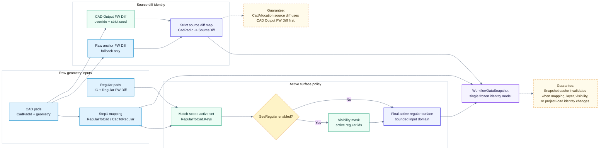

# Notch Table: Identity Contract

> Back to [Notch table module map](notch-table.md)
> 中文: [Identity contract](../zh-TW/notch-table-identity.md)

This diagram verifies that every identity source converges into `WorkflowDataSnapshot` before Step5 rows are generated. Table generation, inspector, and export should not re-derive the same result from partial UI state.

## Contract

| Item | Responsibility |
| --- | --- |
| `RegularGrid` | Provides stable IC / Regular FW Diff identity. |
| Step1 mapping | Defines the computable CAD-to-Regular scope. |
| SeeRegular mask | Restricts the active surface without changing source diff semantics. |
| `WorkflowDataSnapshot` | The only frozen input contract for Step5 table calculation. |
