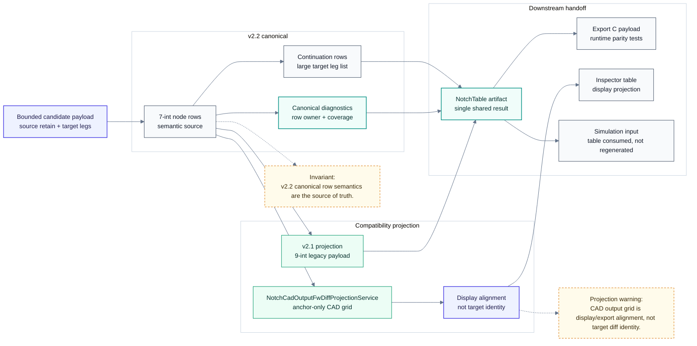

# Notch Table: Output Projection

> Back to [Notch table module map](notch-table.md)
> 中文: [Output projection](../zh-TW/notch-table-output.md)

This diagram describes the final handoff. v2.2 canonical rows are the semantic source; v2.1 payload and CAD output grid are projections and must not become reverse sources of table identity.

## Projection Rules

| Projection | Rule |
| --- | --- |
| v2.2 canonical | Semantic source consumed by Simulation and export. |
| v2.1 compatibility | Legacy payload projection only; it does not redefine row identity. |
| CAD output grid | Anchor/display/export alignment only; it does not override target Regular FW Diff. |
| C export parity | Exported C runtime must match the C# simulation path point by point. |
