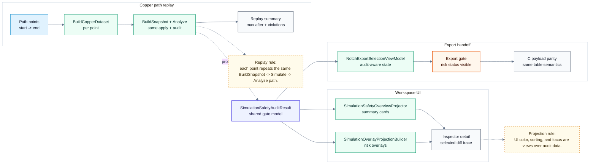

# Simulation: UI / Export / Replay

> Back to [Simulation module map](simulation.md)
> 中文: [UI / export / replay](../zh-TW/simulation-ui-export.md)

This diagram shows how the audit result is shared by UI, export gate, and copper replay. This layer only projects and presents results; it does not re-decide physical plausibility.

## Projection Rules

| Area | Rule |
| --- | --- |
| Overlay | Projects `SimulationSafetyAuditResult` and simulation cells only. |
| Inspector | Shows the selected diff action trace without recalculating flow. |
| Export gate | Presents risk status from the same audit snapshot. |
| Copper replay | Runs the same apply + audit pipeline for every path point. |
