# Simulation Module Map

> Back to [English library](README.md)
> 中文: [Simulation 模組地圖](../zh-TW/simulation.md)

Simulation does not regenerate Notch rows. It consumes one Notch table and converges Manual / CSV / Copper before frames into the same apply and audit path.

## Module Map

```mermaid
%%{init: {"theme": "base", "flowchart": {"curve": "basis", "htmlLabels": true, "nodeSpacing": 44, "rankSpacing": 56}, "themeVariables": {"fontFamily": "Inter, Segoe UI, Noto Sans TC, Arial, sans-serif", "fontSize": "14px", "primaryTextColor": "#172033", "lineColor": "#64748B", "clusterBkg": "#FFFFFF", "clusterBorder": "#CBD5E1"}}}%%
flowchart LR
    subgraph A["1. Source frame"]
        direction TB
        A1["Workspace session<br/>table + grid"]:::entry
        A2["Manual / CSV / Copper<br/>before values"]:::source
        A3["Imported dataset<br/>compatible frame model"]:::contract
    end

    subgraph B["2. Shared apply path"]
        direction TB
        B1["BuildSnapshot<br/>NotchApplySimulationReviewUseCase"]:::compute
        B2["NotchApplySimulationService<br/>Cells + Actions"]:::compute
        B3["Simulation result<br/>single result model"]:::artifact
    end

    subgraph C["3. Physical audit"]
        direction TB
        C1["SimulationSafetyAuditService.Analyze"]:::gate
        C2["EMS cap<br/>After <= 480"]:::risk
        C3["Net-flow residual<br/>cell delta vs actions"]:::risk
        C4["Geometry coverage<br/>retained + incoming"]:::risk
    end

    subgraph D["4. UI / export / replay"]
        direction TB
        D1["Overlay + inspector<br/>risk diff focus"]:::output
        D2["Export gate<br/>same audit snapshot"]:::output
        D3["Copper path replay<br/>repeat same apply + audit"]:::output
    end

    A1 --> A2 --> A3 --> B1 --> B2 --> B3
    B3 --> C1
    C1 --> C2 --> D1
    C1 --> C3 --> D1
    C1 --> C4 --> D1
    D1 --> D2
    D1 --> D3

    N1["Module rule:<br/>Manual, CSV, and Copper differ only before BuildSnapshot."]:::note
    N2["Gate rule:<br/>UI, export, inspector, and replay consume the same audit model."]:::note
    A3 -.-> N1
    C1 -.-> N2

    click A3 "./simulation-source.md" "Open source frame diagram"
    click B3 "./simulation-apply.md" "Open shared apply diagram"
    click C1 "./simulation-audit.md" "Open physical audit diagram"
    click D3 "./simulation-ui-export.md" "Open UI export replay diagram"

    classDef source fill:#E0F2FE,stroke:#0284C7,color:#0F172A;
    classDef entry fill:#F5F3FF,stroke:#7C3AED,color:#1E1B4B,stroke-width:1.5px;
    classDef contract fill:#EEF2FF,stroke:#4F46E5,color:#1E1B4B,stroke-width:1.5px;
    classDef compute fill:#ECFDF5,stroke:#059669,color:#052E2B;
    classDef decision fill:#FEF3C7,stroke:#D97706,color:#3A2A0A;
    classDef gate fill:#FFF7ED,stroke:#EA580C,color:#431407,stroke-width:1.5px;
    classDef risk fill:#FEE2E2,stroke:#DC2626,color:#450A0A;
    classDef output fill:#F8FAFC,stroke:#475569,color:#111827;
    classDef artifact fill:#F0FDFA,stroke:#0D9488,color:#042F2E,stroke-width:1.5px;
    classDef note fill:#FFFBEB,stroke:#D97706,color:#3A2A0A,stroke-dasharray: 4 3;
```

## Entrypoint Map

| Responsibility | Current entry |
| --- | --- |
| Simulation session | `FreeformHelperViewModel.CreateSimulationWorkspaceSessionAsync(...)` |
| Workspace orchestration | `SimulationWorkspaceViewModel` |
| Dataset builder | `SimulationWorkspaceUseCase.BuildManualDataset(...)` / `BuildCopperDataset(...)` |
| CSV import and projection | `NotchApplySimulationReviewUseCase.ImportSources(...)` |
| Shared apply model | `NotchApplySimulationService.Simulate(...)` |
| Safety and physical audit | `SimulationSafetyAuditService.Analyze(NotchApplySimulationResult)` |
| Copper sweep | `SimulationWorkspaceUseCase.ReplayCopperPath(...)` |

## Detail Diagrams

- [Source frame](simulation-source.md): how Manual / CSV / Copper converge into a before frame.
- [Shared apply path](simulation-apply.md): how BuildSnapshot and `NotchApplySimulationService` produce Cells + Actions.
- [Physical audit](simulation-audit.md): how EMS / net-flow / geometry audit becomes the formal gate.
- [UI / export / replay](simulation-ui-export.md): how overlay, inspector, export gate, and copper replay reuse the same audit result.

