# Notch Table：Compensation + Target Allocation

> 回到 [Notch table 模組地圖](notch-table.md)
> English: [Compensation + target allocation](../en/notch-table-compensation.md)

這張圖把補償幾何與 target leg 建立分開。`NotchV22CompensationService` 決定 Stage geometry；`NotchV22TargetAllocationService` 消費 Stage3 area 並保留 Regular FW Diff 身分。

```mermaid
%%{init: {"theme": "base", "flowchart": {"curve": "basis", "htmlLabels": true, "nodeSpacing": 44, "rankSpacing": 56}, "themeVariables": {"fontFamily": "Inter, Segoe UI, Noto Sans TC, Arial, sans-serif", "fontSize": "14px", "primaryTextColor": "#172033", "lineColor": "#64748B", "clusterBkg": "#FFFFFF", "clusterBorder": "#CBD5E1"}}}%%
flowchart LR
    CAND["Primary candidate<br/>CAD area + source diff"]:::contract

    subgraph COMP["NotchV22CompensationService"]
        direction TB
        R1["ToRegular stage<br/>regular overlap recovery"]:::compute
        R2["ToFull stage<br/>reachable full area"]:::compute
        R3["Stage3 area<br/>allocation base"]:::contract
        R4["Boundary query context<br/>shared spatial index"]:::compute
    end

    subgraph TARGET["NotchV22TargetAllocationService"]
        direction TB
        T1["Group regular hits<br/>by (IC, Regular FW Diff)"]:::compute
        T2["Build target legs<br/>area + ratio payload"]:::compute
        T3["Retain source leg<br/>remaining source value"]:::compute
        T4["Target coverage cap<br/>retained + incoming <= limit"]:::gate
    end

    subgraph AUDIT["Pre-payload audit surface"]
        direction TB
        A1["Multi-owner strict overlap<br/>dedupe ambiguous area"]:::risk
        A2["Boundary virtual area cap<br/>limit inflated geometry"]:::risk
        A3["Compensation diagnostics<br/>show before export"]:::artifact
    end

    CAND --> R4 --> R1 --> R2 --> R3
    R3 --> T1 --> T2 --> T3 --> T4
    R4 --> A1 --> A3
    R3 --> A2 --> A3
    A3 --> T4

    N1["Target diff rule:<br/>target legs always keep Regular FW Diff from Stage3 geometry."]:::note
    N2["EMS is not solved here;<br/>this module prepares physically bounded row payload for Simulation audit."]:::note
    T1 -.-> N1
    T4 -.-> N2

    classDef contract fill:#EEF2FF,stroke:#4F46E5,color:#1E1B4B,stroke-width:1.5px;
    classDef compute fill:#ECFDF5,stroke:#059669,color:#052E2B;
    classDef gate fill:#FFF7ED,stroke:#EA580C,color:#431407,stroke-width:1.5px;
    classDef risk fill:#FEE2E2,stroke:#DC2626,color:#450A0A;
    classDef artifact fill:#F0FDFA,stroke:#0D9488,color:#042F2E,stroke-width:1.5px;
    classDef note fill:#FFFBEB,stroke:#D97706,color:#3A2A0A,stroke-dasharray: 4 3;
```

## Boundary

| 模組 | 責任 |
| --- | --- |
| Compensation | 計算 ToRegular / ToFull / Stage3 幾何與有效面積。 |
| Target allocation | 把 Stage3 命中的 regular 轉成 v2.2 target legs。 |
| Coverage cap | 限制 retained + incoming 的物理覆蓋，不是強迫 After 接近 400。 |
| Simulation audit | 在下一條路徑檢查 EMS / net-flow / geometry 合理性。 |
