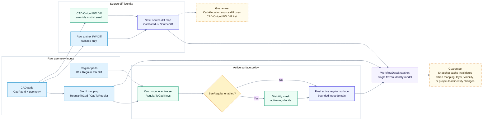

# Notch Table：Identity Contract

> 回到 [Notch table 模組地圖](notch-table.md)
> English: [Identity contract](../en/notch-table-identity.md)

這張圖確認 Step5 在開始產生 rows 前，所有身分來源都先收斂成 `WorkflowDataSnapshot`。後續 table、inspector、export 不應從局部 UI 狀態重新推導同一個結果。

## Contract

| 項目 | 責任 |
| --- | --- |
| `RegularGrid` | 提供穩定 IC / Regular FW Diff 身分。 |
| Step1 mapping | 決定 CAD 與 Regular 的可計算對應範圍。 |
| SeeRegular mask | 只限制 active surface，不改變 source diff 語意。 |
| `WorkflowDataSnapshot` | Step5 table 計算的唯一 frozen input contract。 |
