# Notch Table 模組地圖

> 回到 [中文圖庫](README.md)
> English: [Notch table module map](../en/notch-table.md)

這張圖是 Notch table 計算的導覽層。細節已依模組拆成四張圖，方便逐段檢查 source diff、target diff、payload projection 與 export handoff。

## Module Map

```mermaid
%%{init: {"theme": "base", "flowchart": {"curve": "basis", "htmlLabels": true, "nodeSpacing": 42, "rankSpacing": 54}, "themeVariables": {"fontFamily": "Inter, Segoe UI, Noto Sans TC, Arial, sans-serif", "fontSize": "14px", "primaryTextColor": "#172033", "lineColor": "#64748B", "clusterBkg": "#FFFFFF", "clusterBorder": "#CBD5E1"}}}%%
flowchart LR
    subgraph A["1. Identity contract"]
        direction TB
        A1["RegularGrid<br/>stable IC + FW Diff"]:::source
        A2["Step1 match scope<br/>CAD -> Regular"]:::compute
        A3["CAD Output FW Diff<br/>strict source seed"]:::compute
        A4["WorkflowDataSnapshot<br/>frozen contract"]:::contract
    end

    subgraph B["2. Candidate assembly"]
        direction TB
        B1["GenerateCurrentNotchTableAsync<br/>single UI entry"]:::entry
        B2["CadAllocation path<br/>default canonical mode"]:::compute
        B3["Candidate bucket<br/>(IC, SourceDiff)"]:::compute
        B4["Eligibility + coverage<br/>candidate filter"]:::gate
    end

    subgraph C["3. Compensation + target"]
        direction TB
        C1["ToRegular / ToFull<br/>stage geometry"]:::compute
        C2["Stage3 area<br/>physical allocation base"]:::contract
        C3["Target legs<br/>Regular FW Diff identity"]:::compute
        C4["Boundary guards<br/>cap before payload"]:::gate
    end

    subgraph D["4. Output projection"]
        direction TB
        D1["v2.2 canonical rows<br/>semantic source"]:::output
        D2["v2.1 projection<br/>compatibility payload"]:::output
        D3["CAD output grid<br/>anchor-only display"]:::compute
        D4["NotchTable artifact<br/>Export / Simulation / Inspector"]:::artifact
    end

    A1 --> A2 --> A3 --> A4 --> B1
    B1 --> B2 --> B3 --> B4 --> C1
    C1 --> C2 --> C3 --> C4 --> D1
    D1 --> D2 --> D4
    D1 --> D3 --> D4

    N1["拆分原則：每張小圖只回答一個問題，<br/>overview 不承擔演算法細節。"]:::note
    D4 -.-> N1

    click A4 "./notch-table-identity.md" "Open identity contract diagram"
    click B3 "./notch-table-candidate.md" "Open candidate assembly diagram"
    click C3 "./notch-table-compensation.md" "Open compensation and target diagram"
    click D4 "./notch-table-output.md" "Open output projection diagram"

    classDef source fill:#E0F2FE,stroke:#0284C7,color:#0F172A;
    classDef entry fill:#F5F3FF,stroke:#7C3AED,color:#1E1B4B,stroke-width:1.5px;
    classDef contract fill:#EEF2FF,stroke:#4F46E5,color:#1E1B4B,stroke-width:1.5px;
    classDef compute fill:#ECFDF5,stroke:#059669,color:#052E2B;
    classDef decision fill:#FEF3C7,stroke:#D97706,color:#3A2A0A;
    classDef gate fill:#FFF7ED,stroke:#EA580C,color:#431407,stroke-width:1.5px;
    classDef output fill:#F8FAFC,stroke:#475569,color:#111827;
    classDef artifact fill:#F0FDFA,stroke:#0D9488,color:#042F2E,stroke-width:1.5px;
    classDef note fill:#FFFBEB,stroke:#D97706,color:#3A2A0A,stroke-dasharray: 4 3;
```

## Entrypoint Map

| Responsibility | Current entry |
| --- | --- |
| Workflow table generation | `FreeformHelperViewModel.GenerateCurrentNotchTableAsync(...)` |
| Application table generation | `NotchTableGenerator.Generate(...)` |
| v2.2 compensation stages | `NotchV22CompensationService.Compute(...)` |
| v2.2 target legs | `NotchV22TargetAllocationService.Build(...)` |
| Final anchor/display projection | `NotchCadOutputFwDiffProjectionService.Project(...)` |
| Export selection / handoff | `NotchExportSelectionViewModel` |

## Detail Diagrams

- [Identity contract](notch-table-identity.md)：Regular / CAD / SeeRegular 如何收斂成同一份 snapshot。
- [Candidate assembly](notch-table-candidate.md)：CadAllocation 如何建立 canonical candidate bucket。
- [Compensation + target](notch-table-compensation.md)：ToRegular / ToFull / Stage3 / target allocation 的責任邊界。
- [Output projection](notch-table-output.md)：v2.2 canonical、v2.1 compatibility、CAD output grid 與 handoff。

