# Simulation：Shared Apply Path

> 回到 [Simulation 模組地圖](simulation.md)
> English: [Shared apply path](../en/simulation-apply.md)

這張圖確認所有 simulation source 都會進同一條 apply path。UI、export、replay 不應重新計算 before/after/delta，而是消費 `NotchApplySimulationResult`。

```mermaid
%%{init: {"theme": "base", "flowchart": {"curve": "basis", "htmlLabels": true, "nodeSpacing": 44, "rankSpacing": 56}, "themeVariables": {"fontFamily": "Inter, Segoe UI, Noto Sans TC, Arial, sans-serif", "fontSize": "14px", "primaryTextColor": "#172033", "lineColor": "#64748B", "clusterBkg": "#FFFFFF", "clusterBorder": "#CBD5E1"}}}%%
flowchart LR
    TABLE["NotchTable artifact<br/>v2.2 canonical rows"]:::artifact
    FRAME["Before frame dataset<br/>Manual / CSV / Copper"]:::contract

    subgraph BUILD["BuildSnapshot"]
        direction TB
        B1["NotchApplySimulationReviewUseCase.BuildSnapshot"]:::entry
        B2["Align rows to RegularGrid<br/>diff identity pipeline"]:::compute
        B3["Create request<br/>table + before values"]:::compute
    end

    subgraph APPLY["NotchApplySimulationService"]
        direction TB
        A1["Apply source retain<br/>source row contribution"]:::compute
        A2["Apply target legs<br/>Regular FW Diff targets"]:::compute
        A3["Build result cells<br/>Before / After / Delta"]:::output
        A4["Build result actions<br/>retain + target flow"]:::output
    end

    RESULT["NotchApplySimulationResult<br/>Cells + Actions"]:::artifact

    TABLE --> B1
    FRAME --> B1 --> B2 --> B3 --> A1
    A1 --> A2 --> A3 --> RESULT
    A2 --> A4 --> RESULT

    N1["Single result model:<br/>net-flow audit reads cells and actions from the same object."]:::note
    N2["Duplicate diff policy belongs to the shared identity pipeline, not UI display code."]:::note
    RESULT -.-> N1
    B2 -.-> N2

    classDef entry fill:#F5F3FF,stroke:#7C3AED,color:#1E1B4B,stroke-width:1.5px;
    classDef contract fill:#EEF2FF,stroke:#4F46E5,color:#1E1B4B,stroke-width:1.5px;
    classDef compute fill:#ECFDF5,stroke:#059669,color:#052E2B;
    classDef output fill:#F8FAFC,stroke:#475569,color:#111827;
    classDef artifact fill:#F0FDFA,stroke:#0D9488,color:#042F2E,stroke-width:1.5px;
    classDef note fill:#FFFBEB,stroke:#D97706,color:#3A2A0A,stroke-dasharray: 4 3;
```

## Apply Contract

| Result part | 消費者 |
| --- | --- |
| Cells | Overlay、inspector、EMS cap、Before / After / Delta view。 |
| Actions | net-flow residual、source retain / target legs trace、audit detail。 |
| Diagnostics | duplicate diff / projection warnings。 |
| Shared result | `SimulationSafetyAuditService.Analyze(...)` 的唯一 input。 |
