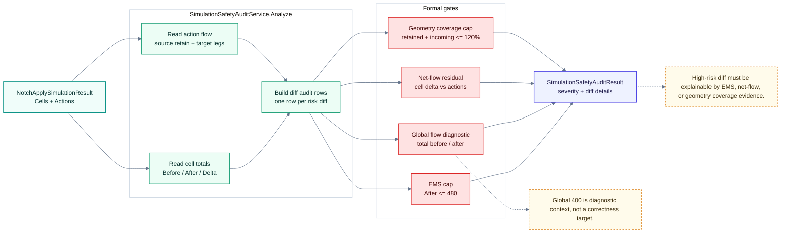

# Simulation：Physical Audit

> 回到 [Simulation 模組地圖](simulation.md)
> English: [Physical audit](../en/simulation-audit.md)

這張圖是 release gate 的核心。`SimulationSafetyAuditService.Analyze(NotchApplySimulationResult)` 同時讀 Cells 與 Actions，正式檢查 EMS cap、net-flow residual、geometry coverage。

## Audit Gates

| Gate | 目的 |
| --- | --- |
| EMS cap | 防止單一 diff after value 超過安全上限。 |
| Net-flow residual | 確認 cell delta 能由 source retain / target action 解釋。 |
| Geometry coverage | 防止 retained + incoming coverage 過度膨脹。 |
| Global flow | 保留全域診斷訊號，但不把 400 當正確性目標。 |
