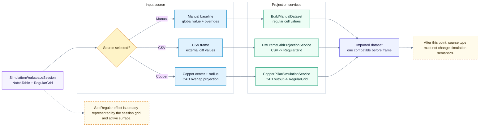

# Simulation：Source Frame

> 回到 [Simulation 模組地圖](simulation.md)
> English: [Source frame](../en/simulation-source.md)

這張圖只描述 before frame 的來源。Manual、CSV、Copper 的差異都應在 `BuildSnapshot` 前收斂；進入 apply path 後不再分叉。

## Source Boundary

| Source | 收斂入口 |
| --- | --- |
| Manual | `SimulationWorkspaceUseCase.BuildManualDataset(...)` |
| CSV | `DiffFrameGridProjectionService.ProjectFrame(...)` |
| Copper | `CopperPillarSimulationService.ProjectCadOutputToRegularGrid(...)` |
| Shared frame | `SimulationWorkspaceUseCase.BuildSnapshot(...)` 的 input dataset。 |
