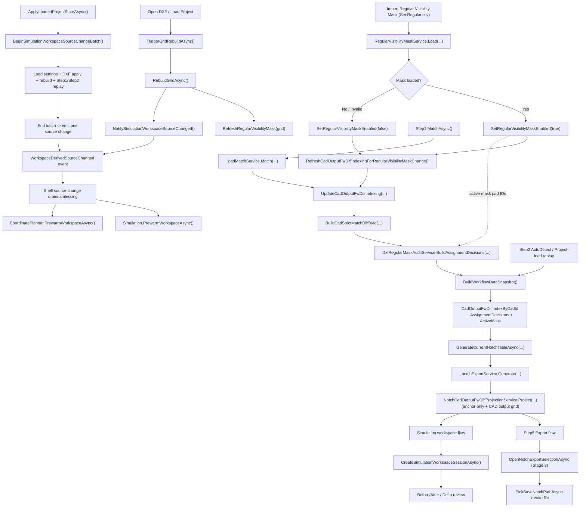

# Freeform Workflow (with SeeRegular)

This diagram reflects the current runtime path in `beta0.5` and includes the SeeRegular (`Regular visibility mask`) branch.

## Verification Notes
- SeeRegular is included in Step4 assignment through `GetActiveRegularVisibilityMaskPadIds()` and `DxfRegularMaskAuditService.BuildAssignmentDecisions(...)`.
- Step5 generator now consumes `CadOutputFwDiffIndexByCadId` as row source diff. In `CadAllocation` mode, source diff is already final when rows are built.
- `NotchCadOutputFwDiffProjectionService.Project(...)` only aligns row anchor diff to CAD output FW diff and builds the display-only CAD output grid. It no longer rewrites target diff.
- Simulation applies `source = CAD Output FW Diff` and `target = Regular FW Diff`, so SeeRegular only changes the source memory/output side, not the geometry target side.
- Project-load source changes are batched (`BeginSimulationWorkspaceSourceChangeBatch` / `End...`) and Shell prewarm is coalesced to avoid burst rebuilds.
