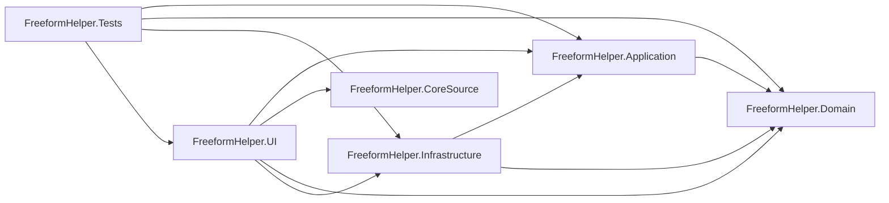

# Project Dependency Graph

- Generated: 2026-10-09 19:49:15 UTC
- Source solution: `FreeformHelper.sln`

## Project Paths

- `FreeformHelper.Application`: `src\FreeformHelper.Application\FreeformHelper.Application.csproj`
- `FreeformHelper.CoreSource`: `src\FreeformHelper.CoreSource\FreeformHelper.CoreSource.csproj`
- `FreeformHelper.Domain`: `src\FreeformHelper.Domain\FreeformHelper.Domain.csproj`
- `FreeformHelper.Infrastructure`: `src\FreeformHelper.Infrastructure\FreeformHelper.Infrastructure.csproj`
- `FreeformHelper.Tests`: `tests\FreeformHelper.Tests\FreeformHelper.Tests.csproj`
- `FreeformHelper.UI`: `src\FreeformHelper.UI\FreeformHelper.UI.csproj`

## Usage

- Run `./scripts/build/generate-dependency-graph.ps1` to refresh this graph.
- Task kickoff should consult this graph first, then do targeted file search.
