# Post-1.0 Tool Workbench Redesign Plan

Last updated: 2026-04-30  
Status: Draft v1, ready for phased implementation

## 1. Goals

1. Upgrade Simulation from a value inspection tool into a complete validation platform.
2. Rework the Coordinate tool from a field-based calculator into a tool that directly generates, checks, and exports coordinate artifacts.
3. Treat Simulation and Coordinate as post-1.0 Tool workbenches, not secondary pages.
4. Keep the existing single-path principle: the UI does not re-derive values; all results are projected from UseCase/service snapshots.

## 2. Current Feature Inventory

### 2.1 Simulation

| Area | Current capabilities | Main entry points |
| --- | --- | --- |
| Workspace lifecycle | open / prewarm / stale source revision / auto build from runtime query | `SimulationHostViewModel`, `FreeformHelperViewModel.Simulation.cs` |
| Session input | current `RegularGrid`, Step5 `NotchTable`, active regular surface, CAD output FW diff map | `SimulationWorkspaceSession` |
| Manual source | global baseline, selected REG override, clear overrides, random visible values, uniform 400 / 360 / 0 presets | `SimulationWorkspaceViewModel.Source.cs` |
| CSV source | multi-file import, compatible frame filtering, frame slider, play/pause, loop, FPS, shape inspector, row-origin summary | `NotchApplySimulationReviewUseCase`, `SimulationWorkspaceViewModel.Playback.cs` |
| Copper source | CAD overlap projection, center X/Y, diameter, peak, baseline, grounded copper / finger press model, mouse-driven center update | `CopperPillarSimulationService`, `SimulationWorkspaceUseCase.BuildCopperDataset(...)` |
| Copper replay backend | start/end/step replay, per-step max after, EMS violations, worst diff, net-flow and coverage counts | `SimulationWorkspaceUseCase.ReplayCopperPath(...)` |
| Shared apply path | Manual / CSV / Copper all converge to `BuildSnapshot -> NotchApplySimulationService.Simulate(...)` | `SimulationWorkspaceUseCase.BuildSnapshot(...)` |
| Canvas projection | Before / After / Delta / Changed only, auto or threshold color, IC area filter, overlay items | `SimulationOverlayProjectionBuilder` |
| Audit | EMS cap, max after, violations, top high-risk diffs, global flow, net-flow residual, target coverage cap | `SimulationSafetyAuditService.Analyze(...)` |
| Inspector | selected REG before/after/delta, EMS status, net-flow, source/target legs, notch impact list | `SimulationWorkspaceViewModel.Selection.cs`, `.Validation.cs` |
| Runtime/export bridge | `query simulation`, export gate reads current simulation safety audit | `RuntimeQueryUseCase.Commands.Simulation.cs`, `ShellViewModel.SimulationSafetyOverview.cs` |

### 2.2 Coordinate

| Area | Current capabilities | Main entry points |
| --- | --- | --- |
| Workspace lifecycle | open / prewarm / stale source revision | `CoordinatePlannerHostViewModel` |
| Session input | current `RegularGrid`, visible CAD pads/layers, default active area size, pixel size, preferred AA outline layer | `CoordinatePlannerWorkspaceSession` |
| Active area source | regular grid bounds, selected layer bounds, layer-missing fallback diagnostics | `CoordinatePlannerActiveAreaResolver` |
| CAD preview | none / all visible / single layer preview on same canvas | `CoordinatePlannerWorkspaceViewModel.UpdateCadPadsForCanvas()` |
| Machine mapping | origin X/Y, AA width/height, pixel width/height | `CoordinatePlannerRequest` |
| AA corners | raw and copper-pillar-safe machine coordinate for TL/TR/BR/BL | `CoordinatePlannerComputationService` |
| Guides | configurable horizontal and vertical guide counts | `CoordinatePlannerComputationService.AddHorizontalGuides(...)`, `.AddVerticalGuides(...)` |
| BIST rectangle | fixed centered 25% to 75% rectangle, raw/safe machine coordinates | `CoordinatePlannerComputationService.AddBistRectangle(...)` |
| 4-point array | custom quadrilateral, row/column dot grid, safe inset by copper pillar radius | `CoordinatePlannerComputationService.AddCustomArray(...)` |
| Safe coordinate model | machine coordinate clamp using copper pillar radius | `ClampMachinePoint(...)`, `ClampMachineRect(...)` |
| Output display | right pane lists AA corners, BIST corners, custom array corners/dots, horizontal/vertical guides | `CoordinatePlannerWorkspaceDetailsPaneView.axaml` |
| Preview export | PNG preview export hook | `CoordinatePlannerWorkspaceViewModel.ExportPreviewPngAsync()` |
| Preference sync | pixel size and preferred AA outline layer persisted back to main workspace | `ApplyCoordinatePlannerPreferences(...)` |

## 3. Main Pain Points

### 3.1 Simulation

1. Input source controls are mode-driven, not task-driven. Users must infer whether they are doing uniform sanity check, CSV playback, copper contact, or path sweep.
2. Copper source currently hides signal diagnostics (`ShowSimulationDiagnostics == false`), while the post-1.0 goal needs copper to be a first-class physical validation path.
3. Copper replay exists as service/VM entry but is not a first-class UI workflow. Start/end/step selection is still awkward and not visible as an artifact table.
4. Audit output is split across EMS card, delta validation, high-risk list, selected flow, tooltip, runtime query. The data is shared, but the UI does not yet feel like one coherent gate.
5. CSV playback has good shape inspector, but lacks scenario naming, run history, and comparison against manual/copper cases.
6. The current left panel mixes setup, mode explanation, view options, playback, and copper geometry in one vertical stack.

### 3.2 Coordinate

1. The tool is a raw-field calculator. It exposes every field up front instead of guiding users through reference, coordinate set, validation, and export.
2. Coordinate output is display-only. There is no canonical export artifact for points/lines/rectangles/dots with stable columns and units.
3. Coordinate sets are fixed concepts: AA corners, BIST rectangle, guides, and 4-point array. There is no user-facing model for "coordinate recipe" or reusable preset.
4. Custom 4-point array editing requires typing eight numeric fields; no canvas picking, corner handles, or quick templates.
5. Safe coordinates are important but visually mixed with raw coordinates. Users cannot quickly answer "which coordinates should I send downstream?"
6. Coordinate and Simulation both care about copper pillar radius/contact geometry, but the UX treats them as unrelated tools.

## 4. Redesign Principles

1. Keep one result snapshot per tool.
   - Simulation result: `SimulationScenarioSnapshot`.
   - Coordinate result: `CoordinateArtifactSnapshot`.
2. UI controls should edit input state only; result tables and overlays should project from snapshots.
3. Use task sections instead of long explanatory text:
   - Prepare
   - Run / Preview
   - Inspect
   - Export
4. Make artifacts explicit:
   - Simulation run artifact: input source, table version, frame/path, audit result, selected diff evidence.
   - Coordinate artifact: coordinate set, raw/safe machine coordinates, pixel coordinates, units, source bounds.
5. Keep Simulation and Coordinate separate mathematically, but share shell patterns, viewport lifecycle, status chips, export affordances, and scenario naming.

## 5. Target Information Architecture

```mermaid
%%{init: {"theme": "base", "flowchart": {"curve": "basis", "htmlLabels": true, "nodeSpacing": 46, "rankSpacing": 58}, "themeVariables": {"fontFamily": "Inter, Segoe UI, Noto Sans TC, Arial, sans-serif", "fontSize": "14px", "primaryTextColor": "#172033", "lineColor": "#64748B", "clusterBkg": "#FFFFFF", "clusterBorder": "#CBD5E1"}}}%%
flowchart LR
    TOOL["Tool Workbench<br/>post-1.0 shell"]:::shell

    subgraph SIM["Simulation"]
        direction TB
        S1["Prepare scenario<br/>Manual / CSV / Copper / Path Sweep"]:::input
        S2["Run snapshot<br/>BuildSnapshot -> Simulate -> Analyze"]:::compute
        S3["Audit dashboard<br/>EMS / net-flow / geometry"]:::gate
        S4["Evidence table<br/>diff flow + replay steps"]:::artifact
        S5["Export / query<br/>run artifact"]:::artifact
    end

    subgraph COORD["Coordinate"]
        direction TB
        C1["Reference setup<br/>AA source + machine + pixel"]:::input
        C2["Coordinate recipes<br/>corners / guides / BIST / arrays / path"]:::compute
        C3["Preview + handles<br/>canvas-first editing"]:::compute
        C4["Artifact table<br/>raw + safe + pixel"]:::artifact
        C5["Export / copy<br/>CSV / JSON / clipboard"]:::artifact
    end

    TOOL --> S1 --> S2 --> S3 --> S4 --> S5
    TOOL --> C1 --> C2 --> C3 --> C4 --> C5
    S4 -. "copper geometry evidence" .-> C2
    C4 -. "path / points for replay" .-> S1

    classDef shell fill:#F5F3FF,stroke:#7C3AED,color:#1E1B4B,stroke-width:1.5px;
    classDef input fill:#E0F2FE,stroke:#0284C7,color:#0F172A;
    classDef compute fill:#ECFDF5,stroke:#059669,color:#052E2B;
    classDef gate fill:#FFF7ED,stroke:#EA580C,color:#431407,stroke-width:1.5px;
    classDef artifact fill:#F0FDFA,stroke:#0D9488,color:#042F2E,stroke-width:1.5px;
```

## 6. Simulation Redesign

### 6.1 Target UX

| Area | Redesign |
| --- | --- |
| Left pane | Scenario builder: choose Manual / CSV / Copper / Path Sweep, then show only relevant controls. |
| Top canvas rail | Version, view mode, color mode, area filter, run status. |
| Center canvas | Same AA overlay, but Copper and Path modes show contact marker/path and current step. |
| Right pane | Audit dashboard first, selected diff evidence second, run artifact history third. |
| Bottom or right table | Replay step table and high-risk diff table use same row action: focus REG, show flow, export evidence. |

### 6.2 Required Model Changes

1. Add `SimulationScenario` model:
   - `Name`
   - `SourceMode`
   - `Version`
   - `AreaFilter`
   - `ManualConfig`
   - `CsvConfig`
   - `CopperConfig`
   - `PathReplayConfig`
2. Add `SimulationScenarioSnapshot`:
   - `Scenario`
   - `NotchApplySimulationReviewSnapshot`
   - `SimulationSafetyAuditResult`
   - optional `CopperPillarPathReplayResult`
   - display-ready `RiskDiffRows`
   - display-ready `ReplayRows`
3. Move current scattered projection properties into a projector:
   - `SimulationScenarioProjector.Project(snapshot, selection, viewMode, colorMode)`.

### 6.3 Completeness Gaps To Close

| Gap | Risk | Target |
| --- | --- | --- |
| Copper mode hides diagnostics | Physical validation cannot use EMS/net-flow/geometry gate directly. | Copper source must run the same audit and show risk dashboard. |
| Replay has no UI artifact | Edge/notch sweeps remain manual or test-only. | Add path sweep editor and replay table. |
| No run history | Manual/CSV/Copper comparisons are hard. | Keep recent scenario snapshots in workspace memory. |
| No scenario export | Results are visible but not easy to hand off. | Export simulation run artifact as CSV/JSON review. |
| Evidence split across widgets | Hard to explain why a diff is risky. | One selected diff evidence panel: cells, actions, net-flow, geometry coverage. |

## 7. Coordinate Redesign

### 7.1 Target UX

| Area | Redesign |
| --- | --- |
| Left pane | Reference setup and recipe selection, not every field at once. |
| Center canvas | Interactive coordinate canvas with optional CAD/REG layers, corner handles, array preview, safe inset. |
| Right pane | Artifact table with stable columns and copy/export commands. |
| Recipe selector | AA corners, guides, BIST rectangle, 4-point array, custom points, line/path sweep. |
| Export rail | Copy selected rows, export CSV, export JSON, export PNG preview. |

### 7.2 Required Model Changes

1. Add `CoordinateRecipe` model:
   - `Kind`: `AaCorners`, `Guides`, `BistRectangle`, `FourPointArray`, `CustomPoints`, `Path`
   - `Name`
   - `Parameters`
2. Add `CoordinateArtifactSnapshot`:
   - `ActiveAreaResolution`
   - `Request`
   - `Recipes`
   - `Rows`
   - `PreviewShapes`
3. Add stable row model:
   - `label`
   - `kind`
   - `recipe`
   - `pixelX/Y`
   - `machineX/Y`
   - `safeMachineX/Y`
   - `worldX/Y`
   - `sourceBounds`
   - `unit`
4. Add export service:
   - CSV review artifact
   - JSON artifact
   - clipboard table

### 7.3 Usability Changes

| Current | Target |
| --- | --- |
| Eight numeric fields for 4-point array corners | Canvas handles plus numeric inspector for selected handle. |
| Safe coordinates shown beside raw coordinates everywhere | User can choose `Raw`, `Safe`, or `Both`; export defaults to safe when copper diameter > 0. |
| BIST rectangle fixed at 25% to 75% | BIST recipe exposes preset and editable margins. |
| Guides only count-based | Guides support count, explicit positions, and exportable line rows. |
| No custom point/path artifact | Add custom point list and path list, reusable by Simulation path replay. |

### 7.4 3635 Coordinate Screen Assessment

On 2026-04-30, I checked the Coordinate page with real screenshots using `example/BOE36.35/project_3635.json`, and confirmed that the main current problem is not the algorithm but the information architecture:

1. The left side puts reference, machine calibration, pixel/copper, guides, BIST, and 4-point array all in one long form, so users must first understand the role of every raw field.
2. When the 4-point array is disabled, it still shows 8 corner fields, which makes the main flow look like a wall of advanced settings.
3. On the right, AA / BIST / guide / array results are each shown as row cards, and the meaning of raw / safe / pixel has no established reading order first.
4. The header and preview rail both repeat source / layer / machine / pixel summaries, so the first screen is too dense.
5. The 3635 AA ratio is very flat and long, and the canvas itself is still readable; what actually gets stuck is the operations on the left and right and the artifact reading order.

Immediate UI cleanup scope:

| Area | First-pass change |
| --- | --- |
| Left pane | Split into `Reference`, `Calibration`, `Artifacts`, `4-point array`; hide array corner fields until array is enabled. |
| Preview rail | Keep machine mapping as the primary line; move pixel/copper/layer to secondary chips. |
| Right pane | Replace repeated fixed sections with artifact groups projected from one `ResultGroups` collection. |
| Result reading | Add explicit read order: pixel origin, machine orientation, safe coordinate policy. |
| Closed later | CSV/JSON/clipboard export closed in S12.006; canvas handles and selected-handle inspector close in S12.016. |

Second-pass cleanup from the 3635 review:

| Area | Second-pass change |
| --- | --- |
| Right pane | Replace grouped cards with one sortable coordinate table projected from `ArtifactRows`. |
| Row details | Row click focuses the artifact on the canvas and opens a detail dialog for pixel / machine / safe coordinates. |
| Canvas density | Default to `Essentials`; `Focus` keeps the selected artifact colored and mutes the rest; `All` restores full overlay density. |
| Quick actions | Use a compact horizontal toolbar with fit, grid toggle, and overlay density selector. |
| Closed later | Export/copy artifacts close in S12.006; canvas handles close in S12.016. |

Third-pass cleanup from Coordinate first-peek review:

| Area | Third-pass change |
| --- | --- |
| Regular display | In Coordinate, regular pads are a muted spatial background by default. Row/column/IC labels, unmatched highlights, and freeform hatch accents are hidden unless explicitly toggled. |
| Guide reference | Horizontal/Vertical guide generation supports two modes: `AA outline` for CAD outline inner bounds and `Regular grid` for using the generated regular table as the reference. |
| Left pane density | Calibration fields are collapsed by default. The first visible controls are reference, guide basis, H/V count, and recipe toggles. |
| Canvas toolbar | Fit/focus and layer toggles share the same compact button styling; unchecked white buttons use dark icon strokes, checked toggles use accent fill. Horizontal guides use a green token so they do not visually merge with CAD/AA blue outlines. |
| Future surface model | Curved-surface coordinate generation should be a separate recipe that maps 2D AA positions to 3-axis `(x, y, z)` coordinates after the flat coordinate artifact model is stable. |

Fourth-pass artifact handoff slice:

| Area | Fourth-pass change |
| --- | --- |
| Artifact model | Promote table rows to Application-level `CoordinateArtifactSnapshot` so table, detail modal, export, and future Simulation path replay consume one source model. |
| Export/copy | Add right-pane Copy / CSV / JSON actions. CSV and JSON include stable label/kind/recipe/geometry, pixel/machine/safe/world numeric fields, unit, source bounds, source, and detail text. |
| Detail modal | Include world coordinate and source bounds so the right pane can stay compact while engineering detail remains one click away. |
| Remaining work | Curved-surface `(x, y, z)` generation remains a future UI recipe after the flat artifact handoff model is validated. |

Fifth-pass guide generation slice:

| Area | Fifth-pass change |
| --- | --- |
| Copy actions | Right-pane actions expose `Copy row` and `Copy all` explicitly instead of depending on selection state. |
| Guide modes | Horizontal and vertical guides can each use count, pitch/spacing, or explicit mm positions. |
| Edge inset | Count, pitch, and explicit guides all honor a per-axis inset so edge probes can avoid AA boundary ambiguity. |
| Closed later | Custom point/path recipes close in S12.014; canvas handles close in S12.016 so drag behavior stays outside guide math. |

Sixth-pass custom recipe and surface model slice:

| Area | Sixth-pass change |
| --- | --- |
| Custom point | Users can add machine-space custom points from the Coordinate left pane; rows are generated by `CoordinatePlannerComputationService`. |
| Custom path | Users can add start/end/step path recipes. The artifact snapshot emits a path line plus step rows, which gives Simulation replay a stable handoff shape. |
| Surface model | Add `CoordinateSurfaceProfile` and `CoordinateSurfaceTransformService` for future curved-screen `(x, y, z)` output. This is a data/model slice, not a full UI recipe. |
| Remaining work | Simulation ingestion of Coordinate path artifacts remains a separate 1.1 slice. |

Seventh-pass Simulation copper audit and replay artifact slice:

| Area | Seventh-pass change |
| --- | --- |
| Copper audit | Copper mode no longer hides the shared `SimulationSafetyAuditResult`. The details pane shows EMS cap, max after, violation count, net-flow residual count, target coverage risk count, and the physical audit summary. |
| Replay editor | Copper controls expose start/end/step fields plus capture-start/capture-end actions from the current copper center. |
| Replay artifact | `CopperPillarPathReplayArtifactService` promotes replay steps into an Application-level `CopperPillarPathReplayArtifactSnapshot` used by the UI table, clipboard output, CSV, and JSON. |
| Focus behavior | Selecting a replay row moves the copper center to that step so the canvas and selected diagnostics inspect the same point. |
| Remaining work | Direct ingestion from Coordinate path artifacts remains a separate 1.1 slice. |

Eighth-pass Coordinate canvas handle slice:

| Area | Eighth-pass change |
| --- | --- |
| 4-point array inspector | The left pane replaces the always-visible eight raw corner fields with a selected-handle inspector: choose TL / TR / BR / BL, then edit one X/Y pair. |
| Canvas handles | Custom array corner overlay points are pointer handles. Dragging a handle updates only that corner through `MoveCustomArrayCornerToWorldPoint(...)`; the computation snapshot and artifact table remain the result source of truth. |
| Focus behavior | Selecting or dragging a handle selects the matching artifact row, so Focus overlay and the detail table inspect the same coordinate. |
| Layout effect | The first-visible Coordinate controls stay task-based: Reference, Calibration, Artifacts, 4-point array, then custom point/path recipes. |
| Remaining work | Direct Simulation ingestion from Coordinate path artifacts and run-history comparison stay separate post-1.1 candidates. |

## 8. Implementation Slices

| Slice | Scope | Validation |
| --- | --- | --- |
| S12.001 | Tool inventory and redesign spec. | Doc review, TODO sync, lint. |
| S12.002 | Introduce `SimulationScenario` and `SimulationScenarioSnapshot` without changing UI layout. | VM/service tests cover Manual, CSV, Copper, replay. |
| S12.003 | Make Copper diagnostics first-class and show audit in Copper mode. | Copper tests assert EMS/net-flow/coverage audit is populated. |
| S12.004 | Add path replay UI artifact: start/end/step controls, replay table, focus action. | ViewModel tests and UI smoke for replay table state. |
| S12.005 | Introduce `CoordinateRecipe` and `CoordinateArtifactSnapshot` while preserving current computation behavior. | Coordinate computation and VM tests verify old outputs map to new rows. |
| S12.006 | Add coordinate artifact export/copy service. | CSV/JSON/clipboard formatting tests. |
| S12.007 | Rework Coordinate left/right panes around recipe selector and artifact table. | UI smoke, token scan, DevView preview. |
| S12.008 | Shared Tool Workbench shell polish for Simulation/Coordinate. | Build, lint, visual smoke, no new inline tokens. |
| S12.010 | Coordinate table/modal/focus overlay tactical cleanup for 3635. | Coordinate VM tests, UI build, lint, 3635 visual screenshot. |
| S12.011 | Coordinate first-peek simplification and H/V guide reference mode. | Coordinate computation/usecase/VM tests, UI build, lint. |
| S12.012 | Coordinate artifact snapshot plus Copy / CSV / JSON export tactical slice. | Coordinate artifact service tests, VM command tests, UI build, lint. |
| S12.013 | Coordinate guide generation modes: count, pitch, explicit positions, and edge inset. | Coordinate computation/VM tests, UI smoke, build, lint. |
| S12.014 | Coordinate custom point/path recipes plus surface transform data model. | Coordinate computation/artifact/surface tests, VM tests, UI smoke, build, lint. |
| S12.015 | Simulation Copper audit and path replay artifact formalization. | Copper replay artifact service tests, Simulation VM tests, UI smoke, build, lint. |
| S12.016 | Coordinate 4-point array canvas handles and selected-handle inspector. | Coordinate VM tests, UI smoke, build, lint. |

## 9. Acceptance Criteria

1. Simulation users can run Manual, CSV, Copper, and Path Sweep from explicit scenario cards.
2. Every Simulation mode produces one scenario snapshot and one audit snapshot.
3. Copper mode no longer loses EMS/net-flow/geometry visibility.
4. Path replay produces a visible, exportable step table.
5. Coordinate users can choose a recipe, inspect a preview, and export stable coordinate rows.
6. Coordinate safe coordinates are visually and semantically distinct from raw coordinates.
7. Simulation path replay can consume coordinate path/point artifacts without manual retyping.
8. Existing `NotchApplySimulationService` and `CoordinatePlannerComputationService` remain the computation truth sources unless a later task explicitly moves them.

