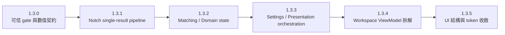

# FreeformHelper 1.3.x 重構總路線圖

- 建立日期：2026-07-20
- 規劃基準：`codex/code-size-cutdown`，commit `165f076`
- Code-size signed reference：R13.002 完成 commit `3032121`；詳見 `docs/performance/code-size-baseline-1.3.0.md`
- 適用版本：`1.3.0`～`1.3.5`
- 執行入口：`TODO.md` 的 `R13.*` work items
- 性質：1.3.x 重構執行順序、風險與驗收 gate；Notch 演算法真實規格仍以 `docs/reference/notch-system-reference.md` 為準
- Reviewer 來源：`master-refactor-roadmap-2026-07-20.md`，SHA-256 `52e28dd079a90e90d9404218f9daa5e4bd64faf6875b461b4a3d6bb75e7970ba`
- 追溯狀態：41/41 個統合建議、實際 12/12 個分類爭議、6/6 個排序判斷均有唯一處置；詳見第 11.1～11.3 節
- GitHub parent spec：[#1](https://github.com/Dennis40816/FreeformHelper/issues/1)

---

## 0. 執行結論

1. 1.3.x 以「先建立可信 gate，再移動核心資料路徑，最後拆 UI」為固定順序。
2. 所有 1.3.x 重構（包含 `R13.003`）都必須保持：
   - BOE 3635 V21/V22 Firmware C export byte-exact。
   - TM8.1 acceptance matrix 與 Notch golden snapshot 完全一致。
   - 不得新增 Runtime Query、UI、inspector、simulation 或 export 的 second-pass derivation；目前已存在的多路推導必須由 R13.102/104 明列並逐步移除，不能因本條而假裝已完成。
   - Existing UI appearance, action roles, spacing and DevView previews remain unchanged except for the owner-approved R13.303 opacity fallback of 0.9 in 1.3.3, which requires updated snapshots.
   - `V21_before == V21_after` 且 `V22_before == V22_after`；不是要求 V21 與 V22 兩份檔案彼此相同。
   - R13.101～R13.103 的 architecture exit target 是：V21/V22 共用 version-neutral input、matching evidence、allocation、compensation、audit 與 resolved result，只能在最後的 version-specific data projection／formatting 邊界分岔。1.3.0 current generator 尚有 early threshold/cache/legacy dispatch debt，詳見 R13.005 canonical docs。
   - 若 Q7 correctness 需要改變任何 C byte，該工作退出 1.3.x zero-diff refactor，另立產品行為變更 issue，不得更新本計畫的 golden。
3. 每次只執行一個 `R13.*` slice；每個 slice 必須單獨 build、targeted test、lint、commit、push。
4. 不把不同 bounded context 為了「去重」硬合併：多對多 Pad overlap、DXF 一對一 audit、Canvas hit-test 是不同結果；只共享真正相同的幾何證據或 tie-break policy。
5. 不批次刪除單一使用 token，也不移除 DevView。只合併語意相同的 token；DevView 是 UI contract 的正式預覽與 guard surface。
6. Reviewer 建議不能只靠 release 主題推定為「已涵蓋」；每一項必須對到一個 `R13.*`、已完成證據、明確不執行理由，或有退出條件的 discovery gate。
7. `R13.007` 是跨版本 traceability governance，可先建立 tracker/labels/spec，且不與 production slice 混在同一 commit；production code 仍一次只執行一個依賴 frontier 上的 `R13.*`。執行 tracker 為 [#2](https://github.com/Dennis40816/FreeformHelper/issues/2)。

**Owner 決定（2026-10-03；回覆 `docs/reviews/ui-feature-inventory-2026-10.md` 的產品問題）**

- V21 firmware C output：答覆「不確定，先保留」；據此：`R13.103` 的 final projection／formatter 分離（含 legacy convergence）暫緩；不得開始移除或變更 V21 output，以及舊 project 對它的讀取路徑。
- `LegacyRegularAnchor`（重新匯出已交付 project）：答覆「不確定，先保留」；據此：`R13.101c-2` 與 `R13.102` 中僅涉及 legacy 的部分暫緩；既有 zero-diff gates 繼續保護它。
- 後續答覆（2026-10-03；問題為 `R13.101c-2`／`R13.103` 是否繼續，保留經等價性測試的 Legacy 相容 adapter，或維持暫緩）：owner 原話「先保留吧 但後續目標會是完全移除2.1」。
- 確認（owner 2026-10-03 在畫面回覆「V21」）：「2.1」指 V2.1，即 V21（本庫 roadmap／TODO 使用「final V2.1 projector」），不是 release 版本 2.1。
- 後續答覆取代先前對 `R13.101c-2`／`R13.103` 及 `R13.102` 純 legacy 部分的「暫緩」後果：V21 與 Legacy 維持原樣，由既有 zero-diff gates 保護；不再投入額外收斂／等價性工作；完全移除是後續目標，版本未訂。owner 決定（2026-10-04，經 Commander 轉述）排在 1.3.x 之後，範圍之後再定，之前不做隱性轉換。本次只記錄，不變更任務狀態。
- The 1.3.1 exit audit keeps B1/B2 as accepted exceptions (owner decision, 2026-10-03). The owner decided on 2026-10-04, relayed by the Commander session, that 1.3.1 closes with A1/A2 and C1–C6 do not block closure. Parent and milestone exits remain the owner's decision.
- Step4 mapping 與 Step6 validation diagnostics：答覆「移到未編號的診斷區」；據此：Owner 確認 `R13.305a` 已寫明的方向。
- 視覺重設計：答覆「先不改視覺」；據此：1.x 只重整結構，不採用新的視覺語言或重設 token set；結構變更所迫使的範圍以外，任何會改變畫面的變更都需另取得 owner 決定。

---

## 1. 目前基準與已驗證事實

### 1.1 2026-07-20 測試基準

規劃前已執行擴充 Notch/Firmware 核心集合：

```powershell
dotnet test tests/FreeformHelper.Tests/FreeformHelper.Tests.csproj `
  -c Debug -p:UseAppHost=false --nologo --no-restore `
  --filter "FullyQualifiedName~NotchExampleCExportDriftTests|FullyQualifiedName~NotchGoldenBaselineTests|FullyQualifiedName~Tm81NotchAcceptanceMatrixTests|FullyQualifiedName~NotchTableExporterTests|FullyQualifiedName~NotchTableGeneratorTests|FullyQualifiedName~NotchV22CompensationServiceTests|FullyQualifiedName~NotchV22TargetAllocationServiceTests|FullyQualifiedName~NotchV22ResolvedResultServiceTests|FullyQualifiedName~NotchV22FinalOutlineServiceTests|FullyQualifiedName~NotchDiffIdentityPipelineTests|FullyQualifiedName~NotchCadOutputFwDiffProjectionServiceTests|FullyQualifiedName~NotchApplySimulationServiceTests|FullyQualifiedName~NotchApplySimulationReviewUseCaseTests|FullyQualifiedName~NotchSettingsTests|FullyQualifiedName~RuntimeQueryUseCaseTests"
```

結果：`103 passed / 0 failed / 0 skipped`。

R13.002 在 2026-07-28 進一步證明，這個數字只能代表原有 test seams 全綠，不能單獨證明 checked-in C golden 等於 production export：

- 舊 `NotchExampleCExportDriftTests` 直接取 raw `_cad`（9,843 pads），略過 production `BuildFilteredCadPadSet` 與 project 保存的 layer selections。
- 真實 UI/IPC、修正後的 production-equivalent test 都使用 4,838 個 selected-layer pads，且兩條路徑輸出的 SHA-256 完全相同。
- production V21 為 692 nodes / 130,979 bytes / `8961B8155B0571B193C7C87D8EEA75077B4EF8822828506C4661B50BA2E57488`。
- production V22 為 548 nodes / 84,023 bytes / `5208068BBD8D82FC0A628693EF6035B31288EC674A25724C0C962CD58757BB47`。

2026-08-08 人員已確認 `example/BOE36.35/project_3635.json` 與 project 保存的 production layer/filter state 是 Lucid 3635 authoritative input，並同意以上述兩個 production hashes 做一次性 provenance correction。這是 refactor 前的 baseline 修復，不是後續更新 golden 的授權。

### 1.2 規劃基準的 gate 缺口（R13.001 已於 2026-07-20 關閉）

R13.001 實作前，`scripts/tests/run-refactor-gate.ps1` 只會執行 `application`、`ui-core`、`smoke`，且 `scripts/tests/run-tests.ps1` 的分類清單未完整包含：

- `NotchExampleCExportDriftTests`
- `NotchGoldenBaselineTests`
- `Tm81NotchAcceptanceMatrixTests`
- `NotchApplySimulationServiceTests`
- `NotchApplySimulationReviewUseCaseTests`
- `NotchV22TargetAllocationServiceTests`
- `NotchV22ResolvedResultServiceTests`
- `NotchV22FinalOutlineServiceTests`
- `NotchDiffIdentityPipelineTests`
- `NotchCadOutputFwDiffProjectionServiceTests`
- `NotchSettingsTests`
- `RuntimeQueryUseCaseTests`

其中 `NotchTableGeneratorTests`、`NotchTableExporterTests`、`NotchV22CompensationServiceTests` 原已在 application group。R13.001 已新增明確的 `notch-core` 與 `notch-golden` group：前者重現 103-case 核心集合，後者由預設 refactor gate 執行，避免再靠人工維護長 filter。完成狀態與驗證數字以 `TODO.md` 為準。

### 1.3 R13.002 cross-path 調查結果

`scripts/perf/run-3635-regression-baseline.ps1` 的 R13.002 版本已能透過 isolated hidden UI/IPC 產生 `c-v21` 與 `c-v22`，並以 normalized ordinal compare 執行 exact gate。現有證據可證明：

- Runtime Query 仍委派既有 ViewModel Step 5 export command，沒有第二條 C row 生成路徑。
- 真實 UI/IPC 與修正後的 production-equivalent Application test 對 V21/V22 各自 byte-identical。
- CLI 的 `--format` 只暫時切換 export file type 並於 export 後恢復；不修改 `EnableV21`／`EnableV22`，連續 V21/V22 export 不互相污染 project version state。
- gate 只停止自己啟動且 executable path 已驗證的 UI process，並隔離 app-general-settings。

project 保存的 layer selections 繼續作為 production Step1/Step5 輸入；checked-in C golden 依第 3.1 節做已簽核的 provenance correction。完成 `R13.002` 後，後續 1.3.x slice 不得再更新這兩份 C golden。

---

## 2. Firmware C 與 Q7 契約

### 2.1 V21 Firmware C

V21 Firmware C 仍使用 Q7：

- `NHC_1ST_RATIO` / `NHC_2ND_RATIO` 為 `UINT8`。
- magnitude 合法範圍為 `0..255`；數值表示 `ratio * 128`，100% 等於 128，255 約為 199%。
- 正負號只由 `NHC_TYPE_ADD` / `NHC_TYPE_SUB` 承載；Q7 byte 本身不是 signed value。
- percent/fraction encode 使用 `MidpointRounding.AwayFromZero`，進入 Firmware payload 時飽和到 `UINT8`。
- Firmware apply 直接使用 INT16 integer path：`(source * magnitudeQ7) >> 7`，不得先轉成 percent/double 再近似。
- V21 threshold 使用獨立的 `ThresholdQ7` contract，合法範圍為 `0..128`；它不是 `0..255` payload magnitude。

因此 Q7 是 V21 Firmware C 的公開相容契約，1.3.x 不得把它默默改成 percent。

### 2.2 V22 Firmware C

V22 Firmware C 不使用 Q7：

- `NHC_COMBINE` 為 `UINT8` percent。
- `NHC_1ST_RATIO` / `NHC_2ND_RATIO` 為 `INT8` signed percent。
- Firmware apply 使用 `INT16` carrier：percent scaling 為 `(INT16)((source * percent) / 100)`，整數除法向零截斷，writeback 維持 firmware modular narrowing。
- V22 threshold 原生為 percent；若開啟 `LinkVersionThresholds`，UI/Application 可從 V21 Q7 threshold 換算，但 Q7 不會被寫進 V22 Firmware C node。

### 2.3 V22 內部仍有 legacy Q7 projection

V22 canonical row 使用 `NotchV22Node` 的 signed percent。不過為了相容既有 `NotchTableRow.Values` 9 欄 reader，`ProjectV22RowsToV21Rows` 仍會把 V22 percent 轉成 Q7 放入 legacy slot。

這是內部相容投影，不是 V22 Firmware C 格式。1.3.x 必須分清：

- V21 Firmware Q7 codec。
- V22 canonical percent model。
- V22 → legacy row Q7 compatibility projection。

不得再由 exporter、simulation、validation 各自實作不同的 clamp/rounding。

### 2.4 R13.003 收斂結果

- `NotchV21Q7Codec` 是 V21 payload encode/decode/scale 的唯一數值契約。
- `NotchThresholdQ7Contract` 獨立負責 `0..128` threshold/allocation rounding，不讓 output-version codec 滲入 shared upstream geometry。
- `NotchV21FirmwareProjector` 一次完成 CadAllocation source row 或 LegacyRegularAnchor row 到 final ABI node 的投影；C formatter 只序列化 final node。
- `NotchV21FirmwareEvaluator` 消費同一 final node，依 FW 的 MUL → snapshot Q7 offsets → writeback 三階段與 INT16 narrowing 執行。
- C# simulation 的 V21 baseline 明確量化到 INT16（有限小數向零截斷、超界飽和、非有限值為 0）；Cells/Actions/audit 都讀同一 firmware baseline，不把量化誤報成 compensation delta。
- CadAllocation 提供 source-oriented Actions；LegacyRegularAnchor 只提供 exact Cells/EMS，不偽造方向相反的 source-flow Actions。

完整 byte boundary、CadAllocation、LegacyRegularAnchor 與 GCC exact parity 都由測試鎖定；V21/V22 Lucid 3635 C golden 未更新。

---

## 3. 1.3.x 驗收層級

| Gate | 目的 | 執行時機 |
|---|---|---|
| G0 Build/Lint | 保證編譯、analyzer、格式與 CRLF | 每個 slice |
| G1 Targeted | 鎖住本 slice 的直接契約 | 每個 slice |
| G2 Notch Core | generator/export/simulation/projection/CLI contract（R13.004b 完成時 118 cases） | 任何 Application/Domain/Settings/RuntimeQuery/VM Notch slice |
| G3 Golden | 3635 V21/V22 byte-exact + 3635/TM8.1 snapshot + TM8.1 matrix | 任何可能影響資料路徑的 slice |
| G4 Runtime CLI | 真實 UI/IPC 的 V21/V22 export 等於 checked-in golden | 1.3.0 建立後；VM/RuntimeQuery/export slice 必跑 |
| G5 UI | DevView + UiLayoutGuard + headless smoke；必要時 rendered snapshot dry-run | View/Style/Control slice |
| G6 Merge | full lint + refactor gate + UI snapshots | 合併 1.3.x milestone 前 |

### 3.1 Golden 更新規則

1. 重構預設不允許 golden 變更。
2. 測試失敗時先保存 actual diff，不得用 actual 覆蓋 expected 來取得綠燈。
3. 1.3.x 只允許 `R13.002` 這一次已簽核、且已證明舊 golden 來自非 production test seam 的 provenance correction；後續 correctness fix 若改 C，必須退出本 zero-diff refactor 計畫。
4. Provenance correction 必須先證明兩個獨立 production-equivalent seams 產生相同輸出，且 production behavior 本身沒有為了符合 actual 而改動。
5. 更新必須記錄：版本、slice、project、CAD/diff/欄位、輸入 selection/filter、舊值、新值、理由、人工簽核與驗證命令。
6. 更新後再完整跑 G2、G3、G4，證明沒有未宣告差異。

---

## 4. Release train 與依賴



| 版本 | 主要成果 | 輸出政策 | 退出條件 |
|---|---|---|---|
| 1.3.0 | 可重現的 core/golden/runtime gate；Q7 契約；code-size baseline；GitHub traceability | 完成一次性 provenance correction 後零差異 | G2/G3/G4 可由單一入口重跑，且每個後續 slice 可追到 issue/commit/PR |
| 1.3.1 | Notch context/result/export 單一路徑 | 零差異 | UI/export/inspector/runtime 讀同一 model |
| 1.3.2 | Matching projection 與 domain mutation 收斂 | 零差異 | Preserve distinct matching rules; share only evidence or calculations proven identical |
| 1.3.3 | Settings draft 與 presentation orchestration 收斂 | Zero data differences; the owner-approved R13.303 opacity fallback of 0.9 changes appearance | Apply/Discard/roundtrip and display projection have dedicated tests; update R13.303 snapshots |
| 1.3.4 | Root VM 變薄、workspace child VM 可獨立測試 | 零差異 | command/side-effect/IPC contract 不變 |
| 1.3.5 | no-visual-change UI 結構整理 | 零資料差異、零未宣告視覺差異 | DevView/UI guards/rendered dry-run 全綠 |

### 4.1 各版本加跑的 targeted suites

| 版本 | G2/G3 之外的必要測試 |
|---|---|
| 1.3.1 | `NotchDisplayProjectorTests`、`NotchValidationUseCaseTests`、`NotchValidationTraceServiceTests`、`SimulationSafetyOverviewProjectorTests`、`SimulationSafetyAuditServiceTests`、`PadInfoViewModelTests` |
| 1.3.2 | `PadMatcherTests`、`DxfRegularMappingAnalyzerTests`、`DxfRegularMaskAuditServiceTests`、`FreeformDetectorTests`、`CoordinatePlannerComputationServiceTests`、`PadCanvasHitTestTests` |
| 1.3.3 | 新增的 `SettingsDraftContractTests`、既有 Settings persistence cases、`SimulationWorkspaceUseCaseTests`、`SimulationWorkspaceViewModelTests`、`SimulationColorScaleResolverTests`、`ShellViewModelConsoleTests` |
| 1.3.4 | `FreeformHelperViewModelTests`、`WorkflowPipelineServiceTests`、`RuntimeQueryIpcTests`、`HeadlessUiSmokeTests` |
| 1.3.5 | `UiLayoutGuardTests`、`UiRenderedVisualSnapshotTests`、`UiVisualSnapshotTests`、`HeadlessUiSmokeTests`、`CadAreaBucketServiceTests`、`PadCanvasHitTestTests`、`PadCanvasCacheInvalidationTests`、`check-xaml-action-roles.ps1` |

---

## 5. 1.3.0 — 可信 gate 與數值契約

### R13.001 建立 Notch gate groups

- 在 `run-tests.ps1` 新增 `notch-core`、`notch-golden`。
- `run-refactor-gate.ps1` 預設執行 `notch-golden`；任何核心路徑 milestone 執行 `notch-core`。
- 同步 `tests/README.md`、`scripts/README.md`。
- 不把 opt-in performance benchmark 放進一般 gate。

完成條件：短命令可重現目前的 `103 passed`，且 golden 三類測試不再漏跑。

### R13.002 Runtime CLI exact export gate

- GitHub：[#3](https://github.com/Dennis40816/FreeformHelper/issues/3)

- 擴充 3635 regression script，產生 `c-v21` 與 `c-v22`。
- 只把 CRLF/LF/lone CR 統一為 LF，並容許最多一個 optional EOF newline；其他內容 ordinal exact compare checked-in C files。
- 失敗輸出清楚的 actual path 與第一個 diff，不自動覆蓋 golden。
- 預設 V21→V22 與 `-ReverseCExportOrder` 的 V22→V21 都必須 exact；`--format` 不得修改 project version/profile state。
- VM/IPC/export 相關 slice 將此 gate 升為必跑。

完成條件：真實 UI instance 的兩個 C export 都與經簽核、具 production provenance 的 checked-in golden 相同。

### R13.003 統一 V21 Q7 codec

- GitHub：[#5](https://github.com/Dennis40816/FreeformHelper/issues/5)

- payload magnitude 固定為 `UINT8 0..255`，`128=100%`，sign 只由 ADD/SUB type 承載；display percent 為 `0..199%`。
- 建立單一 V21 codec，統一 AwayFromZero encode、ABI saturation、display decode 與 raw-Q7 integer apply。
- threshold Q7 另以 `0..128` contract 管理，不與 payload max 合併。
- Firmware exporter、C# simulation、CadAllocation projection 與 LegacyRegularAnchor compatibility 使用同一 final node contract，但不得改變已簽核的 V21 C bytes。
- boundary table tests 鎖定 0、1、127、128、129、255 × ADD/SUB；另鎖 self-target、continuation、INT16 baseline、legacy ABI saturation 與兩種 computation mode 的 GCC exact parity。
- 保留 V22 canonical signed percent，不把 Q7 帶入 V22 Firmware C。

完成條件：C# simulation 與 GCC V21 runtime parity，且 3635 V21/V22 C byte-exact；需要改 C 的 correctness work 已退出本計畫。

### R13.004 死碼與失效設定清理

- GitHub：[#6](https://github.com/Dennis40816/FreeformHelper/issues/6)

- `R13.004d` 已刪除 `TryAssignRowSequence` 與零 caller 的專用 catalog／anchor／private list scaffolding：tracked-repo inventory 確認無 reflection、serializer、XAML 或 script consumer；all-auto-mode public seam 以合法 direct output 對比舊 DP 會產生的 `0/1/2/3` row projection，並完成 G2/G3/G4。公開參數與 result telemetry shape 保留相容。
- `R13.004b` 已刪除 `BuildScaledStage3Legs`：exhaustive policy test 鎖定全部 compensation enum，CurrentGain public generator seam 另鎖完整 node，G2/G3/G4 證明零差異。
- `CadAllocation` 的 `AppendLegacyCompatibleRows` 對目前僅有的 V21/V22 enum 皆直接跳過，是每次生成都空跑的 profile traversal；以 public progress seam 鎖定只有四個實際 phase 後刪除，`LegacyRegularAnchor` 相容入口不受影響。
- `R13.004c-1` 已確認 `PadMatcher` 忽略 `MatchThreshold`，而 PadCanvas 只用它顯示 unmatched diagnostics；direct/draft 修改改為 visual-only refresh，並刪除零 consumer 的 auto-tune command/helper，project/schema/XAML roundtrip 不變。
- `R13.004c-2` 已移除同樣被忽略的 `Mode`／centroid fallback／`NearestK` live VM plumbing；ProjectSettings 與 UiSnapshot 的 retired values 經獨立 load→save seam 原值保存，新專案歷史預設與 live `MatchThreshold` projection 亦保持不變。production 淨減 `157 physical / 141 nonblank`，G2/G3/G4/G5 皆通過。
- `R13.004e` 將誤導 canonical ownership 的 internal `V22NotchAlgorithm` 更名為 `V22LegacyRowStrategy`；rename 前已掃描 `nameof`、`GetType().Name`、reflection、serializer discriminator、XAML、script、test 與文件字串 consumer，唯一 test reflection 已改走 public generator seam，不保留 alias。
- `R13.004f` 稽核後保留 `V22LegacyRowStrategy.Build` 的 CadAllocation compensation branch：一般 production flow 不會進入，但公開 `Generate` 在 mode dispatch 後會同步回報 caller 提供的 `IProgress`，callback 可修改同一份 mutable settings，使 `Build` 重新讀到 CadAllocation。這是 public API 下可觀察的 reachability，不能以「正常流程不用」冒充死碼。Legacy triangle fixture 以 public `Generate` exact 鎖住 9-column geometry row，VM load→save→load 鎖住 `LegacyRegularAnchor + V22-only` persistence；G2/G3/G4 exact。R13.103d-1 其後另行簽核 callback request-freeze 契約，才移除 hybrid branch、comment 與 `allCadPads` 傳遞；本段保留當時 audit 的歷史結論。

完成條件：已達成。已列入本項且可證明的 dead caller／stale setting live owner 均已移除；無法證明不可達的 f branch 有明確保留理由，project load/save 相容。R13.004 累計 production 淨減 `653 physical / 582 nonblank`。

### R13.005 刷新行為與入口文件

- GitHub：[#8](https://github.com/Dennis40816/FreeformHelper/issues/8)

- `behavior-inventory.md` 將舊「7 個建議」校準為 6 partial + 1 unimplemented，並建立 per-CAD resolved與generated table兩個source-of-truth scope、由table派生的simulation review projection，以及 UI/Inspector/PadInfo/Simulation/Validation/RuntimeQuery/export reader matrix；所有 second-pass debt都有 R13.101～104 owner。
- `runtime-cli-plan.md` 鎖定唯一 production export call chain、transient adapter/side effects，以及 diagnostic normalized compare + raw bytes/SHA/node hard gate兩層規則。
- `settings-entry-matrix.md` 分開 current editor與 normative normal flow：Coordinate pixel dimensions、Step4 scoring明定 normal-flow=No，但保留 diagnostic/compatibility consumer、project/app-view precedence與 canonicalized roundtrip。
- `notch-2.2-spec.md` 改為 per-target regular coverage：Conservative source coverage、Current applied Stage3 coverage、per-group rounding/chunking，以及7-field node；CAD-level CombinedRatio不再冒充payload。
- `notch-system-reference.md` 與 3635 baseline記錄 project/mask/output hashes、lock commit/tree、forward/reverse commands、環境、date、named human approval與approval scope；raw `_cad`歷史 seam只准一次性 correction。
- Current architecture debt明列為 early threshold/version cache leak、generator另算 resolved result、LegacyRegularAnchor strategy/re-entrant mutable settings dispatch；final-only branching仍由 R13.101～103完成。
- 最新 profile只支持 end-to-end export：`NotchFirmwareCExporter`保留為structural/measured-path candidate，未證明CPU dominant；3635不呼叫`CoordinatePlannerComputationService`，故移出3635 runtime-hotspot claim、保留R13.206獨立量測。
- Reviewer trace只對 signed master主張41/41、12/12、6/6；不虛構缺失的44 raw proposals重算證據。

完成狀態：已達成。Canonical docs可從每個entry/reader追到current owner與future owner，current/target/debt不混寫；reviewer verifier實跑 `41/12/6`。Targeted 29、notch-core 119、notch-golden 6 tests pass；R13.005 forward/reverse hidden UI/IPC gate的V21/V22 raw signed hashes、golden、export-state invariant與budget全 PASS；UI build與lint/analyzer 0 warning／0 error。Production source、UI、public contract與checked-in golden均無 diff；GitHub #8與PR evidence在本slice commit後同步。

### R13.006 可量測的 code-size cutdown

- GitHub：baseline [#4](https://github.com/Dennis40816/FreeformHelper/issues/4)，首個獨立 cutdown [#7](https://github.com/Dennis40816/FreeformHelper/issues/7)

- `R13.006a` 已建立可重跑 baseline：signed start `3032121` 為 total `586 / 98,950 / 88,315`、logic-first `381 / 64,709 / 57,370`；相較 #4 建票前 observation，兩個 scope 都是 `+0 files / +4 physical / +4 nonblank`。R13.004 後的 `207e29d` 為 total `589 / 98,617 / 88,021`、logic-first `384 / 64,377 / 57,077`。
- R13.006a 的 source gate 會鎖 line/path semantics、五個互斥主群組、ViewModels/Services subsets、signed commit/tree 與 delta arithmetic；secondary Release metric 使用兩個 fresh isolated bin/obj roots，四個 primary DLL bytes/SHA-256 必須 exact。
- 建立 production source LOC、主要 assembly size 與重複／死碼候選的 before/after baseline；不以 minify、generated output 或移除測試製造數字。
- `R13.004` 只處理 reviewer 已點名的 dead code／失效 settings；`R13.006` 不重複計數這些刪除，而是對剩餘 production code 做獨立、可證明的 cutdown。
- `R13.006b` 固定以 post-R13.004 commit `207e29d`／`src` tree `c5048b4ecfd0c8a89a8a4719a48afbf11b980f68` 為 before，不能改用 `3032121` 重算 #6 的刪減。
- 優先刪除已證明不可達的 private path、重複 projection／formatter，以及可直接使用標準函式或既有 shared policy 的自訂包裝。
- `R13.006b` 已以 simulation heatmap 的重複排序完成 #7：`Simulate` 先建立唯一 row／col ordered `cells` list，`BuildHeatmap` 只做 projection，不再重跑相同 `OrderBy/ThenBy`。亂序 grid 公開 seam 同時鎖 `Cells`／`Heatmap.Cells` 的 row／col 順序。
- Source 從固定 before `207e29d` 淨減 `0 files / -2 physical / -2 nonblank`：total 為 `589 / 98,615 / 88,019`、Application `95 / 17,473 / 15,515`、logic-first `384 / 64,375 / 57,075`；完成 source tree 為 `b35b9a50cb646be14db5c15cdd5533ab64d73867`。
- Clean no-PDB Release 兩次 isolated build 均可重現；四個 DLL byte size 合計仍為 `15,315,456`（PE alignment，delta 0），Application DLL hash 更新為 `B7B07B17…62A9B`。Source LOC 是本 cutdown 的 primary reduction evidence。
- `BuildHeatmap` 只有一個 private caller；被刪 LINQ operations 沒有 reflection／name-string、serialization、XAML、script 或 config seam。Public model、UI、Lucid 3635 V21/V22 C、TM8.1 與匯出 state 保持不變，G0/G2/G3/G4 均通過。
- `R13.006c` 已由 [#56](https://github.com/Dennis40816/FreeformHelper/issues/56) 刪除只供兩個`TryGetValue` call-site使用的手刻`EmptyOverrideMap`與aliases；with-grid direct assignment及grid-null fallback改為直接optional-map check。Public兩路fixture固定null、real與duplicate overrides的assignment／counter契約；null-guard與duplicate-tracking mutations各自RED。Public API、ordering、auto policy與result shape不變。
- 完成證據：相對`31c74df` production／logic-first皆為`0 files / -17 physical / -16 nonblank`；兩次fresh isolated deterministic Release完全一致，總DLL `15,332,864 -> 15,332,352 bytes`（`-512`），只有Application由`699,904 / 33FB9E60…FA6170`降為`699,392 / 53541491…5AE784`。Focused 6、Application 214、ui-core 258、smoke 24、golden 6、Runtime Query 18、UI build與lint/analyzer皆通過。Hidden UI／IPC正反順序的signed C、golden、export state與budget不變，selection total／Inspector／preview p95為`35/15/16`與`36/17/19 ms`，evidence SHA-256為`B8B71BB0…3EC0B6`與`C3AF05BB…39452B`；不宣稱效能提升。
- `R13.006d` 已由 [#58](https://github.com/Dennis40816/FreeformHelper/issues/58) 完成direct grouping窄刪減：`BuildRowGroups`在首次見到row時保存`FirstOrder`並直接持有ordered pads，刪除per-pad `CadRowItem`；row groups只在owner內排序一次，override／auto兩路不再重複`OrderBy`。Public 2×2 reverse-row／reverse-ID fixture鎖first-seen row、within-row pad、duplicate winner、fallback assignments與counters；numeric-row及CAD-ID sorting mutations均RED。
- 完成證據：相對`594917f` production／logic-first皆為`0 files / -3 physical / -2 nonblank`；兩次fresh isolated deterministic Release完全一致，總DLL `15,332,352 -> 15,329,792 bytes`（`-2,560`），只有Application由`699,392 / 53541491…5AE784`降為`696,832 / 06F8CF03…C0A4E`。Focused 7、Application 215、ui-core 258、smoke 24、golden 6、Runtime Query 18、UI build與lint/analyzer皆通過。Hidden UI／IPC正反順序的signed C、golden、export state與budget不變，selection total／Inspector／preview p95為`29/15/16`與`33/16/18 ms`，evidence SHA-256為`B2F01E68…582EDA`與`C9DAA555…CF9CF`；不宣稱效能提升，所有R13.101+ parent仍保持open。
- 每個刪除項先列 caller／reflection／serialization／XAML binding inventory；無法證明安全時保留並記錄原因。
- 不為縮短檔案新增泛化 abstraction、dependency、warning suppression 或難以閱讀的壓縮寫法。
- production behavior、公開契約、UI 與未簽核 golden 保持不變；每個 slice 依風險執行 G2/G3/G4。

完成條件：before/after evidence 可重跑，production code size 有實際淨減少，且所有刪除均有 gate 證據。

### R13.007 GitHub spec-to-tickets traceability

- GitHub：parent spec [#1](https://github.com/Dennis40816/FreeformHelper/issues/1)，tracker [#2](https://github.com/Dennis40816/FreeformHelper/issues/2)

- 本項是 cross-cutting governance，不改 production behavior，可在 R13.002 收斂前先完成 setup 與 ticket publication。
- Pocock engineering skills已由 `655284c`加入，並由`9c79c15`同步至upstream post-v1.2.3 snapshot／commit `84fdeffd12f2ee307994d1eb6feb48173b6e0502`（較v1.2.3 tag commit超前2筆）；`docs/agents/skill-sources.md`記錄MIT license與update review。
- `to-spec`產生的parent [#1](https://github.com/Dennis40816/FreeformHelper/issues/1)具problem/solution/testing/out-of-scope決策與`ready-for-agent` lifecycle。
- `to-tickets`產生的1.3.0 frontier為#2～#8；各票具parent、scope/out-of-scope、acceptance、test plan與blocker，並已掛為#1 native sub-issues。
- Native blocked-by graph已建立：#5←#3、#6←#3、#7←#3/#4/#6、#8←#2/#3/#5/#6/#7；issue body文字仍保留供reviewer直接閱讀。
- `docs/agents/triage-labels.md`固定`needs-triage`、`needs-info`、`ready-for-agent`、`ready-for-human`、`wontfix`五個互斥lifecycle角色，live repository labels已核對存在。
- 每個實作 commit 與 PR 回鏈對應 issue；被 reviewer 建議但不導入的項目保留明確理由。

完成狀態：已達成。Repo設定文件、pinned skill provenance、labels、parent spec、approved child tickets、native dependency graph與draft PR #9均可由GitHub追溯，且R13.007沒有`src`diff。除明列的歷史例外外，`3032121`及其後各完成slice使用正規`Refs #N`；`6817c6d`／`c230309`把換行誤寫為literal `\n`，`655284c`則早於tickets建立，三者保留為bootstrap/history例外，由PR與roadmap補足連結，不改寫已推送history。PR #9的base為`1.2`而非repository default branch；`Closes #N`仍作completion intent，但merge後須由default-branch integration PR或人工依dependency順序驗證關票，不能假設GitHub已自動close。

---

## 6. 1.3.1 — Notch single-result pipeline

### R13.101 顯式 NotchGenerationContext

- 取代 `NotchV22CompensationService.Compute` 的選填 precomputed 參數組合。
- context 必須攜帶一致的 allocations、boundary indices、active regular mask、strict ratio 與 boundary query context。
- 禁止呼叫端只傳部分 cache 造成隱性 stage 順序。
- shared computation context 不得攜帶 `EnabledVersions` 或以 V21/V22 選擇 threshold／strategy；版本只屬於最後 projection request。
- `R13.101a` 已由 [#10](https://github.com/Dennis40816/FreeformHelper/issues/10) 完成：`BuildV22CadCandidate` 對每個 CAD/IC candidate 重複複製／掃描同一 pool 的成本已移除。generator 內部 per-IC pool 是 owned、固定大小 snapshot；shared boundary context 存在時為 authoritative pool，redundant fallback 不被讀取；context 缺席時仍依 CAD identity 保留 null／empty／same-ID normalization 與 missing-current append。Public context factory 的 caller-ownership 契約不在本 slice 改寫。
- Public seam 以 throw-on-read fallback 鎖 shared path zero-read，並以 missing-current／same-ID mutation 鎖 fallback 非空洞；既有 generator deterministic test 鎖平行 candidate generation 的 ordered rows。Lucid 3635 的 `9,831` candidates 不變；p50 canonical candidate build `207 -> 128 ms`、compensation `1,596 -> 798 ms`，wall `3,568 -> 3,593 ms`（`+0.7%`），所以 evidence 只主張 deterministic duplicate-work removal。Production 淨減 `-2 physical / -2 nonblank`；targeted 51、notch-core 122、golden 6、GCC exporter/parity 15 tests 與 hidden UI/IPC 正反 gate皆通過，UI build／lint 0 warning／0 error。完整 `NotchGenerationContext`、memo key 與 cache split 仍分別由 R13.101 parent／101b／101c 負責。
- `R13.101b` 已由 [#12](https://github.com/Dennis40816/FreeformHelper/issues/12) 完成：allocation memo 仍以 CAD ID 分區並保留 grid-reference invalidation／8,192-entry capacity，但 entry 改持有 immutable `Polygon2`。相同 instance 直接 O(1) 命中；同 ID 換 polygon instance 才透過既有 `CadPadGeometrySignature` owner 比較 invariant round-trip exact coordinates。Public 6-decimal／AwayFromZero signature 保留給 DXF duplicate/audit tolerance，未新增平行 signature class、cache framework、version/output state或公開 API。
- Public `Generate` seam 以同 area/bounds、同 rounded signature、但 inner X 為 `5.0000004`／`4.9999996` 的 concave polygons 鎖住左右 overlap與 DIFF anchor翻轉；A→B、B→A 皆 exact 等於 fresh generator並鎖 V21/V22 ordered rows。把 memo mutation 回 public 6-decimal signature會由 DIFF20退化為DIFF10 RED；cyclic-start／reversed-winding、固定 rounded literal與既有 DXF consumers亦有 guard。相對 `4a05fc9` production 淨增 `+8 physical / +5 nonblank`；兩次 fresh isolated deterministic Release 完全一致，總 DLL `15,315,456 -> 15,314,944 bytes`（`-512`），Application `691,200 / 2679A0FE…C093A -> 690,688 / 3B2BA783…F2FA`，其餘 Domain `39,936 / 0EAD9AC9…66D5`、Infrastructure `60,928 / CAFA1813…6F29`、UI `14,523,392 / 3A0CBCAC…72B6` 均 unchanged。Lucid 3635 candidates仍為 `9,831`，p50 wall `5,914 -> 4,726 ms`、generation `5,861 -> 4,695 ms`、BuildProfiles `5,672 -> 4,530 ms`，只作 no-regression evidence。Targeted 36、notch-core 124、golden 6、GCC exporter/parity 15、RuntimeQuery 13 tests與 hidden UI/IPC 正反 gate皆通過，兩份 C golden/state/budget不變。完整 `NotchGenerationContext` 與 cache split仍由 R13.101 parent／101c負責。
- `R13.101c` exit target：version-neutral result fingerprint 不包含 `ExportProfile`／`EnabledVersions`；final projector/formatter cache 仍可攜帶 output contract，舊 persistence roundtrip 不變。
- `R13.101c-1` 已由 [#14](https://github.com/Dennis40816/FreeformHelper/issues/14) 完成：只從現行 generated-table settings fingerprint 移除 `ExportProfile`；cached table 仍由當下 requested profile serialization，不新增 formatter cache、key abstraction或公開 API。Public headless export seam 鎖 Release→Debug／Debug→Release 都只做一次 miss/store 後命中同一 table，warm/fresh requested-profile raw C exact，而 profile metadata與 Debug-only FW mask仍依當下 profile輸出；mutation 加回 profile時兩案均 RED。V21/V22切換與 V21 Q7 threshold改動仍 miss。
- 相對 `87cf59a` production 淨減 `-1 physical / -1 nonblank`；兩次 deterministic Release總量皆為 `15,314,944 bytes`，僅 UI hash因本 slice改為 `B1AC7878…1881`、其 bytes仍為 `14,523,392`。Targeted 10、notch-core 130、ui-core 237、golden 6、GCC exporter/parity 15、RuntimeQuery 13 tests與 hidden UI/IPC正反 gate皆通過，V21/V22 golden、export state與budget不變。
- Historical `R13.101c-2` implementation evidence: R13.102a-2a 已從 normal `CadAllocation` resolved-batch settings fingerprint 移除 enabled versions、threshold、`NullValue` 與 target guard/cap，matching export可重用同一 candidate batch再投影當下 request；R13.101c-2a [#64](https://github.com/Dennis40816/FreeformHelper/issues/64) 再把live UI guard/cap settings固定為final-projection-only，保留Step3 revision、per-CAD sparse identity與export batch，只失效Step5 projected table／validation並通知Simulation；R13.102a-2b-1 [#66](https://github.com/Dennis40816/FreeformHelper/issues/66) 已在既有generation boundary以cache epoch、final-projection revision與source revision拒絕in-flight stale completion，R13.102a-2b-2 [#68](https://github.com/Dennis40816/FreeformHelper/issues/68)／[#76](https://github.com/Dennis40816/FreeformHelper/issues/76) 再完成並行full task與目前單一selected sparse result的bounded bridge。Current exit scope follows the owner decisions of 2026-10-03/04: normal A1/A2 closure requires evidence; Legacy request-specific table identity and additional V21/Legacy projector convergence remain accepted B1/B2 exceptions. The repository-wide final-output cache is C1; C1–C6 do not block 1.3.1. Parent and milestone exits remain the owner's decision.
- owner 2026-10-03：`LegacyRegularAnchor` 是否仍需重新匯出已交付 project 尚未確定，暫時保留；`R13.101c-2` 暫緩，既有 zero-diff gates 繼續保護它。
- owner 後續答覆（2026-10-03）取代上述「暫緩」後果：V21／Legacy 維持原樣，既有 zero-diff gates 繼續保護；不再投入額外收斂／等價性工作，完全移除為版本未訂的後續目標；owner 決定（2026-10-04，經 Commander 轉述）排在 1.3.x 之後，範圍之後再定，之前不做隱性轉換；原話與 owner 確認「2.1」指 V21 見第 0 節 Owner 決定。
- R13.101c-2a以public direct UI與Settings Save fixtures鎖guard/cap-only不重算Step3、retained batch命中與fresh projection byte-exact；三種behavior mutation與public enum ABI contract各自RED。final-projection invalidation由settings plan的具名internal flag承載，public policy surface／enum values不變。相對`74301a3` production／logic-first皆為`0 files / +22 physical / +19 nonblank`，0新dependency/service/cache/session；兩次fresh isolated Release完全一致，總DLL增加`512 bytes`且只變更UI。Focused 5、notch-core 182、Application 218、ui-core 264、smoke 25、UI build、lint/analyzer與hidden UI/IPC正反gate皆通過；signed C維持V21 `692 / 130979 / 8961B815…E57488`、V22 `548 / 84023 / 5208068B…57BB47`，selection p95為`27/15/15`與`28/16/15 ms`，Standards／Spec／simplification findings均已修正；不宣稱效能提升。
- `R13.101d-1` 已由 [#20](https://github.com/Dennis40816/FreeformHelper/issues/20) 完成 normal `CadAllocation` 的 computation-input freeze：private `CadAllocationGenerationContext` 統一持有 profiles／allocations、per-IC CAD pools、boundary query/index evidence、owned active-regular／CAD-output snapshots、grid/CAD references、strict ratio與已解析的 compensation／switch／rule／boundary／allocation policy。三個 candidate helpers 只接收此 context，不再接收或重讀 mutable `ProjectSettings`／`NotchSettings`；Enabled outputs、threshold、`NullValue`、target guard/cap 仍只屬獨立 final projection request。這不是 R13.102 resolved batch/task，也沒有改動 `LegacyRegularAnchor` compatibility dispatch。
- Freeze boundary 精確保留既有 callback 時序：BuildProfiles 完成後才擁有化 caller set/map並建立pool／strict／boundary prerequisites；phase-2 initial progress callback返回後才一次凍結其餘 computation policy與projection request。Public同步progress seam鎖phase-2 `ProcessedCount=0/1`、cap-50 V2.1/V2.2 exact rows、enabled-output／`NullValue` snapshot與caller collection ownership；reflection architecture guard則鎖三個candidate helpers不再依賴settings types。
- 相對 `0e03662`，R13.101d-1 的必要 context boundary 為 production `+12 physical / +10 nonblank`。Carrier 使用 private sealed class + readonly fields，沒有 positional record 的未使用 equality／deconstruct／`ToString`；兩次 fresh isolated deterministic Release完全一致，總 DLL `15,312,384 -> 15,312,896 bytes`（`+512`），只有Application `688,640 / CC0C1F71…8E86 -> 689,152 / 28F3BBF2…4E8F`，其餘三個DLL bytes/hash不變。Lucid 3635 candidates固定`9,831`，同環境p50 wall `3,819 -> 3,971 ms`、generation `3,798 -> 3,942 ms`、candidate `121 -> 131 ms`、compensation `906 -> 960 ms`，只作no-regression observation。Targeted 77、notch-core 140、golden 6、GCC exporter/parity 15、RuntimeQuery 13、ui-core 243 tests與hidden UI/IPC正反gate皆通過，兩份signed C、export state與budget不變；UI build／lint與雙軸review為0 finding。完整`NotchGenerationContext`、version-neutral resolved batch、cache split與typed final projectors仍由R13.101 parent／R13.102／R13.103負責。
- `R13.101d-2` 已由 [#26](https://github.com/Dennis40816/FreeformHelper/issues/26) 統一 single-CAD UI 與 generator 的 per-IC CAD pool admission：`NotchAllocationService` 的 membership query 與 `BuildAllocations` 共用 Q7-positive predicate，先檢查 IC 再做 intersection，首個命中即可返回；UI 不再只按每顆 CAD 的 primary IC 組 pool。既有 empty-pool all-visible fallback 與 selected-target inclusion fallback 保留。
- Public two-IC fixture A `[0,5]`、B `[5,15]` 明列 intentional correction：舊 UI `ToRegular / ToFull / Combined = 0.5 / 2 / 1`，generator 為 `0.5 / 1 / 0.5`；完成後 selection preview path、deferred Inspector、Notch Detail 與 generator 皆為 `0.5 / 1 / 0.5`，並共用 owners、blocker、reason／trace、target allocation 及 resolved identity。Pool cache 另由 count-only 改為 canonical ordered CAD IDs（含 count）的 fingerprint，same-count B→C member swap 會失效；firmware API／schema、UI 視覺與 signed C 未改。
- 相對 `e18a4f3`，production 淨增 `+62 physical / +57 nonblank`；兩次 fresh isolated deterministic Release 完全一致，總 DLL `15,313,408 -> 15,314,432 bytes`（`+1,024`），Application bytes 不變但 hash 更新，UI 增加 `1,024 bytes`，Domain／Infrastructure bytes/hash 不變。Fresh current-source benchmark 的 candidate count 仍為 `9,831`；forward／reverse selection `total / notchPreview / Inspector` p95 由 `11 / 3 / 8`、`5 / 3 / 1 ms` 增為 `38 / 22 / 20`、`45 / 24 / 23 ms`，這是 correctness 成本，不宣稱加速，official total `600 ms`／Inspector `400 ms` budget 仍 PASS。Focused 71、notch-core 143、ui-core 247、notch-golden 6、GCC exporter/runtime 16、RuntimeQuery 13 tests，以及 hidden UI/IPC 正反 gate、UI build、lint/analyzer 均通過。At this historical checkpoint, the R13.101/101c-2 context/cache split, R13.102/102a-2 batch/task and R13.103 projector/formatter targets remained open. Current closure follows A1/A2 and the accepted B1/B2 exceptions above.

- `R13.101e` 已由 [#78](https://github.com/Dennis40816/FreeformHelper/issues/78) 完成選填precomputed組合的canonical收斂：normal generator與UI先建立一份`NotchV22CompensationContext`，一次攜帶allocation evidence、boundary indices、active mask、strict/query context與全部computation policy，再由唯一`Compute(context)`執行。舊public multi-parameter `Compute`維持source compatibility，但只負責補齊完整context；明確空allocations不再被當成missing而回退geometry。Stage A/B不再含nullable evidence或隱性stage-order fallback，context不含`EnabledVersions`、threshold、`NullValue`或target guard/cap。
- Public TDD先以半覆蓋CAD + explicit empty allocations鎖住舊`ToRegular=0.5` RED，完成後ratio／combined／overlap／count均為`0`且無debug rows；raw factory、canonical context與compatibility adapter另鎖相同normal diagnostics。相對`659f214` production／logic-first皆為`0 files / +108 physical / +103 nonblank`，同時刪除Stage A/B fallback 45 physical lines；0新service／cache／session／dependency／generic executor，最大相關檔案497行。兩次deterministic Release均為`15,362,560 bytes`，較基線`+2,048`。Focused 76、notch-core 190、Application 221、ui-core 274、smoke 25、golden 6、Runtime Query/IPC 23、GCC 8與hidden正反gate皆通過；signed C、export state、budget、Runtime schema與callback/ordered-row contract不變。This historical checkpoint predates the owner's 2026-10-03/04 exit decisions; current A1/A2 obligations and accepted B1/B2 exceptions are listed above.

### R13.102 統一 Notch resolved result

- 建立一個 source-of-truth result，包含 compensation、Stage1/2/3、target allocation、coverage audit 與 reason/trace。
- generator、inspector、PadInfo、RuntimeQuery、simulation、overlay 只讀取或投影此 result。
- 不允許 reader 從 partial data 重算 Stage3Area、ToFull enabled 或 target legs。
- 同一份 input 在 V21-only、V22-only、V21+V22 三種 output request 下，shared resolved result 必須相同；output request 不得改變 candidate evidence。
- 同一 selection 與 workflow revision 的 synchronous preview、deferred inspector、export 必須等待／投影同一 resolved task/snapshot，不能重算 compensation。
- `R13.102a-1` 已由 [#16](https://github.com/Dennis40816/FreeformHelper/issues/16) 完成：同一 single-CAD selection/revision 的 Step 3 preview 與 200 ms deferred CAD Inspector 共用既有 revisioned per-CAD `NotchV22ResolvedResult` identity。Warm deferred path只投影既有 immutable result；cold miss才 background 建立並保存一次。Output-only profile/file-type/version不改 Step 3 revision或 result identity，真實 computation input變更仍 invalidation，既有 stale/cancellation/pending/UI-thread規則不變。
- 相對 `f600dfe`，production 淨減 `-16 physical / -11 nonblank`；兩次 deterministic Release總量皆為 `15,314,432 bytes`，相較上一片減少 `512 bytes`，只有 UI DLL由 `14,523,392 / B1AC7878…1881` 變為 `14,522,880 / B3B399D9…400F`，其餘三個 DLL bytes/hash不變。Targeted 6、notch-core 130、ui-core 243、golden 6、GCC exporter/parity 15、RuntimeQuery 13 tests與 hidden UI/IPC正反 gate皆通過，兩份 C golden、export state與budget不變。
- `R13.102b-1` 已由 [#22](https://github.com/Dennis40816/FreeformHelper/issues/22) 收斂下一個 UI reader：`ShowNotchDetailCommand` 先由既有 full-key owner取得目前 selection/revision 的 `NotchV22ResolvedResult`，Detail只投影該 instance，不再另跑 compensation／resolved build。Warm、cold、output-only reuse、真實 Step3 invalidation與完整 detail欄位皆由 public headless workflow鎖定；public `NotchDetailUseCase.Build` signature與 compatibility行為保留。
- 跨 IC correction 明列為 intended：舊 compatibility `Build` 的 `anchorIcIndex:null` 會把所有 IC targets加總；normal command現在與 preview／Inspector一致，使用 workflow anchor-IC allocation。最小真實 fixture鎖住 unanchored `Combined ratio: 200.00 %` 與 authoritative `100.00 %`，而底層 compensation ratio不變；不以另一輪 unanchored allocation重算保留 Detail-only second derivation。Deferred Inspector cold completion亦在覆寫前以完整 key重查，避免晚到背景工作移除 Detail剛建立的 current identity。
- 相對 `2973229`，production淨增 `+16 physical / +14 nonblank`，只包含 compatibility-preserving projection seam與 deferred cold race guard。兩次 fresh isolated deterministic Release皆為 `15,313,408 bytes`，相較基線增加 `512 bytes`，只有 UI DLL由 `14,522,880 / B3B399D9…5400F` 變為 `14,523,392 / 984487EE…BE67`，其餘三個 DLL bytes/hash不變。Focused 4、ui-core 246、notch-core 140、golden 6、GCC exporter/parity 15、RuntimeQuery 13 tests、UI build與lint/analyzer皆通過；Lucid 3635 hidden UI/IPC正反順序皆為 V21 `692 / 130979 / 8961B815…E57488`、V22 `548 / 84023 / 5208068B…57BB47`，golden、export state、budget PASS，selection p95皆為 `6 ms`。Standards、Spec與 simplification review無 blocker。
- `R13.102b-2` 已由 [#36](https://github.com/Dennis40816/FreeformHelper/issues/36) 收斂 Runtime Query `multi-owner` reader：visible CAD guard之後只取得一份依current setting或`--overlap-percent` override解析的current-revision `NotchV22ResolvedResult`；輕量Inspector snapshot只供既有CAD response metadata，rows、summary counts與rule trace全部投影`resolved.Compensation.RegularDebugInfos`。Cold override由兩次compensation misses收斂為一次，相同CAD/revision/override重查不增加miss；payload schema、ordering、limit/truncation、threshold metadata與errors不變。
- 本slice只完成R13.102b-2；它沒有建立UI/export共用的revisioned task/session，也沒有改export candidate batch、`LegacyRegularAnchor`或`NotchDisplayProjector` combined-overflow derivation。R13.102、R13.102a-2、R13.101c-2、R13.103與R13.104保持open。
- 完成證據：相對`f866e6a` production／logic-first皆為`+14 physical / +12 nonblank`；兩次fresh isolated deterministic Release完全一致，總DLL `15,322,624 -> 15,323,136 bytes`（`+512`），只有UI由`14,528,512 / 9B017D15…09DBC`變為`14,529,024 / 20280245…86A7`。Focused 2、RuntimeQueryUseCase 18、RuntimeQueryIpc 5、notch-core 170、ui-core 250、notch-golden 6、GCC 8、UI build、lint/analyzer與Standards／Spec／simplification reviews皆通過。Hidden UI/IPC正反順序的signed C、golden、export state與budget不變，selection total p95為`47 / 96 ms`；evidence SHA-256為`359F4F0B…B75F4`與`854254B0…D2D5B`，不宣稱效能提升。
- `R13.102a-2a` 已由 [#28](https://github.com/Dennis40816/FreeformHelper/issues/28) 完成 export/generator-only 的窄 slice：normal `CadAllocation` cold path建立一次Application-owned opaque compact candidate batch與首次final projection；matching warm request重用同一batch，以當下版本、threshold、`NullValue`及target coverage guard/cap重投影。零列首次projection仍保存batch；`LegacyRegularAnchor`維持request-specific `NotchTable` cache。
- Warm batch projection不重播profiles／candidate／merge工作，只回報當次phase 4；Runtime Query schema不變，`exportGenerationCache.entryRowCount`代表最新projected table rows，不代表candidate count或batch大小。
- Mutation 證據分別加回 version/threshold key、移除強相容性 guard、拒存零列 batch、在 hit 重跑 candidates、或回傳首次 final table，均由 focused characterization RED；combined-request admission沿用 R13.103b-1 已鎖的 V22-controlled shared set。
- 完成證據：相對`1deb591` production／logic-first皆為`+405 physical / +377 nonblank`。兩次fresh isolated deterministic Release完全一致，總DLL `15,314,432 -> 15,322,112 bytes`（`+7,680`）；Application `689,152 / 3FE87F11…CCBB5 -> 693,248 / 141A8972…730A`、UI `14,524,416 / AF1EC4E4…9D67 -> 14,528,000 / B00AAB25…E2D0`，Domain／Infrastructure bytes/hash不變。Current-source Lucid 3635三次cold皆為`9,831` candidates／`1,148` rows；cold p50 `1,328.20 ms`，同batch warm projection p50／p95 `0.5884 / 1.0393 ms`，估計retained `331,509 bytes/batch`；ignored evidence SHA-256為`56198980…A031205`，僅作單機no-regression／capacity evidence。Focused 54、notch-core 146、ui-core 250、golden 6、GCC 16、RuntimeQuery 13與hidden UI/IPC正反順序PASS；signed C仍為V21 `692 / 130979 / 8961B815…E57488`、V22 `548 / 84023 / 5208068B…57BB47`。
- `R13.102a-2b-1` 已由 [#66](https://github.com/Dennis40816/FreeformHelper/issues/66) 收斂既有generation completion boundary：request入口固定cache generation epoch、Step5 final-projection revision與Simulation source revision；只有三者仍current的completion可commit projected row count、last generated table、progress／flow及caller continuation，accepted Simulation session保存該次captured source revision。
- `CadAllocation` final-only guard/cap invalidation會拒絕舊completion的table／session／progress發布，但保留已解析batch並把projected row count維持為`0`，下一個current request可直接命中batch重投影；完整Step5 invalidation即使cache為空也推進generation epoch，舊request不得補存batch或table。Export與Simulation共用reference-counted busy scope，重疊操作完成其中一項時不會提早解除另一項busy；`LegacyRegularAnchor`的compatibility行為不變。
- 本 slice 不完成R13.102／R13.102a-2：R13.102a-2b-2仍須讓single-CAD UI sparse result與full export batch共用同一次revisioned task/session；R13.101c-2、R13.102與R13.103 parent亦保持open。
- `R13.102a-2b-2` 依code-size與lifetime風險分兩個consumer-backed leaf：`R13.102a-2b-2a` [#68](https://github.com/Dennis40816/FreeformHelper/issues/68) 先讓並行Export／Simulation在同一output-neutral identity與generation epoch下共用一個full batch-resolution task，並明確拆開phases 1～3 resolution與每位caller自己的phase 4 projection；下一個leaf才把single-CAD sparse resolved result接入同一session。2b-2a不得新增generic executor、第二個cache service、per-candidate task或eager full preview，也不得宣稱完成2b-2 parent。
- `R13.102a-2b-2a` 已完成：cold owner成功後只在epoch／entry仍current時store一次，joiner共讀同一task但各自以入口凍結的final request投影；final-only invalidation保留task／batch並拒絕舊projection，full invalidation detach舊task且禁止補存，faulted entry移除供retry。completed cache、in-flight join與projection都保留完整computation-settings equality防止32-bit fingerprint collision；舊UI service facade由同一路徑薄委派以維持source compatibility。
- 完成證據：相對`03faae6` production／logic-first皆為`0 files / +182 physical / +169 nonblank`，ViewModel淨減`-2 / -4`，無新production file／service／dependency。兩次fresh isolated deterministic Release完全一致，總DLL `15,332,864 -> 15,342,080 bytes`（`+9,216`）；Application `696,320 / 9899BC42…B952EBF -> 697,856 / EA953FCE…33E3B4`、UI `14,535,680 / 258E5AB4…723CE6 -> 14,543,360 / EDB83455…4D0D4B`，Domain／Infrastructure不變。Facade 1、notch-core 187、Application 218、ui-core 274、smoke 25、notch-golden 6、Runtime Query 23、GCC 8 tests與UI build／lint全綠；hidden UI/IPC正反signed C、golden、state、budget皆PASS，selection p95為`31/17/15`與`29/15/15 ms`，evidence SHA-256為`5B5C5272…D5DB4E`與`C3EC88C3…D2961`。generator現為`974 / 899`、cache service為`634 / 575` physical／nonblank；下一個leaf採extract/delete-first，2b-2與所有parents保持open。
- `R13.102a-2b-2b` [#76](https://github.com/Dennis40816/FreeformHelper/issues/76) 已完成並收口2b-2：single-CAD UI的compensation／resolved雙cache已收斂為一份resolved owner，cold/warm full batch至多攜帶並重用目前單一選取CAD的一份resolved result。identity鎖CAD ID、anchor IC/diff、exact CAD、immutable grid state與CAD pool signatures、active mask及全部computation settings；final-only request不進identity，同一mutable grid reference改變亦不能誤用舊result。
- 2b-2b沒有保留所有candidate的polygons/debug evidence，也未新增per-CAD task registry、第二個cache/session service、generic executor或dependency。generator carrier抽離後主檔由`974`降為`841`行，ViewModel淨減`109 / 100` physical／nonblank；相對`7b06722` production為`+2 files / +127 physical / +118 nonblank`，小於duplicate cache path直接淨刪的`128` physical lines。兩次fresh isolated deterministic Release一致，總DLL `15,342,080 -> 15,360,512 bytes`（`+18,432`）。Focused 8、notch-core 189、Application 220、ui-core 274、smoke 25、golden 6、Runtime Query/IPC 23、GCC 8、hidden UI/IPC正反、build/lint與三軸review均PASS；signed C仍為V21 `692 / 130979 / 8961B815…E57488`、V22 `548 / 84023 / 5208068B…57BB47`。R13.101／101c-2／102／102a／102a-2／103與Legacy convergence仍依各自exit條件保持open。

- Owner-approved firmware corner case (2026-10-04): the owner approved public PR #3 at head `9810edf9` and the corner case in chat. With mixed Q7-zero/Q7-positive allocations after CAD inspection, warm V21/V22 firmware rows and FW apply simulation now match cold results; cold generator and golden-input outputs remain unchanged. Synthetic warm/cold full-row snapshots cover this case, but it was not separately verified through the C formatter or actual UI export. See [milestone handoff section 6](../reviews/r13-131-milestone-handoff-2026-10.md) for the exact scope and remaining presentation/interaction validation limits.

### R13.103 Export projection 與 formatter 分離

- owner 2026-10-03：V21 firmware C output 尚未確定，暫時保留；本項 final projection／formatter 分離（含 legacy convergence）暫緩，不得開始移除或變更 V21 output 與舊 project 對它的讀取路徑。
- owner 後續答覆（2026-10-03）取代上述「暫緩」後果：V21／Legacy 維持原樣，既有 zero-diff gates 繼續保護；不再投入額外收斂／等價性工作，完全移除為版本未訂的後續目標；owner 決定（2026-10-04，經 Commander 轉述）排在 1.3.x 之後，範圍之後再定，之前不做隱性轉換；原話與 owner 確認「2.1」指 V21 見第 0 節 Owner 決定。
- `NotchFirmwareCExporter` 已位於 Application 層；本項不是「搬到 Application」。
- 把 version-specific final Firmware node projection（V21 destination-oriented、V22 source-oriented）、version threshold、null／continuation／ordering rule 收斂為唯一允許的版本分岔邊界與可測試 result model。
- exporter 最終只負責 C text formatting 與 fixed contract emission。
- typed vs legacy projection 必須有等價性測試。
- `R13.103a` 已由 [#24](https://github.com/Dennis40816/FreeformHelper/issues/24) 完成 final V2.1 projector／evaluator characterization。Public exporter fixture將三個同destination terms依source identity穩定排序並拆成兩個ABI nodes，鎖exact C lines、node count與generated `INT16` carrier；C# evaluator及GCC `15.1.0` runtime對三個`32767 × Q7 128` terms的final destination都為`32765`。另一個public simulation fixture鎖missing destination／source／anchor三種exact diagnostics及順序。
- Mutation evidence分別把projector步進改為3、把evaluator改成saturating clamp、抑制missing-source diagnostic，三案都會由新增characterization RED；restore後targeted exporter／simulation 27、notch-core 142、notch-golden 6 tests pass。此slice無production source差異；兩次fresh isolated deterministic Release維持`15,313,408 bytes`與四個own-output DLL bytes/SHA。Lucid 3635 hidden UI/IPC正反順序的V21 `692 / 130979 / 8961B815…E57488`、V22 `548 / 84023 / 5208068B…57BB47`仍exact，golden、export state與budget PASS；UI build／lint無warning。
- 移除 canonical candidate build 依 `exportsV22` 提早選 threshold 的行為；先建立version-neutral superset/evidence，再於final row projection建立一個compatibility admitted view。V21-only沿用Q7 predicate；只要request含V22（含both），就沿用V22 effective-percent predicate控制同一shared set，V21再由該集合做compatibility projection。把both改成兩版各自獨立filter會改既有非golden輸出，必須另立behavior-change ticket，不能混入zero-diff refactor。
- `R13.103b-1` 由 [#18](https://github.com/Dennis40816/FreeformHelper/issues/18) 實作此窄邊界：compatibility request在BuildProfiles與CAD pool／strict／boundary prerequisites完成、phase-2 initial progress callback返回後、平行candidate compute開始前凍結；candidate build／merge不再接收enabled version或version-selected threshold。Final admission後的同一dictionary依序供primary selection、target coverage guard、rows、coverage audit、V22 append與V21 projection使用。
- Candidate phase現在刻意量測完整superset：`CandidateCount`、candidate timings與merge-phase `GeneratedRowCount`是candidate／bucket telemetry，可能大於final rows；phase 4仍回報實際output row count。Payload overflow evidence亦先隨candidate保存，只對admitted candidate以原exception type/message驗證，避免threshold-rejected資料新增例外。這些是建立output-neutral evidence的明列telemetry邊界，不代表R13.102 batch/result已完成。
- R13.103b-1完成證據：相對`7490477` production淨減`-8 physical / -10 nonblank`；兩次fresh isolated deterministic Release均為`15,312,384 bytes`，較base減少`2,048 bytes`，只有Application DLL由`690,688 / 3B2BA783…F2FA`變為`688,640 / CC0C1F71…8E86`。Lucid 3635 candidates固定`9,831`，p50 wall `4,726 -> 3,819 ms`、generation `4,695 -> 3,798 ms`，只作no-regression observation。Targeted 30、notch-core 132、golden 6、GCC 15、ui-core 243 tests，以及hidden UI/IPC正反順序、UI build、lint與雙軸review全數通過；V21/V22 signed C、export state與budget不變。
- `R13.103c-1` 由 [#32](https://github.com/Dennis40816/FreeformHelper/issues/32) 收斂 final V22 projector：`NotchV22FirmwareProjector` 一次正規化 typed、`Values.Length >= 7` 與 short-row compatibility payload，同一 projected row 同時形成 input-order `SourceRows` 與既有 C-order `NodesByIc`。Exporter 只格式化 projection，Release no-op 仍在排序／emission boundary 依既有順序移除；simulation 逐 node 以 FW `INT16` semantics 執行，再由已計算 evaluation 聚合 Actions／diagnostics，不再自行 decode 或從 merged continuation legs 重算 physics。
- Intentional correction：MAIN `C=120`、legs `60/20` 加 CONT leg `10` 的 V22 simulation source 由 `30` 修正為與 frozen C 相同的 `40`，完整結果 `[40,60,20,10]`；同 fixture 的 frozen V21 ABI 仍為 `[30,60,20,10]`。source `1`、target `50%` 亦由浮點 `0.5` 修正為 FW integer `0`。Typed／untyped clamp、short-row exact fallback／overflow、Release no-op、invalid IC、INT16 baseline與 public GCC parity皆有 characterization；C node／ordering／bytes及 signed golden 不變。
- 完成證據：相對 `f0d16c8` production／logic-first皆為 `+1 file / +19 physical / +20 nonblank`。兩次 fresh isolated deterministic Release完全一致，總 DLL維持 `15,322,624 bytes`；Application bytes仍為 `693,248`、SHA由 `D88E9F7F…E0CBD`變為 `45431F85…1068EF`。Focused 35、notch-core 156、notch-golden 6、GCC 8、Runtime Query 15、ui-core 250 tests，UI build與lint皆通過；兩個production mutation均由public parity fixture RED。Hidden UI/IPC正反順序的V21/V22 signed C、golden、export state與budget全數不變，selection total p95為 `41 / 47 ms`；不宣稱效能提升。
- `R13.103c-2` 由 [#34](https://github.com/Dennis40816/FreeformHelper/issues/34) 完成 null-sentinel domain contract：`NotchSettings.ValidateNullValueOrThrow` 以 `0..UINT16.MaxValue` 為唯一 Application validation owner，並由 `ProjectSettings.ValidateOrThrow`、V21 final projector與V22 final projector共用；Step 5／Runtime Query notch validation亦先走同一settings validation entry。VM／direct UseCase在report建立前fail-fast，Named Pipe最外層則以既有`IPC_ERROR` failure envelope傳回原message，避免例外斷線退化成`EMPTY_RESPONSE`。會實際投影 Firmware nodes 的 public exporter／simulation 對越界值在 formatter／evaluator 前拋出相同 exact exception；不 silent clamp、migrate或改 persistence schema／UI range，empty C table與unsupported simulation fast path不變。
- Public `65536`／target `65535` fixture 修改前固定 C／GCC `[50,0]` 與 simulation `[50,50]` 的 invalid-input drift；修正後兩入口一致 fail-fast。Runtime Query `notch-validation` 亦由silent clamp修正為direct exception與actual IPC `IPC_ERROR` exact message；public pipe fixture先固定舊`EMPTY_RESPONSE`再GREEN。單次C export在讀取caller-owned collections前snapshot sentinel；active-set enumeration同步把`65534`改為`65535`時，舊live-read實作的V21／V22 fixtures均RED，修正後macro／projector／formatter仍共用`65534`。`0／65535` settings boundary，以及 sentinel `65534` 時的 V22 target／V21 Legacy ref diff `65535` legal boundary均有C／GCC parity characterization。V21 custom-adjacent sentinel 的舊 `NHC_DIFF_NONE` literal刻意修正為numeric `65535`；default-sentinel V21／V22 C bytes與 signed golden exact，沒有更新 golden。
- 完成證據：相對 `493d5d6` production／logic-first皆為 `+0 files / +16 physical / +16 nonblank`；兩次 fresh isolated deterministic Release完全一致，總 DLL維持 `15,322,624 bytes`，Application `693,248 bytes` SHA由 `45431F85…1068EF`變為 `827EF8A0…1EE5D8`，UI `14,528,512 bytes` SHA由 `D0BABA97…3431B`變為 `9B017D15…09DBC`。Focused 13、notch-core 168、notch-golden 6、GCC 8、RuntimeQueryUseCase 16、RuntimeQueryIpc 5、ui-core 250 tests，UI build與lint皆通過；projector/settings/silent-clamp、IPC `EMPTY_RESPONSE`與export live-read mutations均由public fixture RED。Hidden UI/IPC正反順序的V21/V22 signed C、golden、export state與budget全數不變；forward／reverse selection total p95 `53 / 40 ms`的evidence為`build/perf/r13103c2-forward-snapshot-final/regression-baseline-summary.json`（SHA-256 `31B3D8F4…AF85D`）與`build/perf/r13103c2-reverse-snapshot-final/regression-baseline-summary.json`（SHA-256 `ED200E05…5FB15`）。不宣稱效能提升。
- `R13.103d-1` 由 [#54](https://github.com/Dennis40816/FreeformHelper/issues/54) 收斂 Legacy request一致性：`LegacyNotchGenerationRequest`在首次progress callback前擁有化enabled版本並凍結effective V22／V21 thresholds、`NullValue`與`LenScale`；legacy threshold admission及V21／V22 strategies只讀此request。Callback仍同步執行且caller settings立即可見，但只影響下一次generation；V22 strategy原本因re-entrant live mode可達的CadAllocation compensation branch與`allCadPads`參數因此移除。
- Public triangle RED固定callback把entry Legacy mode改成CadAllocation時，舊row的ToFull由`100`變成hybrid `200`；完成後仍是exact Legacy 9-int row。1x2與caller-set fixtures另鎖mid-run linked／unlinked threshold、`NullValue`、`LenScale`、enabled-version mutation不影響未建rows，progress tuple與V21→V22 order不變，下一次呼叫才採新值。live-set與live-threshold mutations及原始live-mode RED均有實跑／restore。
- 完成證據：相對`36d7bb8` production／logic-first皆為`0 files / -3 physical / -4 nonblank`；兩次fresh isolated deterministic Release完全一致，總DLL `15,330,816 -> 15,332,864 bytes`（`+2,048`），只有Application由`697,856 / 699FF83D…744649`變為`699,904 / 33FB9E60…FA6170`。Legacy targeted 6、generator 44、Application 212、notch-core 179、ui-core 258、smoke 24、UI snapshots 21、golden 2、exporter／GCC 30與Runtime Query 18 tests pass；UI build與lint/analyzer為0 warning／0 error。Hidden UI／IPC正反順序的signed C、golden、export state與budget不變，selection total／Inspector／preview p95為`38/23/14`與`27/15/15 ms`，evidence SHA-256為`57685C9D…395309F`與`82BF6DF4…FD47D5`；不宣稱效能提升。
- `R13.103d-2` 由 [#60](https://github.com/Dennis40816/FreeformHelper/issues/60) 刪除固定兩版本卻沒有注入consumer的Legacy strategy registry：generation與eligibility共用明確V21／V22 switch，兩個stateless compatibility algorithm改為static owner；`INotchAlgorithmStrategy`、dictionary、test-only injection constructor與missing-strategy假分支一併移除。Owned request、threshold、9-int rows、comments、ordering與progress維持exact。
- Public XWay／YWay／XYWay matrix鎖反向configured set仍canonical輸出V21→V22、eligibility／row count／anchor一致；放寬V22 admission與交換兩版builder兩個mutation都會RED。相對`f244c47` production／logic-first皆為`0 files / -61 physical / -53 nonblank`；兩次fresh isolated deterministic Release完全一致，總DLL `15,329,792 -> 15,329,280 bytes`（`-512`），只有Application由`696,832 / 06F8CF03…C5C0A4E`變為`696,320 / 9899BC42…B952EBF`，其餘三個DLL bytes/SHA不變。Application 218、notch-core 182、notch-golden 6、ui-core 258、smoke 24、Runtime Query／exporter／GCC 48 tests及UI build／lint皆通過。Hidden正反signed C、golden、export state與budget不變，selection total／Inspector／preview p95為`29/16/15`與`32/19/14 ms`，evidence SHA-256為`F1F09E5A…B79A89`與`0581FE62…F1D12`。
- Historical status after R13.103a/R13.103b-1/R13.103c-1/R13.103c-2/R13.103d-1/R13.103d-2 left the R13.103 parent open. Under the owner decisions of 2026-10-03/04, Legacy request-specific table/cache and compatibility convergence are accepted B1/B2 exceptions, not remaining 1.3.1 blockers; normal A1/A2 evidence and owner-controlled parent/milestone exits still apply.
- `LegacyRegularAnchor` 的固定V21／V22 compatibility dispatch不得成為 normal flow 的第二條實際路徑。

### R13.104 Notch display/safety projection 收斂

- `NotchDisplayProjector` 只格式化 resolved result。
- 移除 `NotchDisplayProjector` 重複的 `>255.0` 門檻推導；overflow/EMS risk predicate 在共享 policy/result 只計算一次。
- `SimulationSafetyOverviewProjector` 與 workspace 不各自拼相同結論字串。
- 新增 EMS safety constant/predicate guard，防止 View/ViewModel 再出現硬編碼 cap 或 risk wording。
- `R13.104a-1` 已由 [#30](https://github.com/Dennis40816/FreeformHelper/issues/30) 完成 EMS after-cap decision 的窄收斂：既有 `DefaultEmsAfterCap = 480` 不變；`SimulationSafetyAuditService.IsEmsAfterCapViolation` 以 `afterValue > afterCap + 1e-9` 為唯一判斷，供 audit violation、net-flow／target-coverage EMS classification、Runtime Query regular snapshot、cell EMS status 及 workspace／overview high-risk projection 共用。`cap` 與 `cap + 0.5e-9` 安全，`cap + 2e-9` 為 violation。
- Public headless Simulation／Runtime Query workflow 與兩個 raw-`>` mutation 已鎖住一致性。相對 `0c46d69` production 為 `+21 physical / +20 nonblank`；兩次 fresh isolated Release 均為 `15,322,624 bytes`，四個 DLL 各自 bytes/SHA exact。Affected 59、ui-core 250、notch-core 148、golden 6、GCC 6、Runtime Query 15 tests，以及 hidden UI/IPC 正反 gate、UI build 與 lint 全數通過；既有 V21/V22 signed C exact。
- `R13.104a-2` 已由 [#38](https://github.com/Dennis40816/FreeformHelper/issues/38) 完成 combined-overflow decision 的窄收斂：`NotchV22TargetAllocationPolicy` 產生同時供 generator與revisioned resolved readers使用的`NotchV22TargetCoverageProjection`，normal anchored target-coverage只計 anchor max-once與實際emitted（strict或ToFull）groups的逐group rounded percent；`NotchDisplayProjector`只格式化supplied ratio／risk。Unanchored public compatibility與非target-coverage modes仍由Application owner保留舊all-target display fallback；below-gate diagnostics、global target-coverage guard與raw CAD-level `CombinedRatio`不變。
- Public headless safe／true-overflow、ToFull bypass、rounding與`255/256` fixtures及三個production mutations已鎖住一致性。相對`f98c2e3` production／logic-first皆為`+73 physical / +67 nonblank`；兩次fresh isolated Release均為`15,326,720 bytes`且四DLL bytes/SHA exact。Focused 16、notch-core 175、ui-core 252、golden 6、Runtime Query 18、GCC 8、hidden UI/IPC正反gate、UI build與lint全數通過；signed V21/V22 C exact。
- `R13.104a-3` 已由 [#40](https://github.com/Dennis40816/FreeformHelper/issues/40) 完成target display membership的窄收斂：normal anchored target coverage只以supplied `EmittedTargets`的`(IcIndex, DiffIndex)` membership投影effective count、compact lines與card role；rounded-zero及其他non-emitted diagnostics仍完整顯示為`Below gate`。`RawCombinedPercent == null` compatibility保留既有strict-only顯示。
- Public Pad Info／compatibility fixtures與strict-only、UI `strict || ToFull` mutations已鎖住一致性；paired order-race test最初`3/3` RED，await既有grid-rebuild idle後`3/3` GREEN，僅穩定test harness，production未變。相對`0fe6416d` production／logic-first皆為`+22 physical / +21 nonblank`；兩次fresh isolated Release完全一致，總 DLL `15,326,720 -> 15,327,744 bytes`（`+1,024`），只有 UI `14,529,536 / D18E2F57…33467 -> 14,530,560 / 5BCB3018…AE304F`，其餘三 DLL bytes／SHA不變。Focused public reader 41、notch-core 175、ui-core 253、golden 6、Runtime Query 18、GCC 8（GCC `15.1.0`）、hidden UI/IPC正反gate、UI build與lint全數通過；signed V21/V22 C exact。Selection total／Inspector／preview p95為`31/16/16`與`33/18/15 ms`，evidence SHA-256為`DA135200…707C14`與`C33465AB…FA1034`。
- `R13.104a-4` 已由 [#42](https://github.com/Dennis40816/FreeformHelper/issues/42) 完成Simulation audit base status的窄收斂：`SimulationSafetyTextProjector.BuildStatusText`以supplied audit投影`null/no cells -> Simulation not run`、`cells + violations -> EMS risk`、`cells + safe -> EMS OK`，供workspace status與overview共讀；stale suffix與build-failure unavailable仍留在overview boundary。Public headless empty-regular-grid fixture與兩個binary／ignore-HasCells mutations已鎖住availability一致性，normal operator workspace builder對missing workflow inputs的拒絕契約不變。
- 相對`ef408f6` production／logic-first皆為`+11 physical / +9 nonblank`；兩次fresh isolated Release完全一致，總 DLL維持`15,327,744 bytes`，前三DLL bytes／SHA不變，UI bytes維持`14,530,560`而SHA更新為`2A133931…AD043A`。Focused 7、notch-core 175、Application 208、ui-core 253、smoke 24、golden 6、Runtime Query 18、GCC 8（GCC `15.1.0`）、hidden UI/IPC正反gate、UI build與lint全數通過；signed V21/V22 C exact。Selection total／Inspector／preview p95為`35/21/17`與`58/26/32 ms`，evidence SHA-256為`17B745E4…F04EC41C`與`A2E1D970…DACA098`。
- `R13.104a-5` 已由 [#44](https://github.com/Dennis40816/FreeformHelper/issues/44) 完成Copper replay status priority的窄收斂：既有step positional constructor不變，support state與global-flow residual以non-positional、`[JsonIgnore]` facts沿原result path保存；step physical risk涵蓋global-flow、net-flow與target-coverage，result再投影any-unsupported／any-EMS／any-physical facts。`SimulationSafetyTextProjector.BuildReplayStatusText`固定`unsupported > EMS risk > audit warning > EMS OK`，供step status與VM aggregate summary共讀；artifact row複製JSON-ignored global-flow fact，使既有structured risk與status一致而不新增CSV／JSON／clipboard field，EMS count suffix亦不變。
- Public headless two-point replay fixture固定step 0 `Max After 200`的global-flow-only `audit warning`、step 1 `Max After 399`及aggregate由錯誤`EMS OK`修正為exact `audit warning`；shared priority、structured facts、artifact schema guard與三個production mutations已鎖住一致性。相對`bdab625` production／logic-first皆為`0 files / +32 physical / +26 nonblank`；兩次fresh isolated Release完全一致，總 DLL `15,327,744 -> 15,329,792 bytes`（`+2,048`），四DLL bytes／SHA reproducible。Focused 17、Application 208、notch-core 175、ui-core 253、smoke 24、golden 6、Runtime Query 18、GCC 8、hidden UI/IPC正反gate、UI build與lint全數通過；signed V21/V22 C exact。Selection total／Inspector／preview p95為`44/18/21`與`40/18/26 ms`，evidence SHA-256為`619E0484…89875B`與`0A4DD778…85C48`；不宣稱效能提升或normal operator UI coverage。
- `R13.104a-6` 已由 [#46](https://github.com/Dennis40816/FreeformHelper/issues/46) 完成no-cell EMS cap provenance的窄收斂：`SimulationSafetyTextProjector.FormatEmsAfterCap`以supplied audit的`AfterCap`為準，只有null audit回退`DefaultEmsAfterCap = 480`；overview no-cells cap與export no-cells handoff prompt共讀此projection。Public empty audit `512`／null `480` theories與overview constant、export literal、null-zero三個mutations已鎖住一致性，availability status、schema、predicate與layout不變。
- 相對`dd559a0` production／logic-first皆為`0 files / +6 physical / +5 nonblank`；兩次fresh isolated Release完全一致，總 DLL維持`15,329,792 bytes`，前三DLL bytes／SHA不變，UI維持`14,531,072 bytes`而SHA更新為`CD7779FD…34E37`。Focused 12、notch-core 175、ui-core 253、smoke 24、golden 6、Runtime Query 18、GCC 8、hidden UI/IPC正反gate、UI build與lint全數通過；signed V21/V22 C exact。Selection total／Inspector／preview p95為`40/19/20`與`34/18/16 ms`，evidence SHA-256為`F874E56C…CE447A`與`4CD7EBB7…5EA40`。
- `R13.104a-7` 已由 [#48](https://github.com/Dennis40816/FreeformHelper/issues/48) 完成physical-audit status的窄收斂：`SimulationSafetyTextProjector.BuildStatusText`對有cells的audit共用`EMS risk > audit warning > EMS OK` priority，physical risk涵蓋既有global-flow／net-flow／target-coverage facts；null／no-cells仍為`Simulation not run`。Workspace與overview共讀此base status，overview `HasRisk`仍只表示EMS danger，`NeedsAttention`納入physical risk與stale，並在非stale summary附加既有physical evidence。Public global-flow-only fixture及EMS priority、status／attention／summary三個production mutations已鎖住一致性；export-selection warning chip、predicate、counts、schema與layout未改。
- 相對`e1c92d0` production／logic-first皆為`0 files / +6 physical / +6 nonblank`；兩次fresh isolated Release完全一致，總 DLL維持`15,329,792 bytes`，前三DLL bytes／SHA不變，UI維持`14,531,072 bytes`而SHA更新為`08878462…F95AB`。Focused 14、Application 208、notch-core 175、ui-core 253、smoke 24、golden 6、Runtime Query 18、GCC 8、hidden UI/IPC正反gate、UI build與lint全數通過；signed V21/V22 C exact。Selection total／Inspector／preview p95為`27/15/14`與`31/18/15 ms`，evidence SHA-256為`3BFF980B…04D199`與`577A9BB1…0A229`；不宣稱效能提升。
- `R13.104a-8` 已由 [#50](https://github.com/Dennis40816/FreeformHelper/issues/50) 完成Notch export review physical-warning reader的窄收斂：badge共讀`BuildStatusText` priority，physical-only summary復用`BuildPhysicalAuditSummaryText`；physical-only audit不再標成clean，但仍不阻擋export。新增VM visibility fact只驅動既有`chipStatus warning` presentation，沒有新增style／token；clean、EMS block與availability wording保持exact。
- Public `Before=400`／`After=450`／global residual`+50` fixture、clean／EMS-priority／availability compatibility、static XAML guard與三個production mutations已鎖住一致性。相對`cb73c8c` production為`+17 physical / +16 nonblank`、logic-first為`+10 / +9`；兩次fresh isolated Release完全一致，總 DLL `15,329,792 -> 15,330,304 bytes`（`+512`），只有UI bytes／SHA更新，final UI為`14,531,584 / 956A3FA5…06AFC9`。Focused 65、Application 208、notch-core 175、ui-core 256、UI snapshots 20、smoke 24、golden 6、Runtime Query 18、GCC 8、hidden UI/IPC正反gate、UI build與lint全數通過；signed V21/V22 C exact。Selection total／Inspector／preview p95為`40/25/17`與`35/20/16 ms`，evidence SHA-256為`981C85CA…4B32D8`與`979B4E22…DD664F`；不宣稱效能提升。
- `R13.104a-9` 已由 [#52](https://github.com/Dennis40816/FreeformHelper/issues/52) 完成active Notch safety guidance的窄收斂：`SimulationSafetyTextProjector`擁有short／Simulation policy／export handoff三個templates；主VM供應current overview cap並通知dependent properties，Settings仍以同一owner使用default `480`。Step 5 overview tooltip共讀既有dynamic guidance property，無新增layout／style／token。
- Public one-cell `AfterCap=512` fixture、default/null `480` compatibility、三個dependent notifications、active-tooltip source guard與三個mutations已鎖住同一screen不再同時呈現兩個EMS policies。此slice沒有改default cap、predicate、audit、target-coverage calibration、Runtime Query、persistence或firmware contract。
- 相對`e1b0b9c` production／logic-first皆為`0 files / +21 physical / +16 nonblank`；兩次fresh isolated Release完全一致，總 DLL `15,330,304 -> 15,330,816 bytes`（`+512`），只有UI更新為`14,532,096 / 67C40172…D7AF33`。Focused 32、Application 208、notch-core 175、ui-core 258、UI snapshots 21、smoke 24、golden 6、Runtime Query 18、GCC 8、hidden UI/IPC正反gate、UI build與lint全數通過；signed V21/V22 C exact。Selection total／Inspector／preview p95為`37/23/16`與`34/17/19 ms`，evidence SHA-256為`97152F5A…41A1EA`與`DD69E750…7DA0EB`；不宣稱效能提升。
- `R13.104a-10` 已由 [#62](https://github.com/Dennis40816/FreeformHelper/issues/62) 完成target-cap help provenance的窄收斂：`SimulationSafetyTextProjector.BuildNotchTargetCoverageCapHelpText`格式化current target cap、uniform `400`對應After與比較用EMS cap。Active Step 3供應current overview cap，Settings保留documented default cap；兩個既有tooltip共讀同一template，沒有新增control／layout／style／token或改target guard／EMS computation。
- Public headless Step 3 tooltip與VM／Settings fixtures鎖target cap `128%`時active exact `After 512 / EMS cap 512`、Settings exact `After 512 / EMS cap 480`；static XAML、default active cap與dependent-notification三個mutations皆RED後restore。相對`32f4469` production／logic-first皆為`0 files / +23 physical / +20 nonblank`；兩次fresh isolated Release完全一致，總DLL `15,329,280 -> 15,329,792 bytes`（`+512`），只有UI更新為`14,532,608 / 44805041…29B52`。Focused 19、ui-core 260、smoke 25、notch-core 182、golden 6、Runtime Query／exporter／GCC 48、hidden UI/IPC正反gate、UI build與lint全數通過，signed V21/V22 C exact。Selection total／Inspector／preview p95為`40/20/19`與`39/23/21 ms`，evidence SHA-256為`D4BE8E99…A08D95D`與`36915EDF…2A3EE3`；不宣稱效能提升。
- Remaining hard-coded cap and Simulation/replay/display text convergence stays recorded as follow-up scope. The owner decision of 2026-10-04 closes 1.3.1 with normal A1/A2 evidence; C1–C6 do not block closure, and B1/B2 remain accepted exceptions. The earlier Legacy-convergence blocker is historical; parent and milestone exits remain the owner's decision.

Exit criteria: close normal A1/A2 with the single-owner result and final-projection evidence plus G2/G3/G4 validation. B1/B2 remain accepted exceptions and C1–C6 are nonblocking under the owner's 2026-10-04 decision; parent and milestone exits remain the owner's decision.

---

## 7. 1.3.2 — Matching 與 Domain state

### R13.201 定義 matching bounded contexts

- Execution status and delivery evidence: [TODO.md R13.201](../../TODO.md).

保留三種不同契約：

1. `PadMatcher`：CAD↔Regular 多對多 overlap evidence。
2. `DxfRegularMappingAnalyzer`：設定化、可人工 override 的一對一 audit/suggestion。
3. `PadCanvas` selection/hit-test：純 UI 幾何互動。

不得把三者合併成一個巨大 `PadMatchingService`。
`R13.004c-2` 只移除失效設定的 live UI owner；`PadMatcher`／`PadMatchService` 的 `MatchingSettings` compatibility parameter 留到本項在 overlap evidence API 邊界一併移除，不在 1.3.0 偷改 public seam。

### R13.202 Preserve distinct best-match rules

- Owner decision (2026-10-05): keep the status quo. `CadBestMatchSeedService` and PadCanvas hover retain their own rules; share only parts proven identical, with no user-visible change. R13.202 may close as status quo or a reduced scope.
- The 3635 measurement covers 4,838 CADs: 582 touch two or more regulars, the two rules select different regulars for 6 CADs, and there are 0 exact ties. The owner selected 「維持現狀 (Recommended)」 ("Keep the status quo (Recommended)") on 2026-10-05: when scores are exactly equal, add no ID tie-break to PadMatcher sorting or R13.202 selection. Preserve current behavior; any later change is a separate behavior-change item. The ID tie-break question is resolved. See [INV2, section 2](../reviews/r13-slice-inventories-2026-10.md) for the rule inventory and [TODO.md R13.202](../../TODO.md) for execution status and characterization PRs.
- DXF audit 可共享 overlap evidence，但保留自己的 score、one-to-one allocation 與 override policy。
- `SelectCadAllocationAnchor` 與 `GetFreeformType` 先以相同輸入建立 parity/差異案例；前者是 allocation anchor、後者是 classification，不能只因都挑最高分就直接合併。若證明共用同一 ordering/evidence，抽出共享 anchor projection，兩個 consumer 仍各自決定結果語意。

### R13.203 Typed ID 漸進導入

- The typed-ID boundary work and review are tracked by [TODO.md R13.203](../../TODO.md); R13.201 is its API dependency.

- 依 boundary 分批導入 `CadPadId`、`RegularPadId`、`IcIndex`、`DiffIndex`。
- 每次只轉換一條 API chain，保留 adapter，不做全 repo 一次改寫。
- 相等性、排序、JSON/CSV/CLI parsing 必須有 legacy equivalence tests。

### R13.204 RegularPad 狀態轉移 API

- Matched-pair assignment and the broader writer-transition scope are tracked separately by [TODO.md R13.204](../../TODO.md).

- 盤點 `IcIndex`、`DiffIndex`、`MatchedCadPadId`、`MatchScore`、`Freeform` 的 writer。
- 以明確 assign/replace/apply API 集中不變量與 invalidation。
- 第一階段只封裝既有語意，不新增拒絕規則；新 lifecycle rule 另立 correctness slice。

### R13.205 DxfRegularMaskAudit 顯式 pipeline

- Audit-phase characterization and the production pipeline scope below are tracked separately by [TODO.md R13.205](../../TODO.md).

- 把 segment offset、local repair、passive compensation 的先後依賴改成顯式 context/step result。
- 保留原本不同 decision source 與 reason code。
- TM8.1 matrix 是必跑 gate。

### R13.206 CoordinatePlanner transform builder

- Transform delivery evidence and execution status: [TODO.md R13.206](../../TODO.md).

- 將 point/line/rectangle 重複的 machine、normalized、pixel、world、safe coordinate projection 收斂為單一參數化 transform/builder。
- builder 只統一座標換算，不混入 guide、BIST、custom array/path 的 feature policy。
- 以現有 `CoordinatePlannerComputationServiceTests` 加入前後 snapshot equivalence，並把 G2/G3 當 Application-layer 低成本保險。

完成條件：所有 planner artifact 使用同一轉換契約；既有 key、排序、raw/safe 座標與輸出 snapshot 零差異。

Exit criteria: preserve the distinct CadBest and hover rules and all user-visible results; share only evidence or calculations proven identical. Consult [TODO.md R13.201–R13.206](../../TODO.md) for execution status. The 1.3.2 exit remains the owner's decision.

---

## 8. 1.3.3 — Settings 與 Presentation orchestration

### R13.301 Settings draft 完整性

- 用顯式 draft snapshot/binding map 取代約 50 個欄位的手動 diff/copy 漂移。
- draft 必須記 original + dirty-field change set；非 modal Settings 開啟後，Canvas/Header 的 live change 不得被未編輯欄位的舊 snapshot 覆寫。
- 專屬測試必須逐欄驗證：Open、Apply、Discard、Reopen、project roundtrip、app-general deferred write。
- 3635 golden 只能當下游保險，不能替代 SettingsWindow 操作測試。

### R13.302 Settings side-effect 單一路徑

- 所有入口收斂到既有 settings apply policy/orchestration。
- 明確鎖住 selection clear、rebuild、downstream invalidation、focus/step、undo、status、fit/zoom。
- WorkspaceHeader、SettingsWindow、RightWorkflowPanel 可多入口，但必須同一 apply plan。
- workflow readiness/completion 必須來自 revisioned execution result state，而不是 row count、preview item 或 summary string；合法零結果仍是 Completed，輸入改變後明確成為 Stale。
- Step2、Step4 diagnostic 與 Step5 export presentation 都要有 typed invalidation；Apply 後不得把舊結果繼續標示為 current。

### R13.303 Simulation color/brush policy

- 共用 simulation intensity/color scale，只搬真正相同的數值映射。
- `NotchApplySimulationAaView` 的 auto-scale/color-mode 保持 presentation policy；共用既有 `SimulationColorScaleResolver`，除非出現非視覺 consumer，否則不搬成 Domain/Application 業務結果。
- Owner decision (2026-10-04): use 0.9 for the AaView/HeatmapView opacity fallback in 1.3.3 after the 1.3.2 exit. This approved visual change requires updated snapshots; do not expand it into a global table of defaults.
- 共用 4 處重複 `GetBrush(Color)` cache primitive，但不得吸收 View-specific resource lookup 或 cache lifetime。
- 移除 code-behind magic fallback 時，先補 token 與 runtime guard test；若範圍超出已知 color/opacity views，另立後續 slice，不擴大 R13.303。

### R13.304 Console 行為收斂

- dedup 比對結構化 log identity，不比對含時間戳的 formatted line。
- 合併 shell-hosted 與 event-hosted 模式的共同 use case；View 只轉送 action。
- 保留 copy、jump、font、filter、auto-follow 契約。

### R13.305 Normal-flow settings surface reduction

- owner 2026-10-03：確認 `R13.305a` 的方向，Step4 mapping 與 Step6 validation diagnostics 移出編號流程，放到未編號的 Diagnostics 區域。
- Settings／workflow 只顯示正常操作中需要使用者決定的參數；不是人工日常調整的欄位不得排入 Step flow。
- Coordinate pixel X/Y 與 Step4 mapping weights、candidate count、confidence／ambiguous thresholds 退出 normal Settings／workflow；若仍需支援校準，只能放 Dev／diagnostic surface。
- `ProjectSettings + ProjectUiSnapshot`、defaults 與舊 project JSON roundtrip 完整保留；第一階段只調整入口與可見性，不刪 persistence schema。
- display-only、derived、automatic policy 與 compatibility fields 必須標出唯一 owner，不能因從 UI 隱藏而建立另一套 hidden mutable state。
- Layer category batch action 移出 draft settings，改由 DXF workspace 的即時操作 owner 承接，確保 Cancel 不會留下未回滾 mutation。
- numbered normal flow 固定為 Step3 直達 Step5；Step4 mapping 與 Step6 validation 保留在未編號 Diagnostics/Inspector，不要求正常使用者手動執行。
- Remove non-operable derived toggles and placeholders. For R13.305b, the owner decided on 2026-10-04: 「禁止關掉最後一個版本」. Neither V21 nor V22 may be switched off when it is the last enabled version. Implement this bidirectional guard in 1.3.3 after the 1.3.2 exit.

完成條件：非人工參數不再干擾 normal flow；必要 workflow action、舊 project roundtrip、3635 V21/V22 C 與主 UI 操作體驗不變。

退出條件：設定與 presentation side effects 都有單一 owner，專屬測試可獨立驗證。

---

## 9. 1.3.4 — Workspace ViewModel 拆解

### R13.401 建立 root shell 邊界

- `FreeformHelperViewModel` 保留 project session、workspace navigation、command compatibility facade。
- 先建立 child VM contract，不先搬 state。
- 列出所有 command、property callback、View event、RuntimeQuery reader 與 side effects。

### R13.402 DxfWorkspaceViewModel

- 搬 DXF load/edit/layer/indexing orchestration。
- project session 透過明確 result/event 更新，不直接 mutation root 私有欄位。

### R13.403 MatchingWorkspaceViewModel

- 搬 Step1/Step2 UI state 與 command binding。
- 計算仍委派 Application/UI use case，不在 child VM 重寫 matching。

### R13.404 NotchWorkspaceViewModel

- 搬 Notch generation/preview/validation/export selection UI state。
- 只讀 1.3.1 的 resolved result model。

### R13.405 ProjectSessionViewModel facade 收斂

- Save/Load、Ctrl+S、RuntimeQuery、project settings persistence 維持現有 public contract。
- 移除已遷移的 root state，補跨 workspace integration tests。

退出條件：root VM 顯著變薄；UI、IPC、快捷鍵與 project roundtrip 行為不變；G2～G5 全綠。

---

## 10. 1.3.5 — UI 結構與 token 收斂

### R13.501 Styles responsibility split

- 拆分 `Controls.Core.axaml` 的 workspace/DXF/validation responsibilities。
- 保持 include 與 selector precedence；禁止因檔案搬移改變 hover/disabled/checked。
- 只對語意相同的 action role 導入 `BasedOn`，並逐一合併經結構比對確定等價的重複 `ControlTemplate`；不建立跨角色的深繼承鏈。
- 使用 DevView 與 UI guard 驗證。

### R13.502 DevView preview extraction

- 將大型 preview 區塊拆成 section controls。
- 保留 action role laboratory、token probe、disabled/checked/icon/chip/status matrix。
- DevView 不移出正式 source tree，也不刪除。

### R13.503 Shared workbench shell

- 只抽取 Simulation/Coordinate 真正相同的 layout shell。
- 盤點 section card、overview card、settings tile 重複骨架；只有結構、density、spacing owner 與互動契約均相同時才抽共用 Control/style，否則保留 role-specific view。
- 遵守 single spacing owner、`panelFormField` 與 two-column token contract。
- 不把不同 workflow action 塞進通用 control。

### R13.504 Token 與命名清理

- 只合併同義 token 或錯誤 legacy alias。
- 單一使用但有清楚語意的 token保留。
- `WorkspaceHeader` popup minimum/inset 邊界（目前 `260`/`200`/`30`）改由 theme-aware token/resource 提供，code-behind 不保留 layout magic literals。
- `notchExport*`/`workspace*` rename 前掃描 `Classes.Contains` 與 code-behind selector consumer；先處理孤立 banner，再處理 `Controls.Core` bulk alias，但維持同一語意 slice 與 selector precedence。

### R13.505 Control initialization contracts

- `NumberScrubber` 初始化順序改成顯式契約並補 Settings UI regression。
- `BalancedWrapPanel` 不列入 public mutable state 修正：掃描命中的是 private nested `Row.Children`，不是外部可取得的 control state。

### R13.506 PadCanvas engine seams

- 將 `PadCanvasSelectionEngine` 與 `PadCanvasVisibleDrawListBuilder` 對整個 owner 的隱式依賴改為窄介面/顯式 state-and-result seam，讓 hit-test、viewport query、decimation 與 selection side effects 可獨立測試。
- 不把 Avalonia pointer、zoom/pan 或 draw-list cache 搬到 Application；此項是 UI 可測試性與依賴方向修正，不是新增全域 DI container registration。

### R13.507 PadCanvas view-only geometry ownership audit

- area-bucket membership 不是純畫筆細節：目前 `PadCanvas.Caches` 另算 buckets，而 `CadAreaBucketService` 已供 selection 使用。改由共享 service/result 投影顏色，消除 selection 與顯色的第二套 derivation。
- freeform hatch 的 `Rect` clipping、screen-to-world spacing 與 Avalonia `DrawingContext` 屬於 renderer，明確保留在 UI；只有出現非 Avalonia consumer 或相同幾何結果第二個 reader 時才抽 pure geometry helper。
- R13.303 負責 AaView color/auto-scale；本項不重複搬移。

完成條件：同一 tolerance 下 area-bucket selection 與顯色讀同一 membership；hatch ownership 決策有測試/文件證據，沒有為 layer purity 做投機式搬移。

退出條件：no-visual-change 證據完整；DevView、UiLayoutGuard、headless smoke、rendered snapshot dry-run、lint 全綠。

---

## 11. 明確不執行或需改寫的舊提案

| 舊提案 | 1.3.x 處置 |
|---|---|
| Golden baseline 目前壞掉 | 已否證；2026-07-20 為 103/103 綠燈 |
| 封裝 `BalancedWrapPanel` public list | 不執行；為 private nested helper 的 false positive |
| `LoadingSpinner` 改用 `LoadingSpinnerDesignSize` | 已完成，不再列工作 |
| 修正 5 個 CRLF 檔 | 當前 `git ls-files --eol` 無 `w/lf`/`w/mixed`，不列工作 |
| 合併所有 matcher/audit/hover | R13.201/R13.202 preserve distinct rules; share only parts proven identical under the 2026-10-05 owner decision |
| exporter 搬到 Application | 已在 Application；改為 R13.103 projection/format split |
| 刪除大量 single-consumer token | 不執行；只做語意 alias/consolidation |
| 移除或移出 DevView | 不執行；改為 R13.502 保留 preview contract |
| Settings draft 只靠 golden 驗證 | 不接受；R13.301 加專屬 Apply/Discard/roundtrip tests |
| 一次性拆完整 root ViewModel | 不接受；R13.401～R13.405 逐 workspace 遷移 |

### 11.1 Reviewer 41 項建議追溯矩陣

狀態定義：`採納`＝按原意執行；`已完成`＝已採納且已有 slice evidence（納入 30 項採納總數）；`改寫`＝保留問題但修正不合理解法/邊界；`已關閉`＝目前已有可重現證據，不再建立工作；`不執行`＝已證明前提不成立。合計為 30 項採納、8 項改寫、2 項已關閉、1 項不執行。

R13.005 只對 signed master SHA-256 `52e28dd079a90e90d9404218f9daa5e4bd64faf6875b461b4a3d6bb75e7970ba` 主張完整追溯；缺失的 upstream 44 raw proposals 沒有被虛構為可獨立重算。以下 verifier 在 2026-08-08 回傳 `41 / 12 / 6`：

```powershell
$text = Get-Content -Raw docs/guides/refactor-roadmap-1.3.x.md
$reviewerCount = [regex]::Matches($text, '(?m)^\| S[0-3]-\d{2} \|').Count
$section = [regex]::Match(
    $text,
    '(?s)### 11\.2 Reviewer 分類爭議與排序判斷(?<body>.*?)### 11\.3').Groups['body'].Value
$disputeCount = [regex]::Matches($section, '(?m)^\| (?!分類爭議|---).+ \|\r?$').Count
$orderingCount = [regex]::Matches($section, '(?m)^[1-6]\. ').Count
$actual = "$reviewerCount/$disputeCount/$orderingCount"
if ($actual -ne '41/12/6') { throw "Reviewer trace drift: $actual" }
$actual
```

| Reviewer ID | 建議摘要 | 處置 | 唯一 owner / 理由 |
|---|---|---|---|
| S0-01 | Q7 magnitude／type-sign／clamp 收斂 | 採納（零 C 差異） | R13.003；統一 contract，但需要改 C 的 correctness work 退出 1.3.x refactor |
| S0-02 | 刪 `TryAssignRowSequence` | 已完成 | R13.004d；caller／reflection／serializer／XAML inventory + all-auto-mode direct-output seam，production 淨減 245 physical / 218 nonblank，G2/G3/G4 exact |
| S0-03 | 刪 `BuildScaledStage3Legs` | 已完成 | R13.004b；exhaustive policy + CurrentGain full-node seam，production 淨減 80 physical / 71 nonblank，G2/G3/G4 exact |
| S0-04 | 移除失效 match settings | 已完成 | R13.004c-1 將 `MatchThreshold` 收斂為 visual-only diagnostics並刪除 dead auto-tune；c-2 移除 Mode/fallback/K live owner，同時保留兩套 schema value 的獨立 roundtrip |
| S0-05 | `V22NotchAlgorithm` 更名 | 已完成 | R13.004e；完整 consumer inventory 後更名為 `V22LegacyRowStrategy`，測試改鎖 public generator，不保留 internal alias |
| S0-06 | EMS policy/wording 收斂 | 採納 | R13.104；共享 predicate/result + 單一文字 projector |
| S0-07 | EMS 硬編碼 guard | 採納 | R13.104；static/runtime guard 均不得出現第二套 cap |
| S0-08 | 移除 display `>255` 重算 | 採納 | R13.104；display 只格式化 resolved result |
| S0-09 | 更新 Notch 2.2 per-target 公式 | 已完成 | R13.005；明列 `notch-2.2-spec.md` 的 effective-area、eligibility、per-group rounding/chunking 與 7-field node |
| S0-10 | 更新 7 個 UseCase 狀態 | 已完成 | R13.005；`behavior-inventory.md` 校準為 6 partial + 1 unimplemented，另列 current side-effect owner |
| S0-11 | 修 5 個 CRLF 檔 | 已關閉 | 2026-07-20 `git ls-files --eol` 無 `w/lf`/`w/mixed`；後續由 G0/prepare script 持續保護 |
| S0-12 | 封裝 `BalancedWrapPanel` public list | 不執行 | R13.505 記錄 false positive；命中 private nested `Row.Children`，非 control 對外 mutable state |
| S0-13 | reference 校準重驗機制 | 已完成 | R13.005；輸入/hash/lock commit+tree/script/命令/環境/輸出/簽核scope完整留存，正反hidden UI/IPC gate重驗 |
| S0-14 | performance hotspot 文件 | 已完成 | R13.005；最新profile只支持end-to-end export，exporter降級為structural/measured-path candidate，CoordinatePlanner因3635未執行改由R13.206量測 |
| S0-15 | 共用 4 個 brush caches | 採納 | R13.303；只抽 cache primitive，不混 resource ownership/lifetime |
| S0-16 | opacity fallback + 禁 magic fallback | 採納（限縮） | R13.303 uses the owner-approved 0.9 fallback in 1.3.3 after the 1.3.2 exit, with updated snapshots; wider scope needs a separate slice |
| S0-17 | WorkspaceHeader popup token | 採納 | R13.504；取代 code-behind 的 `260`/`200`/`30` layout literals |
| S0-18 | LoadingSpinner token | 已關閉 | `LoadingSpinnerDesignSize` 已被 style 使用，不重做 |
| S0-19 | Console raw-field dedup | 採納 | R13.304；結構化 identity，不比較 formatted line |
| S0-20 | DevView 移出或 dev-only | 改寫 | R13.502；保留正式 source/preview guard。是否隱藏 production navigation 是產品發佈政策，沒有該需求時不以搬檔破壞 UI contract |
| S1-01 | 顯式 NotchGenerationContext | 採納 | R13.101 |
| S1-02 | 四套 matching 合成單一 service/model | 改寫 | R13.201/R13.202 preserve distinct CadBest/hover and bounded-context rules; share only parts proven identical, with no user-visible change (owner decision, 2026-10-05) |
| S1-03 | 合併 anchor 選擇 | 改寫 | R13.202 keeps the status quo or a reduced scope; share `SelectCadAllocationAnchor`/`GetFreeformType` evidence only where proven identical, preserving each consumer's semantics |
| S1-04 | exporter 業務邏輯搬 Application | 改寫 | R13.103；exporter 已在 Application，實際工作是 projection/result 與 formatter 分離 |
| S1-05 | DxfRegularMaskAudit 顯式順序 | 採納 | R13.205；獨立 bounded context，不與 Notch context 實作綁成同一 slice |
| S1-06 | simulation color mapper | 採納 | R13.303；共用數值映射，render/resource ownership 留在各 View |
| S1-07 | Console dual-mode 收斂 | 採納 | R13.304；共同 use case + 等價 action contract |
| S2-01 | typed IDs | Adopted | R13.203 introduces IDs incrementally by boundary; see [TODO.md R13.203](../../TODO.md) for execution status |
| S2-02 | `RegularPad` transition API | 採納 | R13.204；首輪只封裝既有語意，不偷加 lifecycle 拒絕規則 |
| S2-03 | CoordinatePlanner builder | 採納 | 新增 R13.206；Application snapshot equivalence + G2/G3 |
| S2-04 | PadCanvas engines 真正注入 | 採納（限縮） | 新增 R13.506；窄 seam/state-result dependency，不引入全域 container |
| S2-05 | area buckets 搬 Application 評估 | 改寫為明確收斂 | 新增 R13.507；Application `CadAreaBucketService` 已存在，PadCanvas 不再另算同一 membership |
| S2-06 | freeform hatch 幾何搬移評估 | 改寫為保留 UI | R13.507；目前只有 Avalonia clipping/zoom/drawing consumer，搬 Application 沒有 domain value |
| S2-07 | AaView auto-scale/color-mode 搬移評估 | 改寫為 presentation policy | R13.303；共用 resolver，但無非視覺 consumer 時不升格 Domain/Application 結果 |
| S2-08 | `BasedOn`/template 去重 | 採納（加 guard） | R13.501；只合併語意/結構相同者並鎖 selector precedence |
| S2-09 | `notchExport*` naming 收斂 | 採納 | R13.504；先 grep behavior consumer，banner-first、bulk-second |
| S2-10 | 清 74 single-use/6 duplicate tokens | 改寫 | R13.504；合併同義/重複 alias，不以使用次數刪有語意或 canvas-tuning token |
| S2-11 | 共用 card/tile layout skeleton | 採納（條件式） | R13.503；結構、density、spacing owner、interaction 全同才抽取 |
| S2-12 | NumberScrubber 初始化契約 | 採納 | R13.505；Settings UI regression，若影響 binding/apply 再升 G3 |
| S3-01 | root VM bounded-context 拆分 | 採納 | R13.401～R13.405；逐 workspace 遷移，G2～G5 |
| S3-02 | Settings draft 批次 apply/discard | 採納 | R13.301/R13.302；專屬逐欄測試 + G2/G3，不能只靠 golden |

### 11.2 Reviewer 分類爭議與排序判斷

Reviewer 章節標題寫「11 項分類爭議」，但實際表格有 12 列；本 roadmap 以實際 12 列為準，沒有忽略 EMS 那一列。

| 分類爭議 | 1.3.x 決定 |
|---|---|
| `BuildScaledStage3Legs` 證明與既有漂移耦合 | 已關閉；R13.004b 以 exhaustive policy + public full-node seam 與 G2/G3/G4 證明不可達且零漂移 |
| `TryAssignRowSequence` 證據過弱 | 已關閉；R13.004d 以完整 consumer inventory、會區分舊 DP 的 all-auto-mode public output seam 與 G2/G3/G4 證明不可達且零漂移 |
| match settings 缺精確 consumer 證據 | 已關閉；R13.004c 以 PadMatcher invariance、XAML/RuntimeQuery/reflection inventory、兩套 persistence seam 與 G2/G3/G4/G5 證明分類 |
| V22 類別更名可能影響 reflection/serialization | 已關閉；R13.004e 確認 production reflection／serialization／XAML／script consumer 為 0，唯一 test type-name reflection 已改為 public generator seam |
| CoordinatePlanner 屬 Application、可能影響輸出 | 接受質疑；R13.206 保留 snapshot equivalence + G2/G3 |
| CRLF 五檔路徑不明 | 以目前 repo scan 關閉舊問題；未來若碰 embedded output/template，仍按資料路徑跑 G2/G3 |
| root VM 理論 UI-only 但 IPC 風險高 | 接受 Gate override；R13.401～405 必跑 G3/G4/G5 |
| Settings draft 可能靜默改輸入 | 接受 Gate override，但修正「只能信 golden」：逐欄 contract tests 是主證據，G2/G3 是下游保險 |
| PadCanvas area bucket 搬移後可能有新 consumer | 接受重評條件；R13.507 inventory consumers，且 selection/顯色共用 membership |
| naming 可能被 code-behind class 判斷消費 | 接受；R13.504 前置 grep `Classes.Contains`/selector consumers |
| NumberScrubber 可能間接影響設定 | 接受；R13.505 跑 Settings UI regression，binding/apply 有變則加 G3 |
| EMS 來源項目數對不上 | 不虛構第二個 reviewer ID；單一 normalized item 完整對到 R13.104 的 policy/text/guard 三部分 |

6 個排序判斷的決定如下：

1. Naming banner 與 bulk alias 保留在 R13.504 同一語意 slice，實作順序固定 banner-first、bulk-second，不為快速勝利建立另一套 release gate。
2. Opacity 漂移與已知 code-behind fallback 留在 R13.303；禁止擴張為全域 fallback registry，若 inventory 超出已知 views 則先新增後續 TODO。
3. 接受 typed IDs 排在 matching contract 穩定後，避免同一 API chain 轉型兩次。
4. `DxfRegularMaskAuditService` 保留獨立 R13.205；它與 Notch context 只共享設計模式，不共享 bounded context 或 commit。
5. 接受重新推導的 1.3.0～1.3.5 release train，不把來源文件的 Stage 編號當依賴本身。
6. 接受 root VM/Settings draft 的 Gate override；root VM 用 G3/G4/G5，Settings draft 用逐欄 contract tests + G2/G3。

### 11.3 Reviewer 立即行動清單處置

| Reviewer immediate action | 處置 |
|---|---|
| 先跑 V21/V22 drift test | R13.001 建立 group；R13.002 再修正 test seam，已重現 production V21/V22 drift |
| 追查 V22 漂移來源 commit | 已先完成更高價值的 input-path trace：來源是舊 test 使用 raw `_cad`、production 使用 saved layer selections；只有 production contract 判定需要歷史責任時才做 commit archaeology |
| 判定 regression 或行為變更並 reconcile golden | 已定位為 test/golden provenance；2026-08-08 已簽核 production layer/filter contract，依第 3.1 節做一次性 correction |
| 三個 golden 類別加入 test group | R13.001 已完成；並擴充為 `notch-core`/`notch-golden`，不只塞進既有 application list |
| 複核分類/排序 | 本節已完成 12/12 + 6/6 決策 |
| baseline 綠後才做其他項目 | 採納；release train 固定 R13.001/R13.002 gate-first |

---

## 12. 每個 slice 的固定執行模板

1. 讀取本 roadmap、`TODO.md` 與 dependency graph。
2. Inventory：列出 entry、reader、writer、side effects。
3. 寫或更新 targeted regression test。
4. 實作單一 `R13.*` slice。
5. 執行：

   ```powershell
   ./scripts/dev/prepare-ui-workspace.ps1
   dotnet build src/FreeformHelper.UI/FreeformHelper.UI.csproj -p:UseAppHost=false --nologo
   # targeted tests
   ./scripts/tests/lint.ps1 -UseNoAppHost
   ```

6. 依風險加跑 G2/G3/G4/G5。
7. 更新 TODO 與必要 canonical docs。
8. 一個 slice 一個 commit，commit body 記錄 single entry、single result、side effects、驗證結果。
9. push 分支後才開始下一個 slice。

Merge 前額外執行：

```powershell
./scripts/dev/prepare-ui-workspace.ps1
./scripts/tests/lint.ps1 -AllFiles -UseNoAppHost
./scripts/tests/run-refactor-gate.ps1 -UseNoAppHost -IncludeUiSnapshots
```

---

## 13. 進度與變更控制

- This roadmap defines version order, scope, and gates. Under the owner's 2026-10-05 decision, 「可以先用各自的，但路徑未來要統一」 ("Each project may use its own table for now, but the path will be unified later"), TODO.md is NFH's single status table until Issues replace it after migration. Roadmap, handoff, and WIP documents reference IDs without restating execution status; the integrator verifies merges and writes the table back once per batch.
- Approval after trunk integration (owner, 2026-10-05): 「可以，但手動解衝突要重批 (Recommended)」 ("Allowed, but manual conflict resolution requires approval again (Recommended)"). After owner approval, a new commit that only merges trunk cleanly needs no new approval if tests pass; any manual conflict resolution requires owner approval again.
- Integration batches awaiting review have no limit (owner, 2026-10-05: 「不設上限」 ("No limit")).
- 版本不得跳過前一版本退出條件；可在同版本內調整 slice 順序，但必須記錄依賴理由。
- 新發現的重構項目先寫入 TODO，再判斷歸屬版本，不直接擴大當前 slice。
- 若同一 blocking condition 連續出現，先縮小 slice 或補 guard，不以更新 golden、放寬 lint、warning suppression 繞過。
- 任何計算輸出變更都視為 correctness change，不得夾在純 refactor/UI commit。

### Milestone handoff

每個 1.3.x milestone 完成時記錄：

1. 完成的 `R13.*`。
2. single-entry / single-result 變化。
3. side effects 是否變化。
4. G0～G6 實際執行結果。
5. golden 是否更新；若是，附簽核記錄。
6. 尚未完成的風險與下一版第一個 slice。
